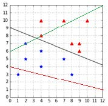
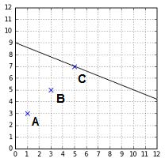
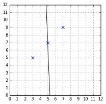
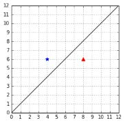
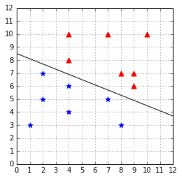
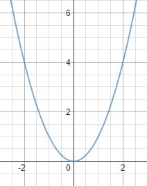
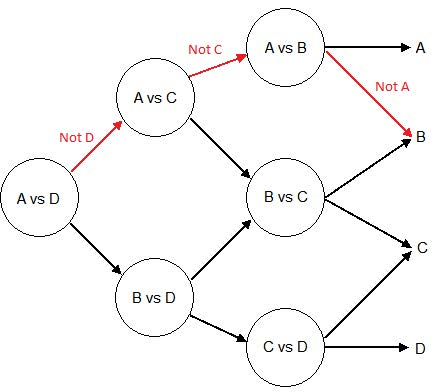

## 序

### 本书的受众

这本书的目的是提供支持向量机(svm)的一般概述。您将了解它们是什么，它们可以解决哪些类型的问题，以及如何使用它们。我试图让这本书对许多类别的读者都有用。软件工程师会发现大量的代码示例和简单的算法解释。更深入地理解svm的内部工作方式将使您能够更好地使用可用的实现。

希望第一次看到支持向量机的学生会发现该主题的覆盖面足够大，从而激起他们的好奇心。我还尽可能多地收录参考文献，这样感兴趣的读者就能更深入地阅读。

### 该如何阅读这本书

因为每一章都是建立在前一章的基础上，所以按顺序阅读这本书是最好的方法。

### 参考文献

在书的末尾你可以找到参考书目。引用一篇论文或一本书时，要用作者的名字加上出版日期。例如，(Bishop, 2006)在参考书目中引用了下面一行：

Bishop, C. M. (2006). Pattern Recognition and Machine Learning. Springer.

### 代码

这本书使用的IDE是Pycharm, 版本是Community Edition 2016.2.3，使用的python版本为 WinPython 64-bit 3.5.1.2以及NumPy。你可以在[这里](https://bitbucket.org/syncfusiontech/svm-succinctly)找到本书的所有代码。

## 引言

支持向量机是目前最高效的有监督机器学习算法之一。这意味着当您遇到问题并尝试在其上运行SVM时，您通常会得到非常好的结果，而无需进行很多调整。尽管如此，因为它基于强大的数学背景，它经常被视为一个黑盒子。在本书中，我们将深入讨论SVM背后的主要思想。有几种支持向量机，这就是为什么我经常提到支持向量机。本书的目标是了解它们是如何工作的。

支持向量机是几个人多年工作的结果。第一个SVM算法是Vladimir Vapnik在1963年提出的。他后来与Alexey Chervonenkis就[VC理论](https://en.wikipedia.org/wiki/Vapnik–Chervonenkis_theory)进行了密切的合作，VC理论试图从统计学的角度解释学习过程，他们都对支持向量机做出了巨大的贡献。你可以在[这里](http://www.svms.org/history.html)找到支持向量机的详细历史。

在现实生活中，支持向量机已成功应用于三个主要领域:文本分类、图像识别和生物信息学(Cristianini & Shawe-Taylor, 2000)。具体的例子包括分类新闻报道、手写数字识别和癌症组织样本。

在第一章中，我们将了解重要的概念:向量、线性可分性和超平面。它们是让您理解支持向量机的基础知识。在第二章中，我们将学习一种称为感知器的简单算法，而不是直接进入这个主题。不要跳过它——尽管它没有讨论支持向量机，本章将给您提供宝贵的见解，解释为什么支持向量机更擅长分类数据。

第三章将逐步构建所谓的支持向量机优化问题。第4章可能是最难的，它将向您展示如何解决这个问题——首先用数学方法，然后用编程方法。在第五章中，我们将发现一种新的支持向量机，称为软间隔支持向量机。我们将看到它是如何对原来的问题进行改进的。

第6章将介绍核，并解释所谓的“核技巧”。有了这个技巧，我们将得到目前最常用的核函数SVM。在第七章中，我们将学习SMO，这是一种专门为快速解决SVM优化问题而创建的算法。在第8章中，我们将看到支持向量机可以用于对多个类别的样本进行分类。

现在让我们开始我们的旅程。

## 预备知识

本章介绍了一些为了更好地理解支持向量机需要了解的基础知识。我们将首先了解向量是什么，并研究它们的一些关键性质。然后，我们将学习数据线性可分的含义，然后引入一个关键组件:超平面。

### 向量(Vectors)

在支持向量机中，有**向量**这个词。为了理解支持向量机和如何使用支持向量机，了解向量的一些基础知识是很重要的。

####　什么是向量

向量是一种可以用箭头表示的数学对象（图1）


*图1：向量的表示方法*

当我们进行计算时，我们用它的端点(箭头尖端所在的点)的坐标来表示一个向量。在图1中，点A的坐标为(4,3)。我们可以写作：
$$
\vec{OA} = (4,3)
$$
如果愿意，可以给向量起另一个名字，如$\mathbf{a}$。
$$
\mathbf{a} = (4,3)
$$
从这一点出发，人们可能会认为向量是由它的坐标来定义的。但是，如果我给你一张只有一条水平线的纸，让你画出与图1中相同的矢量，你仍然可以这么做。

你只需要两条信息:

* 向量的长度是多少？
* 向量与水平方向的夹角是多少？

这就引出了向量的以下定义:

**向量**是既有大小又有方向的东西

让我们仔细看看组成向量的两个要素

#### 向量的大小

向量$\mathbf{x}$的大小（或者说长度）写作$||x||$，也称为向量的**模**


*图2：这个向量的大小就是线段OA的长度*

在图2中，我们可以利用勾股定理计算出向量$\vec{OA}$的大小$||OA||$：
$$
OA^2 = OB^2+AB^2 \\
OA^2=4^2+3^2 \\
OA^2=25 \\
OA=\sqrt{25} \\
||OA||=OA=5
$$
一般来说，我们用欧几里德范数公式来计算向量$x=(x_1,\cdots,x_n)$的模：
$$
||x||:= \sqrt{x_1^2+\cdots+x_n^2}
$$
在Python中，可以通过调用numpy模块提供的norm函数轻松地计算模，如代码1所示。

*代码1*

```python
import numpy as np 
x = [3,4] 
np.linalg.norm(x) # 5.0
```

#### 向量的方向

方向是向量的第二个分量。根据定义，它是一个新向量，它的坐标是向量的初始坐标除以它的模。

向量$\mathbf{u}=(u_1,u_2)$的方向是一个新的向量$\mathbf{w}$:
$$
\mathbf{w} = (\frac{u_1}{||u||},\frac{u_2}{||u||})
$$
可以使用代码2中的代码在Python中计算它。

*代码2*

```python
import numpy as np 
# Compute the direction of a vector x. 
def direction(x): 
    return x/np.linalg.norm(x)
```

它是利用几何学得来的，图3显示了向量$\mathbf{u}$与水平轴和垂直轴的夹角。$\theta$是向量$\mathbf{u}$与水平轴的夹角，$\alpha$是$\mathbf{u}$与垂直轴的夹角。


*图3：向量$\mathbf{u}$与轴的夹角*

使用初等几何，我们可以看到$\cos(\theta)=\frac{u_1}{||u||}, \cos(\alpha)=\frac{u_2}{||u||}$。这意味着$\mathbf{w}$也可以被定义为：
$$
\mathbf{w} = (\frac{u_1}{||u||},\frac{u_2}{||u||}) = (\cos(\theta),\cos(\alpha))
$$

$\mathbf{w}$的坐标由余弦函数定义。因此，如果$\mathbf{u}$与轴之间的夹角发生变化，$\mathbf{u}$的方向$\mathbf{w}$也会发生变化。这就是为什么我们称这个向量为$\mathbf{u}$的方向。我们可以计算$\mathbf{w}$(代码3)的值，并发现其坐标为$(0.6,0.8)$

*代码3*

```python
u = np.array([3,4]) 
w = direction(u) 
print(w) # [0.6 , 0.8]
```

值得注意的是，如果两个向量具有相同的方向，那么它们将具有相同的方向向量(代码4)。

*代码4*

```python
u_1 = np.array([3,4]) 
u_2 = np.array([30,40]) 
print(direction(u_1)) # [0.6 , 0.8] 
print(direction(u_2)) # [0.6 , 0.8]
```

此外，**方向向量的模永远是1**。我们可以用向量$\mathbf{w}=(0.6,0.8)$验证一下(代码5)。

*代码5*

```python
np.linalg.norm(np.array([0.6, 0.8])) # 1.0
```

这是有意义的，因为这个向量的唯一目标是描述其他向量的方向——通过模为1，它尽可能地保持简单。因此，像这样的方向向量通常称为**单位向量**。

#### 向量的维度
请注意，数字的书写顺序很重要。因此，我们说一个$n$维向量是$n$个实数的元组。

例如，$\mathbf{w}=(0.6,0.8)$是一个二维向量，我们常写作$\mathbf{w} \in \mathbb{R}^2$。同样的，向量$\mathbf{u}=(5,3,2)$是一个三维向量，且$\mathbf{u} \in \mathbb{R}^3$。

#### 点积

点积(点乘)是对两个向量进行的一种运算，它的结果是一个数。数有时被称为**标量**；这就是点积被称为**标量积**的原因。

人们经常在点积问题上遇到麻烦，因为它似乎是凭空出现的。重要的是，它是对两个向量执行的操作，它的结果使我们对这两个向量之间的关系有了一些了解。有两种方法来定义点积:几何和代数。

#### 点积的几何定义
几何上，点积是两个向量的欧几里得模的乘积与它们夹角的余弦值。


*图4：向量x和向量y*

这意味着如果有两个向量$\mathbf{x},\mathbf{y}$，并且它们之间的夹角是$\theta$ （图4），它们的点积为：
$$
\mathbf{x} \cdot \mathbf{y} = \|x\| \|y\| \cos(\theta)
$$
通过这个公式，我们可以看到点积受到角度的影响:

* $\theta=0^{\circ}$时，$\cos(\theta)=1$，有$\mathbf{x} \cdot \mathbf{y} = \|x\| \|y\|$

* $\theta=90^{\circ}$时，$\cos(\theta)=0$，有$\mathbf{x} \cdot \mathbf{y} = 0$

* $\theta=0^{\circ}$时，$\cos(\theta)=-1$，有$\mathbf{x} \cdot \mathbf{y} =- \|x\| \|y\|$

记住这一点，当我们学习感知器学习算法时，它会很有用。

我们可以使用这个定义编写一个简单的Python函数来计算点积(代码6)，并使用它来获得图4(代码清单7)中的点积的值。

*代码6*

```python
import math 
import numpy as np 
def geometric_dot_product(x,y, theta): 
    x_norm = np.linalg.norm(x) 
    y_norm = np.linalg.norm(y) 
    return x_norm * y_norm * math.cos(math.radians(theta))
```

但是，我们需要知道$\theta$的值才能计算点积

*代码7*

```python
theta = 45 
x = [3,5] 
y = [8,2] 
print(geometric_dot_product(x,y,theta)) # 34.0
```

#### 点积的代数定义


*图5：用这三个角可以简化点积*

在图5中，我们可以看到三个角$\theta,\beta,\alpha$之间的关系:
$$
\theta=\beta-\alpha
$$

这意味着计算$\cos(\theta)$相当于计算$\cos(\beta-\alpha)$

利用余弦的差分恒等式，我们得到：
$$
\cos(\theta)=\cos(\beta-\alpha) = \cos(\beta)\cos(\alpha)+\sin(\beta)\sin(\alpha) \\
\cos(\theta) = \frac{x_1}{\|x\|}\frac{y_1}{\|y\|} + \frac{x_2}{\|x\|}\frac{y_2}{\|y\|} \\
\cos(\theta) = \frac{x_1y_1+x_2y_2}{\|x\|\|y\|}
$$

两边同时乘以$\|x\|\|y\|$，得到:
$$
\|x\|\|y\|\cos(\theta) = x_1y_1+x_2y_2
$$

已知：
$$
\|x\|\|y\|\cos(\theta) = \mathbf{x}\cdot\mathbf{y}
$$

则易得：
$$
\mathbf{x}\cdot\mathbf{y} = x_1y_1+x_2y_2
$$
或者可以写成：
$$
\mathbf{x}\cdot\mathbf{y} = \sum_{i=1}^2(x_i y_i)
$$

对于$n$维向量，我们可以这样写：
$$
\mathbf{x}\cdot\mathbf{y} = \sum_{i=1}^n(x_i y_i)
$$

这个公式是点积的**代数定义**。

*代码8*

```python
def dot_product(x,y): 
    result = 0 
    for i in range(len(x)): 
        result = result + x[i]*y[i] 
    return result

```
这个定义的好处是我们不需要知道角度来计算点积。我们可以编写一个函数来计算它的值(代码8)，并得到与几何定义相同的结果(代码9)。


*代码9*

```python
x = [3,5]
y = [8,2] 
print(dot_product(x,y)) # 34

```
当然，我们也可以使用numpy提供的函数(代码10)。

*代码10*

```python
import numpy as np 
x = np.array([3,5]) 
y = np.array([8,2]) 
print(np.dot(x,y)) # 34

```
我们花了很多时间来理解点积是什么以及它是如何计算的。这是因为点积是一个你应该熟悉的基本概念为了弄清楚支持向量机的情况。现在我们将看到另一个重要的方面，线性可分性。

### 了解线性可分性

在这一节中，我们将用一个简单的例子来介绍线性可分性。

#### 线性可分的数据
假设你是一位葡萄酒生产商。你销售的葡萄酒来自两个不同的批次:

* 高端葡萄酒售价145美元一瓶。
* 普通葡萄酒售价8美元一瓶。

最近，你开始收到客户的投诉，他们买了一瓶昂贵的酒。他们声称瓶子里装的是廉价酒。这对你的公司造成了很大的声誉损失，顾客也不再买你的酒了。

#### 用酒精浓度来区分葡萄酒

你决定找到一种方法来区分这两种酒。你知道其中一个比另一个含有更多的酒精，所以你打开几个瓶子，测量酒精浓度，并在图上画出。


*图6：一个线性可分数据的例子*

在图6中，您可以清楚地看到，昂贵的葡萄酒比便宜的酒含有更少的酒精。事实上，您可以找到将数据分成两组的点。这个数据被称为线性可分的。现在，你决定在装一瓶昂贵的酒之前自动测量酒的酒精浓度。如果它大于13%，生产链停止，你的一个员工必须进行检查。这一改进极大地减少了投诉，您的业务再次繁荣。

这个例子太简单了——在现实中，数据很少像这样工作。事实上，一些科学家确实测量过葡萄酒中的酒精浓度，他们得到的图表如图7所示。这是一个非线性可分数据的例子。即使大多数时候数据不是线性可分的，很好地理解线性可分性是很基本的。在大多数情况下，我们会从线性可分的情况开始(因为它比较简单)，然后推导不可分的情况。


*图7：从真实数据集绘制的酒精浓度图*

类似地，在大多数问题中，我们不会只处理一个维度，如图6所示。现实生活中的问题比这个例子更具挑战性，其中一些问题可以有数千个维度，这使得处理这些问题更加抽象。然而，它的抽象性并没有使其更加复杂。本书中的大多数例子都是二维的。它们足够简单，很容易被可视化，我们可以在它们上面做一些基本的几何，这将让你理解支持向量机的基本原理。

在图6的示例中，只有一个维度:也就是说，每个数据点都由一个数字表示。当有更多维度时，我们将使用向量来表示每个数据点。每当我们添加一个维度时，我们用来分离数据的对象就会发生变化。实际上，虽然我们可以用图6中的一个点来分离数据，但一旦进入二维空间，我们就需要一条线(一组点)，而在三维空间中，我们需要一个平面(也是一组点)。

综上所述，数据在以下情况下是线性可分的:

* 在一维中，您可以找到一个点来分离数据(图6)。
* 在二维中，您可以找到一条线来分离数据(图8)。
* 在三维中，您可以找到一个平面来分离数据(图9)。


*图8：被线分割的数据*


*图9：被平面分割的数据*

类似地，当数据是非线性可分的时，我们无法找到一个分离点、线或平面。图10和图11显示了二维和三维线性不可分数据的例子。


*图10：二维中线性不可分的数据*


*图11：三维中线性不可分的数据*

### 超平面

当数据超过三个维度时，我们用什么来分离数据呢?我们用的是**超平面**。

#### 什么是超平面

在几何中，超平面是比其所在空间小一维的子空间。

这个定义虽然是正确的，但并不十分直观。现在不用理会它，我们将通过首先学习直线来理解超平面是什么。

如果你还记得学校里学过的数学，你可能学过直线有这样一个方程$y=ax+b$，这个常数$a$就是斜率，$b$是它与y轴相交的截距。这个公式有几个成立的值$x$，我们说解的集合是一条直线。

经常令人困惑的是，如果你在微积分课程中学习函数$f(x) = ax+b$，你就了解了一个单变量函数。

但是，需要注意的是，线性方程$y=ax+b$有两个变量，分别是$x$和$y$，我们可以随意命名它们。

例如，我们可以把$y$重命名$x2$，$x$重命名$x1$，等式变成:$x_2=ax_1+b$。

这和$ax_1-x_2+b=0$是等价的。

如果定义二维向量$\mathbf{x}=(x_1,x_2)$和$\mathbf{w}=(a,-1$，则得到直线方程的另一种表示形式(其中$\mathbf{w}\cdot\mathbf{x}$为$\mathbf{w}$和$\mathbf{x}$的点积):
$$
\mathbf{w}\cdot\mathbf{x} + b =0
$$

最后一个方程的优点是它使用了向量。即使我们用二维向量来推导它，它也适用于任何维度的向量。实际上，它就是超平面的方程。

从这个方程，我们可以对超平面有另一个认识:它是满足条件$\mathbf{w}\cdot\mathbf{x} + b =0$的点的集合。这个定义的本质是**超平面是点的集合**。

如果我们能够从直线方程推导出超平面方程，那是因为直线是超平面。你可以通过阅读超平面的定义来说服自己。你会注意到，实际上，一条线是一个二维空间，被一个三维平面包围着。类似地，点和面也是超平面。

#### 理解超平面方程
我们从直线方程推导出超平面方程。相反的做法很有趣，因为它更清楚地显示了两者之间的关系。

给定向量$\mathbf{w}=(w_0,w_1),\mathbf{x}=(x,y)$和$b$，我们可以用这个方程来定义超平面：
$$
\mathbf{w}\cdot\mathbf{x} + b =0
$$

这等价于：
$$
w_0 x +w_1 y+b =0 \\
w_1 y=-w_0 x-b
$$

把$y$放到等式的一边，有：
$$
y = -\frac{w_0}{w_1}x-\frac{b}{w_1}
$$

如果令$a=-\frac{w_0}{w_1},c=-\frac{b}{w_1}$，则得到：
$$
y=ax+c
$$

我们看到当$w_1=-1$时，直线方程的偏移量$c$只等于超平面方程的偏移量$b$。因此，当您看到超平面的图时，如果与垂直轴的交点不是$b$，您不应该感到惊讶(这将是我们下一个示例中的情况)。而且，如果$w_0$和$w_1$的符号相同，斜率为负。

#### 使用超平面对数据进行分类


*图12：线性可分的数据集*

考虑到图12中线性可分的数据，我们可以使用一个超平面来进行二分类。

例如，对于向量$\mathbf{w}=(0.4,1.0)$和$b=-9$，我们得到图13中的超平面。


*图13：被超平面分割的数据*

我们将每个向量$\mathbf{x}_i$与一个标签$y_i$关联起来，标签只有两个取值$+1,-1$(分别是图13中的三角形和星形)。

我们定义一个假设函数$h$:
$$
h(\mathbf{x}_i) = 
\begin{cases}
+1 & \text{if} \quad \mathbf{w}\cdot\mathbf{x}_i+b \geq 0 \\
-1 & \text{if} \quad \mathbf{w}\cdot\mathbf{x}_i+b < 0 \\

\end{cases}
$$

这等价于：
$$
h(\mathbf{x}_i) = sign(\mathbf{w}\cdot\mathbf{x}_i+b)
$$

它利用超平面与$\mathbf{x}$的位置来预测$\mathbf{x}$标签的值$y$。超平面一边的每个数据点将被分配一个标签，另一边的每个数据点将被分配另一个标签。

例如，对向量$\mathbf{x}=(8,7)$来说，$\mathbf{x}=(8,7)$在超平面的上面。当我们计算的时候，我们得到$\mathbf{w}\cdot\mathbf{x}+b = 0.4\times 8+1\times 7 -9=1.2$，其结果是正的，所以$h(x)=+1$。

同样地，$\mathbf{x}=(1,3)$在超平面下面，因为$\mathbf{w}\cdot\mathbf{x}+b = 0.4\times 1+1\times 3 -9=-5.6$,所以$h$的计算结果为$-1$

因为函数$h$超平面方程，它是值的线性组合，被称为**线性分类器**。

还有一个技巧，我们可以通过去掉b常数使公式$h$变得更简单。首先，我们往向量$\mathbf{x}_i=(x_1,x_2,\cdots,x_n)$添加一个分量$x_0=1$。我们得到了这个向量$\mathbf{\hat{x}}_i=(x_0,x_1,x_2,\cdots,x_n)$(它读作“$\mathbf{x}_i$ hat”，因为我们给它戴上了帽子)。类似地，我们向向量$\mathbf{w}_i=(w_1,w_2,\cdots,w_n)$添加一个分量$w_0=b$，它变成$\mathbf{\hat{w}}_i=(w_0,w_1,w_2,\cdots,w_n)$。

备注:在本书的其余部分中，我们将把一个向其添加人工坐标的向量称为**增广向量**

当我们使用增广向量时，假设函数为:
$$
h(\mathbf{\hat{x}}_i) = sign(\mathbf{\hat{w}}\cdot\mathbf{\hat{x}}_i)
$$

如果我们有一个超平面来分离数据集，如图13所示，通过使用假设函数，我们能够完美地预测每个点的标签。主要的问题是:我们如何找到这样的超平面?

#### 如何找到超平面(是否分离数据)?

回忆一下超平面方程的增广形式$\mathbf{w}\cdot\mathbf{x}=0$。重要的是要理解影响超平面形状的唯一值是$\mathbf{w}$。为了让你们相信，我们可以回到二维的情况，当时超平面只是一条直线。当我们创建增广的三维向量时，我们得到$\mathbf{x}=(x_0,x_1,x_2)$和$\mathbf{w}=(b,a,-1)$。可以看到，向量$\mathbf{w}$同时包含$a$和$b$，这是定义直线的两个主要要素。更改$\mathbf{w}$的值会给我们带来不同的超平面(线)，如图14所示。



*图14：不同的$\mathbf{w}$值会得到不同的超平面*

### 总结

在介绍了向量和线性可分性之后，我们学习了什么是超平面，以及如何使用它对数据进行分类。然后我们看到，学习算法的目标是找到一个分离数据的超平面。最终，我们发现寻找超平面等同于寻找向量$\mathbf{w}$。

现在我们将研究学习算法使用哪些方法来找到分离数据的超平面。在研究支持向量机是如何做到这一点之前，我们先来看看一个最简单的学习模型:感知机。

## 感知机

### Presentation

感知机是Frank Rosenblatt在1957年发明的一种算法，比支持向量机早了几年。它广为人知是因为它是一个简单神经网络的组成部分:多层感知机。感知机的目标是找到一个可以分离线性可分数据集的超平面。一旦找到超平面，就用它来进行二分类。

给定增广向量$\mathbf{x}=(x_0,x_1,\cdots,x_n)$和$\mathbf{w}=(w_0,w_1,\cdots,w_n)$，感知机使用我们在前一章中看到的相同的假设函数对数据点$\mathbf{x}_i$进行分类:
$$
h(\mathbf{x}_i) = sign(\mathbf{w}\cdot\mathbf{x}_i)
$$

译者注：之后翻译中的所有“假设”或者是“假设函数”都可以认为是上面那个公式。~~（我实在不知道咋翻译这个词）~~

### 感知机学习算法

给定$m$个$n$维的训练数据集$\mathcal{D}$，每个训练样本表示为$(\mathbf{x}_i,y_i)$，感知机学习算法(Perceptron Learning Algorithm,PLA)的目的是找到一个假设函数$h$，使其可以正确预测每一个样本$\mathbf{x}_i$的标签值$y_i$。

感知机的假设函数是$h(\mathbf{x}_i) = sign(\mathbf{w}\cdot\mathbf{x}_i)$，我们看到$\mathbf{w}\cdot\mathbf{x}$是超平面的方程。然后我们可以说，假设函数的集合$\mathcal{H}$是$n-1$维超平面的集合(因为一个超平面比它的所在空间小一维)。

这里重要的是要理解唯一未知的值$\mathbf{w}$。这意味着算法的目标是找到一个值$\mathbf{w}$。你只要找到$\mathbf{w}$，你就有了一个超平面。因为$\mathbf{w}$的取值是无限的，所以有无数个超平面，也就有无数的假设函数。

这个可以写成更正式的形式:

给定一个训练集：$\mathcal{D}=\left\{(\mathbf{x}_i,y_i)\mid \mathbf{x}_i \in \mathbb{R}^n,y_i \in \{+1,-1\}  \right\}_{i=1}^m$和假设函数的集合$\mathcal{H}$。找到一个$h \in \mathcal{H}$，使得对于每一个$\mathbf{x}_i$都有$h(\mathbf{x}_i)=y_i$

这也等价于：

给定一个训练集：$\mathcal{D}=\left\{(\mathbf{x}_i,y_i)\mid \mathbf{x}_i \in \mathbb{R}^n,y_i \in \{+1,-1\}  \right\}_{i=1}^m$和假设函数的集合$\mathcal{H}$。找到一个$\mathbf{w}=(w_0,w_1,\cdots,w_n)$，使得对于每一个$\mathbf{x}_i$都有$sign(\mathbf{w} \cdot \mathbf{x}_i)=y_i$


PLA是一个非常简单的算法，给出如下总结:

1. 从一个随机的超平面(由$\mathbf{w}$向量定义)开始，并使用它对数据进行分类。
2. 选择一个错误分类的例子，通过更新的值来选择另一个超平面，希望它能更好地对这个例子进行分类(这称为**更新规则**)。
3. 用新的超平面对数据进行分类
4. 重复步骤2，3直到没有错误分类的例子

一旦过程结束，就有了一个分隔数据的超平面。

该算法如代码11所示。

*代码11*

```python
import numpy as np 
def perceptron_learning_algorithm(X, y): 
    w = np.random.rand(3) # can also be initialized at zero. 
    misclassified_examples = predict(hypothesis, X, y, w) 
    while misclassified_examples.any(): 
        x, expected_y = pick_one_from(misclassified_examples, X, y) 
        w = w + x * expected_y # update rule 
        misclassified_examples = predict(hypothesis, X, y, w) 
    return w
```

让我们仔细看一下代码。

`perceptron_learning_algorithm`使用几个函数(代码12)。`hypothesis`函数是假设函数$h(x)$，它根据$\mathbf{w}$所定义的超平面返回样本$\mathbf{x}_i$的预测值$y_i$。`predict`函数计算每个样本的假设值（$h(x)$），并返回错误分类的样本。

*代码12*

```python
def hypothesis(x, w): 
    return np.sign(np.dot(w, x)) 
# Make predictions on all data points 
# and return the ones that are misclassified. 
def predict(hypothesis_function, X, y, w): 
    predictions = np.apply_along_axis(hypothesis_function, 1, X, w) 
    misclassified = X[y != predictions] 
    return misclassified
```

一旦我们用`predict`进行了预测，我们就知道哪些示例是错误分类的，因此我们使用函数pick_one_from随机选择其中一个示例(代码13)。


*代码13*

```python
# Pick one misclassified example randomly
# and return it with its expected label. 
def pick_one_from(misclassified_examples, X, y): 
    np.random.shuffle(misclassified_examples) 
    x = misclassified_examples[0] 
    index = np.where(np.all(X == x, axis=1)) 
    return x, y[index]
```

然后是算法的核心:更新规则。现在，只要记住它改变了$\mathbf{w}$。为什么这样做，稍后将详细解释。我们再次使用预测函数，但这一次，我们要将$\mathbf{w}$更新。它允许我们查看我们是否对所有数据点进行了正确的分类，或者我们是否需要重复这个过程直到所有数据点都正确分类。

代码14演示了如何将`perceptron_learning_algorithm`函数用于一个玩具数据集。注意，向量$\mathbf{w}$和向量$\mathbf{x}$必须具有相同的维数，因此在将每个向量赋给函数之前，我们将$\mathbf{x}$转换为增广向量。

*代码14*

```python
# See Appendix A for more information about the dataset 
from succinctly.datasets import get_dataset, linearly_separable as ls 

np.random.seed(88)

X, y = get_dataset(ls.get_training_examples) 

# transform X into an array of augmented vectors.
X_augmented = np.c_[np.ones(X.shape[0]), X] 

w = perceptron_learning_algorithm(X_augmented, y) 

print(w) # [-44.35244895 1.50714969 5.52834138]
```

#### 理解更新规则

为什么要使用这个更新规则呢？回想一下，我们随机选择了一个错误分类的例子。现在我们想让感知机正确地分类这个例子。为此，我们决定更新向量$\mathbf{w}$。这里的想法很简单。由于$\mathbf{w}$和$\mathbf{x}$点积结果的符号是不正确的，通过改变它们之间的角度，我们可以使它正确：

* 如果预测的标签是+1，$\mathbf{w}$和$\mathbf{x}$之间的夹角小于$90^{\circ}$，我们就要增加它。
* 如果预测的标签是-1，$\mathbf{w}$和$\mathbf{x}$之间的夹角大于$90^{\circ}$，我们就要减少它。


*图15:两个向量*

$\mathbf{w}$和$\mathbf{x}$之间有一个夹角$\theta$(图15)。

将两个向量相加会得到一个新向量$\mathbf{w}+\mathbf{x}$，这个新向量与$\mathbf{x}$的夹角$\beta$会小于$\theta$（图16）。


*图16:向量相加会得到一个更小的夹角*

同样的，将两个向量相减会得到一个新向量$\mathbf{w}-\mathbf{x}$，这个新向量与$\mathbf{x}$的夹角$\beta$会大于$\theta$（图17）。


*图17:向量相减会得到一个更大的夹角*

我们可以用这两个观测值来调整角度：

* 如果预测的标签是+1，$\mathbf{w}$和$\mathbf{x}$之间的夹角小于$90^{\circ}$，我们就要利用$\mathbf{w}=\mathbf{w}-\mathbf{x}$来增加它。
* 如果预测的标签是-1，$\mathbf{w}$和$\mathbf{x}$之间的夹角小于$90^{\circ}$，我们就要利用$\mathbf{w}=\mathbf{w}+\mathbf{x}$来减少它。

因为我们只在错误分类的样本上这样做，当预测标签有值时，预期标签是相反的。这意味着我们可以重写前面的语句:

* 如果样本真实的标签是-1（也就是说我们预测成了+1），我们要扩大夹角，$\mathbf{w}=\mathbf{w}-\mathbf{x}$
* 如果样本真实的标签是+1（也就是说我们预测成了-1），我们要缩小夹角，$\mathbf{w}=\mathbf{w}+\mathbf{x}$

译者注：$h(\mathbf{x}_i)=sign(\mathbf{w} \cdot \mathbf{x}_i)$的结果完全是由$\mathbf{w}$和$\mathbf{x}_i$夹角决定的（因为我们只关心正负，不关心数字大小）。所以如果$h(\mathbf{x}_i)=+1$而$\mathbf{x}_i$的真实标签是-1，就说明原先$\mathbf{w}$与$\mathbf{x}_i$的夹角小于90（cos在0~90时为正），所以更新后的$\mathbf{w}$要扩大与$\mathbf{x}$的夹角以达到$\mathbf{w}\cdot\mathbf{x}_i<0$，即$h(\mathbf{x}_i)=sign(\mathbf{w} \cdot \mathbf{x})=-1$

用代码描述如代码15所示，其完全等价于代码16。

*代码15*

```python
def update_rule(expected_y, w, x): 
    if expected_y == 1:
        w = w + x 
    else: 
        w = w - x 
    return w
```

*代码16*

```python
def update_rule(expected_y, w, x):
    w = w + x * expected_y 
    return w
```

我们可以通过在应用更新规则前后检查预测的值来验证更新规则是否如我们所期望的那样(代码17)。


*代码17*

```python
import numpy as np 

def hypothesis(x, w): 
    return np.sign(np.dot(w, x)) 
x = np.array([1, 2, 7]) 
expected_y = -1 
w = np.array([4, 5, 3]) 

print(hypothesis(w, x)) # The predicted y is 1. 

w = update_rule(expected_y, w, x) # we apply the update rule. 

print(hypothesis(w, x)) # The predicted y is -1.
```

请注意，更新规则并不一定要在第一次更改样本的假设符号。有时，在发生更新规则之前，有必要更新几次，如代码18所示。因为我们在错误分类的样本之间循环，所以我们将一直使用更新规则，直到样本被正确分类。重要的是，每次我们更新规则时，都会在正确的方向上改变角度的值(增加或减少角度)。

*代码18*

```python
import numpy as np 

x = np.array([1,3]) 
expected_y = -1 
w = np.array([5, 3]) 

print(hypothesis(w, x)) # The predicted y is 1. 

w = update_rule(expected_y, w, x) # we apply the update rule. 

print(hypothesis(w, x)) # The predicted y is 1. 

w = update_rule(expected_y, w, x) # we apply the update rule once again.

print(hypothesis(w, x)) # The predicted y is -1.
```

还要注意的是，有时更新特定样本$\mathbf{x}$的值会改变$\mathbf{w}$和超平面，从而使先前正确分类的样本变成错误分类。所以，在更新后，假设的分类能力可能会变差。这在图18中得到了说明，它向我们展示了在每个迭代步骤中错误分类的例子的数量。避免此问题的一种方法是在进行更新之前记录$\mathbf{w}$的值，并仅在更新减少错误分类样本的数量时使用更新的$\mathbf{w}$值。PLA的这种修改被称为口袋算法(Pocket algorithm)


*图18：PLA更新规则振荡*

#### 算法收敛性

我们说过，我们一直用更新规则更新向量$\mathbf{w}$，直到没有错误分类点。但我们怎么能如此确定这真的会发生呢?幸运的是,数学家们研究过这个问题,我们可以非常确定,因为感知机收敛定理保证如果两组P和N(正样本和负样本)是线性可分的,向量$\mathbf{w}$的更新次数是有限的,Novikoff在1963年首次证明了这一点(Rojas, 1996)。


#### 理解感知机的局限性

关于PLA算法需要了解的一点是，因为向量$\mathbf{w}$是随机初始化的，错误分类的样本是随机选择的，所以每次我们运行算法时，可能会返回一个不同的超平面。图19显示了在同一数据集上运行PLA四次的结果。如你所见，PLA得到了四个不同的超平面。


*图19：PLA每次得到的超平面都不同*

一开始，这似乎不是什么问题。毕竟，这四个超平面对数据进行了完美的分类，所以它们可能同样优秀，对吧?然而，当使用像PLA这样的机器学习算法时，我们的目标不是找到一种方法来完美地分类我们现在拥有的数据。我们的目标是找到一种方法来正确分类新数据。

让我们介绍一些术语来明确这一点。为了训练一个模型，我们从现有数据中选取一个**样本**，并将其称为**训练集**。我们训练模型，它会得到一个**假设**(在我们的例子中是一个超平面)。我们可以测量假设在训练集上的表现如何:我们称之为**样本内误差**(也称为训练误差)。一旦我们对假设感到满意，我们就决定将其用于新的数据(**测试集**)，看看它是否确实学到一些东西。我们测量假设在测试集中表现如何，我们称之为**样本外误差**(也称为泛化误差)。


#### 我们的目标是样本外误差最小

在PLA的例子中，图19中的所有假设都对数据进行了完美分类:它们的样本内误差为零。但我们真正关心的是样本外误差。我们可以使用图20中所示的测试集来检查它们的样本外错误。


*图20：测试集*

正如您在图21中所看到的，右边的两个假设，尽管对训练数据集进行了完美的分类，但在测试数据集上却出现了错误。

现在我们更好地理解了为什么它是有问题的。当对线性可分数据集使用感知机时，我们可以保证找到一个样本内误差为零的假设，但我们不能保证它能多好地泛化到新的数据(如果一个算法泛化得很好，它的样本外误差将接近样本内误差)。我们如何选择一个泛化良好的超平面?我们将在下一章中看到，这是支持向量机的目标之一。


*图21：并不是所有的假设都有完美的样本外误差*

### 总结

在本章中，我们学习了感知机是什么。然后我们看到了感知机学习算法是如何工作的，以及更新规则背后的动机是什么。在学习了PLA是保证收敛的之后，我们看到并不是所有的假设都是相等的，并且其中一些会比其他的更好地泛化。最后，我们发现感知机无法选择样本外误差最小的假设而只是随机选择一个样本内误差最小的假设。

## 支持向量机优化问题

### 支持向量机搜索最优超平面

感知机有几个优点:它是一个简单的模型，算法很容易实现，我们有一个理论证明它会找到一个超平面来分离数据。但是，它最大的缺点是不能每次都找到相同的超平面。我们为什么要关心这个?因为不是所有分离的超平面都是相等的。如果感知机给你一个超平面它非常接近一个类的所有数据点，你有权利相信它在给出新数据时泛化效果很差。

支持向量机(Support Vector Machines,SVM)没有这个问题。事实上，SVM不是寻找超平面，而是试图得到超平面。我们称它为**最优超平面**，我们说它是最能分离数据的超平面。

### 怎么比较两个超平面
因为我们不能根据感觉来选择最优的超平面，我们需要某种评价标准来允许我们比较两个超平面，并说哪一个比其他所有超平面都好。

在本节中，我们将尝试了解如何比较两个超平面。换句话说，我们将寻找一种计算的方法，让我们知道哪个超平面分割数据的效果最好。我们将着眼于看似有效的方法，但随后我们将看到为什么它们不起作用，以及我们如何纠正它们的局限性。让我们只用超平面的方程来比较两个超平面。

#### 利用超平面方程

给定一个样本$(\mathbf{x},y)$和一个超平面，我们想知道这个样本和超平面间有什么关系。

我们已经知道的一个关键元素是如果的值$\mathbf{x}$满足直线方程，那么就表示它在直线上。超平面也类似，对于由向量$\mathbf{w}$和偏移量$b$定义的超平面，如果点$\mathbf{x}$在超平面上，则$\mathbf{w} \cdot \mathbf{x} + b = 0$

但是如果点不在超平面上呢？

让我们看看图22的例子。在图22中直线由$\mathbf{w}=(-0.4,-1)$和$b=9$定义，当我们用超平面方程时：

* 对于点A(1,3)，用向量$\mathbf{a}=(1,3)$，可以得到$\mathbf{w}\cdot\mathbf{a}+b=5.6$
* 对于点B(3,5)，用向量$\mathbf{b}=(3,5)$，可以得到$\mathbf{w}\cdot\mathbf{b}+b=2.8$
* 对于点A(5,7)，用向量$\mathbf{c}=(5,7)$，可以得到$\mathbf{w}\cdot\mathbf{c}+b=0$



*图22：A在方程中得到的结果比B大*

正如你所看到的，当点不在超平面上时我们得到一个不等于0的数。事实上，离超平面越远，得到的数值越大。

另一件需要注意的事情是，方程返回的数字的符号告诉我们这个点相对于直线的位置。利用图23所示的直线方程，我们得到:

* 点A(3,5)得到的是2.8
* 点B(5,7)得到的是0
* 点C(7,9)得到的是-2.8


*图23：这个方程对C返回负数*

如果方程返回一个正数，则该点在这条线的下面，如果它是一个负数，则该点在这条线的上面。注意，在视觉上它并不一定在上面或下面，因为如果您有一条像图24中那样的线，它将在左边或右边，但应用相同的逻辑。超平面方程返回的数字的符号可以让我们判断两点是否在同一侧。事实上，这正是我们在第二章中定义的假设函数的作用。




*图24：一条线可以以不同的方式分隔空间*

现在我们有了比较两个超平面的方法。


给定一个训练样本$(\mathbf{x},y)$和一个由向量$\mathbf{w}$和偏移量$b$定义的超平面，我们计算$\beta=\mathbf{w}\cdot\mathbf{x}+b$来知道点到超平面有多远。

给定一个数据集$\mathcal{D}=\left\{(\mathbf{x}_i,y_i)\mid \mathbf{x}_i \in \mathbb{R}^n,y_i \in \{+1,-1\}  \right\}_{i=1}^m$，我们对每个样本计算它的$\beta$值，并记$B$是所有$\beta$中最小的值：
$$
B = \min_{i=1\dots m}\beta_i
$$

如果我们需要在两个超平面之间进行选择，我们将选择其中$B$最大的一个。

要清楚的是，这意味着如果我们有$k$个超平面，我们将计算$B_i (i=1\dots k)$并选择其中$B$最大的超平面。

#### 负样本存在问题

不幸的是，利用超平面方程的结果有其局限性。问题是，取最小值对负值的样本(即方程返回负值的样本)是行不通的。

记住，我们总是希望取离超平面最近的点的$\beta$。用正样本来计算$\beta$实际上是没问题 的。如果有两个点的$\beta$分别为$\beta=+5,\beta=+1$，我们会选择较小的那个，也就是$+1$。但是，如果两个值分别为$\beta=-5,\beta=-1$，根据规则会选择$-5$，因为$-5<-1$，实际情况是$\beta=-1$的点会更靠近超平面。


解决这个问题的一种方法是使用的绝对值。

给定一个数据集$\mathcal{D}$，我们对每个样本计算它的$\beta$值，并记$B$是所有$\beta$中绝对值最小的值：
$$
B = \min_{i=1\dots m}|\beta_i|
$$

#### 超平面是否正确分类数据?

计算$B$可以让我们选择一个超平面。但是，如果只使用这个值，我们可能会选择一个错误的超平面。考虑图25中的情况:样本被**正确分类**，使用最后一个公式计算的$B$值为2。


*图25：超平面正确分类了数据*

在图26中，样本分类不正确，但其$B$的值也是2。这是有问题的，因为我们不知道哪个超平面更好。理论上，它们看起来一样好，但实际上，我们希望选择图25的超平面。



*图26：超平面正确错误分类了数据*

我们如何调整我们的公式来满足这个要求?

好吧，在我们的训练样本$(\mathbf{x},y)$中有一个值我们没有使用：样本的标签$y$。

如果我们往$\beta$值上乘一个$y$，就能改变它的符号，把这个新的值记作$f$：
$$
f = y \times \beta \\
f = y(\mathbf{w}\cdot \mathbf{x} + b)
$$

这样如果**样本被正确分类，则$f$的符号永远会是正号**；而如果**样本被错误分类，则$f$的符号永远会是负号**。

给定数据集$\mathcal{D}$，我们可以计算：
$$
F = \min_{i=1\dots m}f_i \\
F = \min_{i=1\dots m}y_i (\mathbf{w}\cdot\mathbf{x}+b)
$$

根据这个公式，当比较两个超平面时，我们仍然会选择其中$F$最大的一个。额外的好处是，在像图25和图26这样的特殊情况下，我们将始终选择正确分类的超平面(因为它的值将为正值，而其他超平面的值将为负值)。


在文献中，$f$被称为函数间隔;它的值可以用Python计算，如代码19所示。类似地，这个数字被称为数据集$\mathcal{D}$的函数间隔。

*代码19*

```python
# Compute the functional margin of an example (x,y) 
# with respect to a hyperplane defined by w and b. 
def example_functional_margin(w, b, x, y): 
    result = y * (np.dot(w, x) + b) 
    return result 
# Compute the functional margin of a hyperplane 
# for examples X with labels y. 
def functional_margin(w, b, X, y): 
    return np.min([example_functional_margin(w, b, x, y[i]) for i, x in enumerate(X)])
```

利用这个公式，我们发现在图25中超平面的函数间隔为+2，而在图26中超平面的函数间隔为-2。因为图25中的超平面有更大的函数间隔，所以我们选择第一个。

提示:记住，我们希望选择边界(间隔)最大的超平面


#### 标度不变性(Scale invariance)

看来这次我们找到了比较两个超平面的好方法。然而，函数间隔有一个主要的问题:不具有标度不变性。

给定一个向量$\mathbf{w}_1=(2,1)$和偏移量$b_1=5$，如果把它们乘以10，就得到$\mathbf{w}_2=(20,10)$和$b_2=50$。我们对它们进行了**重缩放（rescaled）**。

向量$\mathbf{w}_1$和$\mathbf{w}_2$代表同一个超平面，因为它们具有相同的单位向量。超平面是一个正交于向量$\mathbf{w}$的平面，它与向量的长度无关。唯一重要的是它的方向，正如我们在第一章看到的，它是由单位向量给出的。此外，当在图上跟踪超平面时，垂直轴与超平面的交点的坐标将是$0,b/w_1$，因此超平面也不会因为缩放$b$而改变。

正如我们在代码20中所看到的，问题是，当我们用$\mathbf{w}_2$计算函数间隔时，我们得到的是一个比$\mathbf{w}_1$大10倍的数字。这意味着给定任何超平面，只要缩放$\mathbf{w}$和$b$，我们总能找到一个函数间隔更大的超平面。

*代码20*

```python
x = np.array([1, 1]) 
y = 1 

b_1 = 5 
w_1 = np.array([2, 1]) 

w_2 = w_1 * 10 
b_2 = b_1 * 10 

print(example_functional_margin(w_1, b_1, x, y)) # 8 
print(example_functional_margin(w_2, b_2, x, y)) # 80
```

要解决这个问题，我们只需要做一个小小的调整。我们不用向量$\mathbf{w}$，而是用它的单位向量。为此，我们将除以它的模。用同样的方法，我们也对$b$除以$\mathbf{w}$的模使它也保持比例不变。

回想一下函数间隔的公式：$f = y(\mathbf{w}\cdot \mathbf{x} + b)$

稍微对它进行一点修改，得到一个新的数字$\gamma$：
$$
\gamma = y(\frac{\mathbf{w}}{\|w\|}\cdot \mathbf{x} + \frac{b}{\|w\|})
$$
和前面一样，给定一个数据集$\mathcal{D}$，我们计算：
$$
M = \min_{i=1\dots m} \gamma_i \\
M = \min_{i=1\dots m} y_i(\frac{\mathbf{w}}{\|w\|}\cdot \mathbf{x}_i + \frac{b}{\|w\|})
$$

这样做的好处是，不管我们选择的向量$\mathbf{w}$有多大，结果都是一样的。$\gamma$也被称为样本的**几何间隔**，而$M$则是数据集的几何间隔。代码21是其的一个Python实现。

*代码21*

```python
# Compute the geometric margin of an example (x,y) 
# with respect to a hyperplane defined by w and b. 
def example_geometric_margin(w, b, x, y): 
    norm = np.linalg.norm(w) 
    result = y * (np.dot(w/norm, x) + b/norm) 
    return result 
    
# Compute the geometric margin of a hyperplane 
# for examples X with labels y. 
def geometric_margin(w, b, X, y): 
    return np.min([example_geometric_margin(w,b, x, y[i]) for i, x in enumerate(X)])
```

我们可以验证一下几何间隔是否如我们期望的那样。代码22中，向量$\mathbf{w}_1$和它的重缩放向量$\mathbf{w}_2$都返回了同一个值。

*代码22*

```python
x = np.array([1,1]) 
y = 1 

b_1 = 5 
w_1 = np.array([2,1])

 w_2 = w_1*10 
 b_2 = b_1*10 

 print(example_geometric_margin(w_1, b_1, x, y)) # 3.577708764 
 print(example_geometric_margin(w_2, b_2, x, y)) # 3.577708764
```
它被称为几何间隔，因为我们可以用简单的几何方法验证这个公式。它给出了超平面和$\mathbf{x}$之间的距离。

在图27中，我们看到这个点$X'$是点$X$到超平面的正交投影。我们希望找到$X$和$X'$之间的距离$d$。


*图27：点$X$到超平面的几何间隔*


向量$\mathbf{k}$和向量$\mathbf{w}$有相同的方向，所以他们有一个相同的单位向量$\frac{\mathbf{w}}{\|w\|}$。我们知道$\mathbf{k}$的模是$d$，所以$\mathbf{k}$为：$\mathbf{k}=d\frac{\mathbf{w}}{\|w\|}$。

此外，我们可以看到$\mathbf{x}'=\mathbf{x}-\mathbf{k}$，所以我们把$\mathbf{k}$代入得：
$$
\mathbf{x}'=\mathbf{x}-d\frac{\mathbf{w}}{\|w\|}
$$

因为点$mathbf{x}'$是在超平面上，所以$\mathbf{x}'$满足超平面方程，故有：
$$
\mathbf{w} \cdot \mathbf{x}' +b = 0\\

\mathbf{w} \cdot (\mathbf{x} - d\frac{\mathbf{w}}{\|w\|})+b = 0\\

\mathbf{w}\cdot\mathbf{x} - d\frac{\mathbf{w}\cdot\mathbf{w}}{\|w\|}+b=0 \\

\mathbf{w}\cdot\mathbf{x} - d\frac{\|w\|^2}{\|w\|}+b=0 \\

\mathbf{w}\cdot\mathbf{x} - d\|w\| +b=0 \\

d = \frac{\mathbf{w}\cdot\mathbf{x}+b}{\|w\|}\\

d = \frac{\mathbf{w}}{\|w\|}\cdot \mathbf{x} + \frac{b}{\|w\|}


$$

最后，和前面一样，我们两边乘上$y$，以确保我们选择了一个正确分类数据的超平面，它给出了我们前面看到的几何间隔公式：
$$
\gamma = y(\frac{\mathbf{w}}{\|w\|}\cdot \mathbf{x} + \frac{b}{\|w\|})
$$


*图28：w=(-0.4,-1)和b=8的超平面*



*图29：w=(-0.4,-1)和b=8.5的超平面*

现在我们已经定义了几何间隔，让我们看看它是如何让我们比较两个超平面的。我们可以看到，与图29相比，图28中的超平面更接近蓝色星形示例，而不是红色三角形示例。因此，我们期望它的几何间隔更小。代码23使用代码21中定义的函数来计算每个超平面的几何间隔。从图29中可以看出，$\mathbf{w}=(-0.4,-1)$和$b=8.5$定义的第二个超平面的几何间隔更大$(0.64 > 0.18)$。在这两者之间，我们会选择图29这个超平面。

*代码23*

```python
# Compare two hyperplanes using the geometrical margin. 
positive_x = [[2,7],[8,3],[7,5],[4,4],[4,6],[1,3],[2,5]] 
negative_x = [[8,7],[4,10],[9,7],[7,10],[9,6],[4,8],[10,10]] 

X = np.vstack((positive_x, negative_x)) 
y = np.hstack((np.ones(len(positive_x)), -1*np.ones(len(negative_x)))) 

w = np.array([-0.4, -1]) 
b = 8 

# change the value of b 
print(geometric_margin(w, b, X, y)) # 0.185695338177 
print(geometric_margin(w, 8.5, X, y)) # 0.64993368362
```

我们看到，为了计算另一个超平面的几何间隔，我们只需要修改$\mathbf{w}$或$b$的值。我们可以试着用一个小增量来改变它，看看边际是否会变大，但这是一种随机的，它会花很多时间。我们的目标是在所有可能的超平面中为一个数据集找到最优的超平面，但是超平面有无数个。

tip:要找到最优超平面，只要找到$\mathbf{w}$和$b$的值，就可以得到最大的几何间隔。

我们怎么才能找到使几何间隔取得最大的值$\mathbf{w}$呢?幸运的是，数学家已经设计了解决这些问题的工具。为了找到$\mathbf{w}$和$b$，我们需要解决所谓的**优化问题**。在研究支持向量机的优化问题之前，让我们快速回顾一下什么是优化问题。

### 什么是优化问题

#### 无约束优化问题

优化问题的目标是最小化或最大化关于某个变量x的函数(也就是说，找到函数返回的最小或最大值的x值)。例如，求函数$f(x)=x^2$的最小值的问题是这样的:
$$
\underset{x}{\text{minimize}} \quad f(x)
$$
或者写作：
$$
\min_x \quad f(x)
$$

在这种情况下，我们可以在所有可能的值中自由搜索。我们说这个问题是不受约束的。如图30所示，函数的最小值在$x=0$处。



*图30：无约束条件下，最小值是0*


*图31：在约束为x-2=0的条件下，最小值为4*

#### 约束优化问题

##### 单等式约束
有时我们对函数本身的最小值不感兴趣，而是对满足某些约束条件时的最小值感兴趣。在这种情况下，我们通常在约束条件前面加上*subject to*，通常缩写为*s.t.*。例如，如果我们想知道$f$的最小值，但$x$限制为一个特定的值，我们可以这样写:

$$
\underset{x}{\text{minimize}} \quad f(x) \\
subject \ to \quad x=2
$$
这个示例如图31所示。一般来说，等式右边的约束条件是0，所以问题可以被重写:
$$
\underset{x}{\text{minimize}} \quad f(x) \\
subject \ to \quad x-2=0
$$

使用这个符号，我们清楚地看到约束是一个**仿射函数（affine function）**，而目标函数是一个**二次函数（quadratic function）**。因此我们称这个问题为二次优化问题或二次规划(Quadratic Programming,QP)问题。

##### 可行域(feasible set)

满足问题约束的变量集称为可行集(或可行域)。在求解优化问题时，将从可行集中选取解。在图31中，可行集只包含一个值，所以问题很简单。然而，当我们操作具有多个变量的函数时，例如$f(x,y)=(x^2+y^2)$，它允许我们知道我们试图从哪个值中选取最小(或最大值)。

例如：
$$
\underset{x,y}{\text{minimize}} \quad f(x,y) \\
subject \ to \quad x-2=0
$$

在这个问题中，可行集是所有点对$(x,y)$的集合，如$(x,y)=(2,y)$

##### 多等式约束何向量表示法

我们可以添加任意多的约束条件。这里有一个函数有三个约束条件的问题的例子$f(x,y,z)=x^2+y-z^2$：
$$
\begin{align*}
& \underset{x,y,z}{\text{minimize}} \quad & f(x,y,z) \\
& subject \ to  & x-2=0 \\
& & y+8=0 \\
& & z+3=0
\end{align*}
$$

当我们有几个变量时，我们可以切换到向量表示法来提高可读性。对于向量$\mathbf{x}=(x,y,z)^T$，函数变成$f(x)=x_1^2-x_2+x_3^2$，问题就变成：
$$
\begin{align*}
& \underset{\mathbf{x}}{\text{minimize}} \quad & f(\mathbf{x}) \\
& subject \ to  & \mathbf{x}_1-2=0 \\
& & \mathbf{x}_2+8=0 \\
& & \mathbf{x}_3+3=0
\end{align*}
$$

当添加约束时，请记住这样做会减少可行集。要接受一个解时，这个解必须满足所有的约束条件。

例如，我们看下面这个问题：
$$
\begin{align*}
& \underset{x}{\text{minimize}} & x^2 \\
& subject \ to  & x-2=0 \\
& & x-8=0 \\

\end{align*}
$$

我们可以认为$x=2$和$x=8$是解，但事实并非如此。$x=2$时，约束$x-8=0$不满足;$x=8$时，约束$x-2=0$不满足;这个问题无可行集(或者说无解)。

tip: 如果你给一个问题添加太多的约束条件，它就会变得不可行

如果你通过添加一个约束来改变一个优化问题，你会使优化变得更糟，或者，最好的情况下，新加的约束让原可行集保持不变(Gershwin, 2010)。

##### 不等式约束

我们也可以使用不等式作为约束:
$$
\begin{align*}
& \underset{x,y}{\text{minimize}} & x^2+y^2 \\
& subject \ to  & x-2 \geq 0 \\
& &  y \geq 0 \\
\end{align*}
$$
我们也可以结合等式约束和不等式约束：
$$
\begin{align*}
& \underset{x,y}{\text{minimize}} & x^2+y^2 \\
& subject \ to  & x-2 = 0 \\
& &  y \geq 0 \\
\end{align*}
$$
##### 如何解决优化问题?

有几种方法可以解决各种类型的优化问题。然而，介绍它们超出了本书的范围。感兴趣的读者可以查看*OpModels and Application*(El Ghaoui, 2015)和*Convex Optimization*(Boyd & Vandenberghe, 2004)，这两本好书可以开始这个主题，并且可以在线免费获得(详情请参阅参考书目)。相反，我们将再次关注支持向量机，并推导出一个优化问题，使我们能够找到最优超平面。如何解决支持向量机优化问题将在下一章详细解释。

### 支持向量机的优化问题

给定一个线性可分数据集$\mathcal{D}=\left\{(\mathbf{x}_i,y_i)\mid \mathbf{x}_i \in \mathbb{R}^n,y_i \in \{+1,-1\}  \right\}_{i=1}^m$以及一个由向量$\mathbf{w}$和偏移量$b$决定的超平面，回忆一下超平面的几何间隔$M$是由以下定义的:
$$
M = \min_{i=1\dots m}\gamma_i
$$
其中$\gamma_i=y_i(\frac{\mathbf{w}}{\|w\|}\cdot \mathbf{x}_i + \frac{b}{\|w\|})$是样本$(\mathbf{x}_i,y_i)$的几何间隔。

最优分离超平面是由法向量$\mathbf{w}$和偏移量$b$定义的几何间隔$M$最大的超平面。

为了找到$\mathbf{w}$和$b$，我们需要解决下面的优化问题，约束是每个样本的间隔应该大于或等于$M$:
$$
\underset{\mathbf{w},b}{\text{maximize}} \quad M \\
subject\ to\quad \gamma_i \geq M,i=1,\dots,m
$$

几何间隔与函数间隔之间存在一定的关系：
$$
M = \frac{F}{\|w\|}
$$

所以我们可以把问题重写为：
$$
\begin{align*}
\underset{\mathbf{w},b}{\text{maximize}} \quad &M \\
subject\ to\quad &\frac{f_i}{\|w\|} \geq \frac{F}{\|w\|},i=1,\dots,m
\end{align*}
$$
然后我们可以通过去除不等式两边的模来简化约束:
$$
\begin{align*}
\underset{\mathbf{w},b}{\text{maximize}} \quad &M \\
subject\ to\quad &f_i \geq F,i=1,\dots,m
\end{align*}
$$

回想一下，我们试图最大化几何间隔，$\mathbf{w}$和$b$的缩放比例并不重要。我们可以任意缩放$\mathbf{w}$和$b$，其几何间隔并不会改变。因此，我们决定缩放$\mathbf{w}$和$b$直到$F=1$。它不会影响优化问题的结果。（注：这里的M和F都是超平面到数据集的间隔，而不是数据点(或者叫样本)到超平面的间隔。不要记混了）

问题就变成了：
$$
\begin{align*}
\underset{\mathbf{w},b}{\text{maximize}} \quad &M \\
subject\ to\quad &f_i \geq 1,i=1,\dots,m
\end{align*}
$$

因为$M=\frac{F}{\|w\|}$，所以有：
$$
\begin{align*}
\underset{\mathbf{w},b}{\text{maximize}} \quad &\frac{F}{\|w\|} \\
subject\ to\quad &f_i \geq 1,i=1,\dots,m
\end{align*}
$$
而我们又让$F=1$，故上面等价于：
$$
\begin{align*}
\underset{\mathbf{w},b}{\text{maximize}} \quad &\frac{1}{\|w\|} \\
subject\ to\quad &f_i \geq 1,i=1,\dots,m
\end{align*}
$$
这个最大化问题等价于下面的最小化问题：
$$
\begin{align*}
\underset{\mathbf{w},b}{\text{minimize}} \quad &\|w\| \\
subject\ to\quad &y_i(\mathbf{w}\cdot\mathbf{x}_i+b) \geq 1,i=1,\dots,m
\end{align*}
$$

> tip:您还可以在[本页](http://www.svm-tutorial.com/2015/06/svm-understanding-math-part-3/)上阅读这个优化问题的另一个推导，在这里我使用几何间隔，而不是函数间隔和几何间隔。

这个最小化问题给出了与下面相同的结果：

$$
\begin{align*}
\underset{\mathbf{w},b}{\text{minimize}} \quad &\frac{1}{2}\|w\|^2 \\
subject\ to\quad &y_i(\mathbf{w}\cdot\mathbf{x}_i+b) \geq 1,i=1,\dots,m
\end{align*}
$$
为了方便以后使用QP求解器来解决问题，添加了这个$\frac{1}{2}$因子，并且对范数进行平方具有去掉平方根的优点。

最后，你会看到写在大多数文献里的优化问题:
$$
\begin{align*}
\underset{\mathbf{w},b}{\text{minimize}} \quad &\frac{1}{2}\|w\|^2 \\
subject\ to\quad &y_i(\mathbf{w}\cdot\mathbf{x}_i+b) \geq 1,i=1,\dots,m
\end{align*}
$$

为什么我们要这么费劲地重写这个问题呢?因为原来的优化问题很难解决。相反，我们现在有一个凸二次优化问题(convex quadratic optimization problem)，虽然不明显，但更容易解决。

### 总结

首先，我们假设某些超平面比其他超平面更好:它们在处理新的数据时会表现得更好。在所有可能的超平面中，我们决定将“最佳”超平面称为最优超平面。为了找到最优超平面，我们寻找了一种比较两个超平面的方法，最后我们得到了一个允许我们这样做的数。我们发现这个数字也有几何意义，叫做几何间隔。

然后我们说，最优超平面是具有最大几何间隔的超平面，我们可以通过最大化间隔来找到它。为了让事情变得简单，我们注意到，我们可以最小化$\mathbf{w}$的模，即超平面的法向量，我们可以确定它是最优超平面的$\mathbf{w}$(如果你记得，$\mathbf{w}$在计算几何间隔的公式中使用过)。

## 求解优化问题

### 拉格朗日乘子(Lagrange multipliers)

意大利-法国数学家拉格朗日(Giuseppe Lodovico Lagrangia)，也被称为约瑟夫-路易斯拉格朗日(Joseph-Louis Lagrange)，发明了一种寻找受等式约束的函数的局部极大值和极小值的策略。它被称为拉格朗日乘数法

#### 拉格朗日乘数法

拉格朗日注意到，当我们试图解决如下一个优化问题:
$$
\begin{align*}
\underset{\mathbf{x}}{\text{minimize}} \quad &f(\mathbf{x}) \\
subject\ to\quad & g(\mathbf{x})=0
\end{align*}
$$
当 $f$的梯度点与$g$的梯度方向相同时，$f$取得最小值。 换句话说，当
$$
\nabla f(\mathbf{x}) = \alpha \nabla g(\mathbf{x})
$$
所以如果我们想找到在约束$g$下的最小值$f$，我们只需要求解：
$$
\nabla f(\mathbf{x}) - \alpha \nabla g(\mathbf{x}) = 0
$$

这里的常数$\alpha$也被称为拉格朗日乘子。

为了简化，我们观察到，如果我们定义一个函数$\mathcal{L}(\mathbf{x},\alpha)=f(\mathbf{x})-\alpha g(\mathbf{x})$，那么它的梯度是$\nabla\mathcal{L}(\mathbf{x},\alpha)=\nabla f(\mathbf{x})-\alpha \nabla g(\mathbf{x})$。因此，求解$\nabla\mathcal{L}(\mathbf{x},\alpha)=0$可以让我们找到最小值。


拉格朗日乘子方法可以概括为这三个步骤：

1. 过为每个约束引入一个乘数来构造拉格朗日函数$\mathcal{L}$
2. 得到拉格朗日量$\nabla \mathcal{L}$的梯度
3. 求解$\nabla\mathcal{L}(\mathbf{x},\alpha)=0$

#### 支持向量机拉格朗日问题

上一章中提到SVM的优化问题为：
$$
\begin{align*}
\underset{\mathbf{w},b}{\text{minimize}} \quad &\frac{1}{2}\|w\|^2 \\
subject\ to\quad &y_i(\mathbf{w}\cdot\mathbf{x}_i+b) \geq 1,i=1,\dots,m
\end{align*}
$$

让我们回 到这个问题，我们需要最小化一个目标函数：
$$
f(\mathbf{w}) = \frac{1}{2}\|w\|^2
$$
和$m$个约束函数：
$$
g_i(\mathbf{w},b)=y_i(\mathbf{w}\cdot \mathbf{x}_i+b)-1,i=1,\dots,m
$$
我们引入拉格朗日函数:
$$
\mathcal{L}(\mathbf{w},b,a)=f(\mathbf{w})\sum_{i=1}^m \alpha_i g_i(\mathbf{w},b) \\

\mathcal{L}(\mathbf{w},b,a)=\frac{1}{2}\|\mathbf{w}\|^2-\sum_{i=1}^m \alpha_i [y_i(\mathbf{w}\cdot \mathbf{x}_i)+b-1]
$$
注意，我们为每个约束函数引入了一个拉格朗日乘子$\alpha_i$

我们可以试着求解$\mathcal{L}(\mathbf{w},b,a)=0$，但这个问题只能在样本数量较少的情况下用分析的方法解决(Tyson Smith, 2004)。我们再一次用对偶原理重写这个问题。

为了得到原问题的解，我们需要解下面的拉格朗日问题：
$$
\begin{align*}
\min_{\mathbf{w},b} \max_\alpha \quad &\mathcal{L}(\mathbf{w},b,a) \\
subject\ to\quad &\alpha_i \geq 0,i=1,dots,m
\end{align*}
$$

这里有趣的是我们需要在$\mathbf{w}$和$b$的情况下最小化，同时在$\alpha$的情况下最大化

> tip:你们可能已经注意到拉格朗日乘数法是用来解决等式约束的问题的，而这里我们用的是不等式约束的问题。这是因为，如果满足一些附加条件(KKT条件)，该方法仍然适用于不等式约束。我们稍后将讨论这些条件。


### 对偶问题(The wolfe dual problem)

拉格朗日问题有$m$个不等式约束(其中$m$是训练样本的数量)，通常用它的对偶形式来解决。对偶原理告诉我们，一个优化问题可以从两个角度来看。第一个是原始问题，在我们的例子中是一个最小化问题，另一个是对偶问题，也就是一个最大化问题。有趣的是对偶问题的最大值总是小于或等于原始问题的最小值(我们说它提供了原始问题解的下界)。

在我们的例子中，我们试图解决一个凸优化问题，而**Slater条件**适用于仿射约束(Gretton, 2016)，所以**Slater定理**告诉我们**强对偶性**成立。这意味着对偶问题的最大值等于原始问题的最小值。解对偶和解原函数是一样的，只是它更简单一些。

回想一下，拉格朗日函数是：
$$
\begin{align*}

\mathcal{L}(\mathbf{w},b,a) &= \frac{1}{2}\|\mathbf{w}\|^2-\sum_{i=1}^m \alpha_i [y_i(\mathbf{w}\cdot \mathbf{x}_i)+b-1] \\
&= \frac{1}{2}\mathbf{w} \cdot \mathbf{w}-\sum_{i=1}^m \alpha_i [y_i(\mathbf{w}\cdot \mathbf{x}_i)+b-1]

\end{align*}
$$

拉格朗日原始问题是：
$$
\begin{align*}
\min_{\mathbf{w},b} \max_\alpha \quad &\mathcal{L}(\mathbf{w},b,a) \\
subject\ to\quad &\alpha_i \geq 0,i=1,dots,m
\end{align*}
$$
求解最小化问题涉及对$\mathcal{L}$求$\mathbf{w}$和$b$的偏导数。

$$
\nabla_\mathbf{w} \mathcal{L} = \mathbf{w} - \sum_{i=1}^m \alpha_i y_i \mathbf{x}_i = 0 \\
\frac{\partial \mathcal{L}}{\partial b}=-\sum_{i=1}^m\alpha_i y_i = 0
$$

从上面第一个式子中可得：
$$
\mathbf{w} = \sum_{i=1}^m \alpha_i y_i \mathbf{x}_i
$$

再把$\mathbf{w}$的值代入$\mathcal{L}$：
$$
\begin{align*}
W(\alpha,b) &=\frac{1}{2}(\sum_{i=1}^m \alpha_i y_i \mathbf{x}_i) \cdot (\sum_{j=1}^m \alpha_j y_j \mathbf{x}_j) - \sum_{i=1}^m \alpha_i[y_i ((\sum_{j=1}^m \alpha_j y_j \mathbf{x}_j)\cdot \mathbf{x}_i+b)-1] \\

&= \frac{1}{2}\sum_{i=1}^m\sum_{j=1}^m \alpha_i \alpha_j y_i y_j \mathbf{x}_i \cdot \mathbf{x}_j - \sum_{i=1}^m\alpha_i y_i ((\sum_{j=1}^m \alpha_j y_j \mathbf{x}_j)\cdot \mathbf{x}_i+b) + \sum_{i=1}^m \alpha_i \\

&= \frac{1}{2}\sum_{i=1}^m\sum_{j=1}^m \alpha_i \alpha_j y_i y_j \mathbf{x}_i \cdot \mathbf{x}_j -\sum_{i=1}^m\sum_{j=1}^m \alpha_i \alpha_j y_i y_j \mathbf{x}_i \cdot \mathbf{x}_j - b\sum_{i=1}^m \alpha_i y_i + \sum_{i=1}^m \alpha_i \\

&= \sum_{i=1}^m \alpha_i - \frac{1}{2}\sum_{i=1}^m\sum_{j=1}^m \alpha_i \alpha_j y_i y_j \mathbf{x}_i \cdot \mathbf{x}_j  - b\sum_{i=1}^m \alpha_i y_i


\end{align*}
$$

所以我们成功地消去了$\mathbf{w}$，但仍然在函数的最后一项中使用了$b$：
$$
W(\alpha,b) = \sum_{i=1}^m \alpha_i - \frac{1}{2}\sum_{i=1}^m\sum_{j=1}^m \alpha_i \alpha_j y_i y_j \mathbf{x}_i \cdot \mathbf{x}_j  - b\sum_{i=1}^m \alpha_i y_i
$$

我们还注意到$\frac{\partial \mathcal{L}}{\partial b}= 0$，这意为着$\sum\limits_{i=1}^m\alpha_i y_i = 0$，也就是说上面的公式中最后一项为0，所以上面的式子可以写作：
$$
W(\alpha) = \sum_{i=1}^m \alpha_i - \frac{1}{2}\sum_{i=1}^m\sum_{j=1}^m \alpha_i \alpha_j y_i y_j \mathbf{x}_i \cdot \mathbf{x}_j 
$$
这就是对偶拉格朗日函数

优化问题现在称为对偶问题:
$$
\begin{align*}
\underset{\alpha}{\text{maximize}}\quad & \sum_{i=1}^m \alpha_i - \frac{1}{2}\sum_{i=1}^m\sum_{j=1}^m \alpha_i \alpha_j y_i y_j \mathbf{x}_i \cdot \mathbf{x}_j \\
subject\ to \quad& \alpha_i \geq 0,\text{for any }i=1,\dots,m \\
 &\sum_{i=1}^m\alpha_i y_i = 0

\end{align*}
$$

传统的对偶拉格朗日问题是受梯度为零的约束。理论上，我们应该添加约束$\nabla_\mathbf{w}\mathcal{L}$和$\frac{\partial \mathcal{L}}{\partial b}= 0$。然而，我们只添加了后者。事实上，我们增加了$\sum\limits_{i=1}^m\alpha_i y_i = 0$，因为从函数中移去$b$是必要的。然而，我们可以在没有约束$\mathbf{w}=\sum\limits_{i=1}^m \alpha_i y_i \mathbf{x}_i$的情况下解决这个问题。

对偶问题相对于拉格朗日问题的主要优点是目标函数$W$现在只依赖于拉格朗日乘子。此外，这个公式将在下一节中帮助我们在Python中解决这个问题，并且在我们稍后定义核时将非常有用。

### KKT条件(Karush-Kuhn-Tucker conditions)
由于我们处理的是不等式约束，因此有一个额外的要求:解必须也满足Karush-Kuhn-Tucker (KKT)条件

KKT条件是优化问题解是最优解的一阶必要条件。此外，该问题还应满足一定的正则性条件。幸运的是，其中一个正则性条件是Slater条件，我们刚刚看到它适用于支持向量机。由于我们试图解决的原问题是一个凸问题，KKT也是原问题和对偶问题最优解的充分条件，且这两个解是没有对偶间隙(duality gap)的。

**综上所述，如果一个解满足KKT条件，我们可以保证它是最优解**

KKT条件有：

* 固定条件（Stationarity）：
$$
\nabla_\mathbf{w} \mathcal{L} = \mathbf{w} - \sum_{i=1}^m \alpha_i y_i \mathbf{x}_i = 0 \\

\frac{\partial \mathcal{L}}{\partial b}=-\sum_{i=1}^m\alpha_i y_i = 0
$$
* 原始的可行性条件（Primal feasibility）
$$
y_i (\mathbf{w} \cdot \mathbf{x}_i + b) -1 \geq 0 \qquad \text{for all }i=1,\dots,m
$$

* 对偶可行性条件（Dual feasibility）
$$
\alpha_i \geq 0 \qquad \text{for all }i=1,\dots,m
$$

* 松弛互补条件（Complementary slackness）
$$
\alpha_i[y_i (\mathbf{w} \cdot \mathbf{x}_i + b) -1] =0 \qquad \text{for all }i=1,\dots,m
$$

> Note: "求解支持向量机问题相当于求解KKT条件"(Burges, 1988)

请注意，我们之前已经看到了其中的大多数条件。让我们逐一检查一下。

####  固定条件（Stationarity）
固定条件告诉我们所选的点必须是一个静止点。它是函数停止递增或递减的点。当无约束条件时，固定条件为目标函数的梯度为零的点。当我们有约束条件时，我们使用拉格朗日函数的梯度。

#### 原始的可行性条件

观察这个条件，你应该认识到原始问题的约束条件。为了在约束下找到函数的最小值，它们必须被强制执行，这是有道理的

#### 对偶可行性条件

同样，这个条件表示对偶问题必须遵守的约束条件。

#### 松弛互补条件

从松弛互补条件中很明显可以得出$\alpha_i=0$或$y_i (\mathbf{w} \cdot \mathbf{x}_i + b) -1=0$

**支持向量**是具有正拉格朗日乘子的样本，它们也都满足$y_i (\mathbf{w} \cdot \mathbf{x}_i + b) -1 \geq 0$这个约束条件。（这也意味着对支持向量来说$y_i (\mathbf{w} \cdot \mathbf{x}_i + b) -1=0$）

> Tip:从互补松弛条件可以看出，支持向量是具有正拉格朗日乘子的样本。

### 有了乘子之后该怎么做?

当我们解决对偶问题时，我们得到一个包含所有拉格朗日乘子的向量$\alpha$。然而，当我们最初陈述原始问题时，我们的目标是找到$\mathbf{w}$和$b$。让我们看看如何从拉格朗日乘数中得到这些值。

#### 计算$\mathbf{W}$

从之前的公式$\nabla_\mathbf{w} \mathcal{L}$中，我们很容易得到$\mathbf{w} = \sum\limits_{i=1}^m \alpha_i y_i \mathbf{x}_i$


#### 计算$b$
当有了$\mathbf{w}$后，我们可以用原始问题的约束条件来计算$b$：
$$
y_i (\mathbf{w} \cdot \mathbf{x}_i + b) -1 \geq 0
$$
事实上，这个约束仍然成立，因为我们将原来的问题转化成新的公式是等价的。它的意思是，离超平面最近的点的函数间隔为1(这个1是我们利用缩放所选择的值):
$$
y_i (\mathbf{w} \cdot \mathbf{x}_i + b) = 1
$$

我们知道上面公式中的所有其他变量，很容易求出$b$。等式两边同时乘以$y_i$，因为$y_i^2=1$(记住$y_i$只有$+1,-1$两个取值)，得到:
$$
\mathbf{w} \cdot \mathbf{x}_i + b = y_i \\
b = y_i - \mathbf{w} \cdot \mathbf{x}_i
$$

然而，正如在《模式识别与机器学习》(Pattern Recognition and Machine Learning. Bishop, 2006)中指出的那样，取平均值，而不是随机的支持向量$\mathbf{x}_i$，可以为我们提供一个数值上更稳定的解:
$$
b = \frac{1}{S} \sum_{i=1}^S(y_i - \mathbf{w} \cdot \mathbf{x}_i)
$$
其中$S$是支持向量的数量。

其他作者，如(Cristianini & shaw - taylor, 2000)和(Ng)，使用的是另一个公式:
$$
b = - \frac{\max_{y_i=-1}(\mathbf{w} \cdot \mathbf{x}_i)+\min_{y_i=1}(\mathbf{w} \cdot \mathbf{x}_i)}{2}
$$

它们取最近的正支持向量和最近的负支持向量的平均值。这个最新的公式最初是由统计学习理论(Vapnik V. N.， 1998)在定义最优超平面时使用的。

#### 假设函数(Hypothesis function)

支持向量机使用与感知机相同的假设函数。一个样本的类别由以下给出:
$$
h(\mathbf{x}_i) = sign(\mathbf{w} \cdot \mathbf{x}_i+b)
$$

当使用对偶公式时，仅使用支持向量来计算:
$$
h(\mathbf{x}_i) = sign(\sum_{j=1}^S \alpha_j y_j (\mathbf{x}_j \cdot \mathbf{x}_i)+b)
$$


### 用QP求解器求解支持向量机

QP求解器是一种用于求解二次规划问题的程序。在下面的例子中，我们将使用名为[CVXOPT](http://cvxopt.org/)的Python包。

这个包提供了一种方法，能够解决如下形式的二次问题：
$$
\begin{align*}
\underset{x}{\text{minimize}} \quad & \frac{1}{2}x^T P x+q^T x \\

subject\ to \quad &Gx \preceq h \\
& Ax = b


\end{align*}
$$

它看起来不像我们的优化问题，所以我们需要重写它，以便我们可以用这个包来解决它。

首先，我们注意到在对偶优化问题的情况下，我们试图最小化的是$\alpha$，所以我们可以用$\alpha$代替$x$重写二次问题，来更好地看两个问题是如何关联的:
$$
\begin{align*}
\underset{x}{\text{minimize}} \quad & \frac{1}{2}\alpha^T P \alpha+q^T \alpha \\

subject\ to \quad &G \alpha \preceq h \\
& A \alpha = b

\end{align*}
$$

这里的$\preceq$符号表示逐分量向量不等式(component-wise vector ineqalities)。它意味着矩阵$G \lambda$的每一行都代表一个必须满足的不等式。

我们要改变对偶问题。首先，我们将最大化问题转化为:
$$
\begin{align*}
\underset{\alpha}{\text{maximize}} \quad & - \frac{1}{2}\sum_{i=1}^m\sum_{j=1}^m \alpha_i \alpha_j y_i y_j \mathbf{x}_i \cdot \mathbf{x}_j + \sum_{i=1}^m \alpha_i \\

subject\ to \quad & \alpha_i \geq 0,\text{for any }i=1,\dots,m \\
& \sum_{i=1}^m \alpha_i y_i = 0


\end{align*}
$$

乘以-1变为最小化问题：
$$
\begin{align*}
\underset{\alpha}{\text{minimize}} \quad & \frac{1}{2}\sum_{i=1}^m\sum_{j=1}^m \alpha_i \alpha_j y_i y_j \mathbf{x}_i \cdot \mathbf{x}_j - \sum_{i=1}^m \alpha_i \\

subject\ to \quad & -\alpha_i \geq 0,\text{for any }i=1,\dots,m \\
& \sum_{i=1}^m \alpha_i y_i = 0

\end{align*}
$$

然后我们引入向量$\alpha = (\alpha_1,dots,\alpha_m)^T$和$y = (y_1,\dots,y_m)^T$以及所有可能的向量$x_i$的点积的Gram矩阵$K$：
$$
K(\mathbf{x}_1,\dots,\mathbf{x}_m) = 
\begin{pmatrix}
\mathbf{x}_1 \cdot \mathbf{x}_1 & \mathbf{x}_1 \cdot \mathbf{x}_2 &\dots &\mathbf{x}_1 \cdot \mathbf{x}_m \\
\mathbf{x}_2 \cdot \mathbf{x}_1 & \mathbf{x}_2 \cdot \mathbf{x}_2 &\dots &\mathbf{x}_2 \cdot \mathbf{x}_m \\
\vdots & \vdots & \ddots & \vdots \\
\mathbf{x}_m \cdot \mathbf{x}_1 & \mathbf{x}_m \cdot \mathbf{x}_2 &\dots &\mathbf{x}_m \cdot \mathbf{x}_m 

\end{pmatrix}
$$

我们用它们来构造对偶问题的一个向量化版本，其中$yy^T$表示的是的$y$外积。
$$
\begin{align*}
\underset{x}{\text{minimize}} \quad & \frac{1}{2}\alpha^T (yy^TK) \alpha - \alpha \\

subject\ to \quad & -\alpha \preceq 0 \\
& y \alpha = 0

\end{align*}
$$

现在，我们可以找出CVXOPT的qp函数所需的每个参数$P，q，G，h，A$以及$b$的值。代码24演示了这一点。

*代码24*

```python
# See Appendix A for more information about the dataset 
from succinctly.datasets import get_dataset, linearly_separable as ls
import cvxopt.solvers 

X, y = get_dataset(ls.get_training_examples) 
m = X.shape[0] 

# Gram matrix - The matrix of all possible inner products of X. 
K = np.array([np.dot(X[i], X[j]) for j in range(m) for i in range(m)]).reshape((m, m)) 

P = cvxopt.matrix(np.outer(y, y) * K) 
q = cvxopt.matrix(-1 * np.ones(m)) 

# Equality constraints
A = cvxopt.matrix(y, (1, m)) 
b = cvxopt.matrix(0.0) 

# Inequality constraints 
G = cvxopt.matrix(np.diag(-1 * np.ones(m))) 
h = cvxopt.matrix(np.zeros(m)) 

# Solve the problem 
solution = cvxopt.solvers.qp(P, q, G, h, A, b) 

# Lagrange multipliers 
multipliers = np.ravel(solution['x']) 

# Support vectors have positive multipliers. 
has_positive_multiplier = multipliers > 1e-7 
sv_multipliers = multipliers[has_positive_multiplier] 

support_vectors = X[has_positive_multiplier] 
support_vectors_y = y[has_positive_multiplier]

```

代码24初始化所有必需的参数，并将它们传递给qp函数，qp函数返回一个解。解包含很多元素，但我们只关心$x$，在我们的例子中，它对应于拉格朗日乘数。

正如我们之前看到的，我们可以用所有的拉格朗日乘数重新计算$\mathbf{w}$:$\mathbf{w}=\sum\limits_{i=1}^m \alpha_i y_i \mathbf{x}_i$。代码25显示了计算$\mathbf{w}$的函数的代码。

*代码25*
```python
def compute_w(multipliers, X, y): 
    return np.sum(multipliers[i] * y[i] * X[i] for i in range(len(y)))

```

因为非支持向量的拉格朗日乘数几乎为零，所以我们也可以只使用支持向量数据和它们的乘数来计算$\mathbf{w}$，如代码26所示。


*代码26*
```python
w = compute_w(multipliers, X, y) 
w_from_sv = compute_w(sv_multipliers, support_vectors, support_vectors_y) 

print(w) # [0.44444446 1.11111114] 
print(w_from_sv) # [0.44444453 1.11111128]

```

之后我们用平均法计算$b$：

*代码27*
```python
def compute_b(w, X, y): 
    return np.sum([y[i] - np.dot(w, X[i]) for i in range(len(X))])/len(X)

```

*代码28*
```python
b = compute_b(w, support_vectors, support_vectors_y) # -9.666668268506335
```

当我们在图32中绘制结果时，可以看到超平面是最优超平面。与感知器相反，SVM总是返回相同的结果


*图32：用CVXOPT 得到的超平面*

这种支持向量机的公式称为**硬间隔支持向量机**。它不能用于数据不是线性可分的情况。支持向量机有几种公式。在下一章中，我们将考虑另一个称为**软间隔支持向量机**的公式，因为野值(outliers)，它能用于数据是线性不可分的情况。


### 总结

$\mathbf{w}$模的最小化是一个**凸优化问题**，可以用拉格朗日乘数法求解。当有更多的样本时，我们更喜欢使用凸优化包，它将为我们完成所有困难的工作。

我们看到原来的优化问题可以用拉格朗日函数重写。然后，借助于对偶理论，我们将拉格朗日问题转化为对偶问题。我们最终使用CVXOPT包来解决对偶问题。

## 软间隔支持向量机

### 处理噪声数据

硬间隔支持向量机最大的问题是它要求数据是线性可分的。现实生活中的数据常常是线性不可分的。即使数据是线性可分的，在将其输入模型之前也会发生很多事情。也许有人在示例中输入了错误的值，或者可能传感器的探测返回了一个异常的值。在存在异常值（离该类别的大部分数据点很远）的情况下，有两种情况：异常值可以比该类的大多数样本更接近其他类别的样本，从而导致间隔的减少，或者它打破其他类别的线性可分性。 让我们硬间隔SVM是如何处理这两种情况的。

#### 异常值减小间隔

当数据线性可分时，硬间隔分类器在存在异常值时不会像我们希望的那样。

现在让我们考虑添加异常数据点(5,7)的数据集，如图33所示。


*图33：添加异常点(5,7)后，数据依然是线性可分的*

在本例中，我们可以看到间隔非常窄，似乎异常值是这一变化的主要原因。直观地，我们可以看到这个超平面可能不是分离数据的最佳超平面，而且它的泛化能力可能很差。

#### 异常值让数据线性不可分

更糟糕的是，当异常值打破线性可分性时，如图34中的点(7,8)，分类器无法找到超平面。我们被一个单一的数据点卡住了


*图34：异常点(7,8)让数据线性不可分*


### 软间隔代解决方案

#### 松弛变量

1995年，Vapnik和Cortes引入了原始支持向量机的改进版本，允许分类器犯一些错误。现在的目标不是零分类错误，而是犯尽可能少的错误。

为此，他们通过添加一个变量$\zeta$(zeta)来修改优化问题的约束条件。约束:
$$
y_i (\mathbf{w}\cdot \mathbf{x}_i + b) \geq 1
$$
变成了：
$$
y_i (\mathbf{w}\cdot \mathbf{x}_i + b) \geq 1-\zeta_i
$$

因此，在最小化目标函数时，即使样本不满足原始约束(即离超平面太近，或不在超平面的正确一侧)，也有可能满足该约束。代码29说明了这一点。

*代码29*

```python
import numpy as np 

w = np.array([0.4, 1]) 
b = -10 

x = np.array([6, 8]) 
y = -1 

def constraint(w, b, x, y): 
    return y * (np.dot(w, x) + b)

def hard_constraint_is_satisfied(w, b, x, y): 
    return constraint(w, b, x, y) >= 1 
    
def soft_constraint_is_satisfied(w, b, x, y, zeta): 
    return constraint(w, b, x, y) >= 1 - zeta 
    
# While the constraint is not satisfied for the example (6,8). 
print(hard_constraint_is_satisfied(w, b, x, y)) # False 

# We can use zeta = 2 and satisfy the soft constraint. 
print(soft_constraint_is_satisfied(w, b, x, y, zeta=2)) # True
```

问题是，我们可以为每个样本选择一个很大的$\zeta$值，这样所有的约束条件都会得到满足。

*代码30*

```python
# We can pick a huge zeta for every point 
# to always satisfy the soft constraint. 
print(soft_constraint_is_satisfied(w, b, x, y, zeta=10)) # True 
print(soft_constraint_is_satisfied(w, b, x, y, zeta=1000)) # True
```

为了避免这种情况，我们需要修改目标函数以对$\zeta$值大的进行惩罚:
$$

\begin{align*}
\underset{\mathbf{w},b,\zeta}{\text{minimize}} \quad &\frac{1}{2}\|w\|^2 + \sum_{i=1}^m \zeta_i \\
subject\ to\quad &y_i(\mathbf{w}\cdot\mathbf{x}_i+b) \geq 1 - \zeta_i,i=1,\dots,m
\end{align*}

$$
我们把所有个体的$\zeta$总和加到目标函数中。添加这样的惩罚称为**正则化**。因此，解决方案将是在具有最小误差的情况下最大化j间隔超平面。

还有一个小问题。有了这个公式，我们可以很容易地利用的负值$\zeta_i$来最小化函数。我们添加约束$\zeta_i \geq 0$来防止这种情况。此外，我们希望在软间隔方面保持一定的控制。也许有时我们想要使用硬间隔—毕竟，这就是我们添加参数$C$的原因，它将帮助我们确定$\zeta$有多重要(稍后详细介绍)。

这就引出了**软间隔公式**：

$$

\begin{align*}
\underset{\mathbf{w},b,\zeta}{\text{minimize}} \quad &\frac{1}{2}\|w\|^2 + \sum_{i=1}^m \zeta_i \\
subject\ to\quad &y_i(\mathbf{w}\cdot\mathbf{x}_i+b) \geq 1 - \zeta_i \\
& \zeta_i \geq 0,i=1,\dots,m
\end{align*}

$$

如(Vapnik V. N.， 1998)所示，使用与线性可分情况相同的方法，我们发现我们需要在一个稍微不同的约束下，最大化相同的对偶问题：
$$
\begin{align*}
\underset{\alpha}{\text{maximize}} \quad & \sum_{i=1}^m \alpha_i - \frac{1}{2}\sum_{i=1}^m\sum_{j=1}^m \alpha_i \alpha_j y_i y_j \mathbf{x}_i \cdot \mathbf{x}_j  \\

subject\ to \quad & 0 \leq \alpha_i \leq C,\text{for any }i=1,\dots,m \\
& \sum_{i=1}^m \alpha_i y_i = 0


\end{align*}
$$

这里的约束从$\alpha_i \geq 0$变成了$0 \leq \alpha_i \leq C$。这个约束通常被称为框约束(box constraint)，因为向量$\alpha$被限制在边长为$C$正交的框内。注意，正交是平面上象限的模拟$n$维欧几里德空间(Cristianini & Shawe-Taylor, 2000)。我们将在关于SMO算法的章节中的图50中的可视化框约束

因为我们最小化松弛向量$\zeta$的1-范式，优化问题也称为**1-范式软间隔**。


### 理解参数C的作用

这个参数$C$让你可以控制SVM如何处理错误。现在让我们看看改变它的值将得到何种不同的超平面。

图35显示了我们在本书中使用的线性可分数据集。在左边，我们可以看到把$C$设置为$+\infty$得到了与硬间隔分类器相同的结果。然而，如果我们选择一个更小的值$C$，就像我们在中间图做的那样，我们可以看到超平面比左侧的超平面更接近一些点。这些点违反了硬间隔约束。令$C=0.01$加剧了这种行为，如右侧图所示。


*图35：线性可分的数据集中分别设置$C=+\infty,C=1,C=0.01$*

如果我们选择一个非常接近零的值$C$会发生什么?那么基本上就没有约束了，我们得到的超平面不能分类任何样本。

当数据是线性可分的时候，坚持用大$C$是最好的选择。但如果我们有一些嘈杂的异常值呢?在这种情况下，正如我们在图36中所看到的，使用$C=+\infty$得到了一个非常窄的间隔。然而，当我们使用$C=1$时，我们得到的超平面与没有异常值下的硬间隔超平面非常接近。只有异常值违反了约束。设置$C=0.01$时则有一个非异常值违反了约束。这个$C$的值似乎给了我们的软间隔分类器太多的自由。


*图36：线性可分的数据集中添加一个异常值后，分别设置$C=+\infty,C=1,C=0.01$*

最终，在异常值使数据线性不可分的情况下，我们不能使用$C=+\infty$，因为没有满足所有硬边距约束的解。相反，我们测试了$C$的几个值，并看到使用$C=3$得到了最好的超平面。事实上，我们在$C \geq 3$时得到的超平面都是一样的。这是因为无论我们如何惩罚它，都必须违反异常值的约束才能分离数据。和前面一样，当我们使用小$C$时，会违反更多的约束。


*图37：线性不可分的数据集中，分别设置$C=3,C=1,C=0.01$*

经验法则：

* 较小的$C$会带来更大的间隔，但会存在一些错误的分类。
* 较大的$C$更接近硬间隔分类器，在这种情况下基本不能违反约束条件
* 找到噪声数据不会对解产生太大影响的$C$很关键。


### 怎么找到最好的参数$C$

没有任何$C$可以解决所有的问题。推荐的选择方法是使用[交叉验证](http://scikit-learn.org/stable/modules/cross_validation.html)的[网格搜索](http://scikit-learn.org/stable/modules/grid_search.html)(Hsu, Chang， & Lin, A Practical Guide to Support Vector Classification)来选择$C$。要明白$C$的值非常特定于您正在使用的数据,所以如果有一天你发现$C = 0.001$不适合你的数据集,你仍然应该尝试将这个值用在另一个数据集中,因为相同的$C$在不同的数据集中完全不同。

### 其他软间隔公式

#### 2-范式软间隔（2-Norm soft margin）

这个问题还有另一种形式，叫做2-范式(或L2正则化)软间隔，它最小化的是$\frac{1}{2} \|w\|^2 + C \sum\limits_{i=1}^m \zeta_i^2$。这个公式引出了一个没有框约束的对偶问题。关于2-范式软间隔的更多信息，请参阅(Cristianini & shaw - taylor, 2000)。

#### nu-SVM

由于$C$的大小受特征空间的影响，所以提出了$\nu SVM$。其思想是使用一个值在0到1之间变化的参数$\nu$，而不是参数$C$。

> Note: “$\nu$为问题提供了一个更透明的参数化，它不依赖于特征空间的缩放，而只依赖于数据中的噪声水平。”(Cristianini & Shawe-Taylor, 2000)

其所要解决的优化问题为：
$$
\begin{align*}
\underset{\alpha}{\text{maximize}} \quad &  - \frac{1}{2}\sum_{i=1}^m\sum_{j=1}^m \alpha_i \alpha_j y_i y_j \mathbf{x}_i \cdot \mathbf{x}_j  \\

subject\ to \quad & 0 \leq \alpha_i \leq \frac{1}{m},\text{for any }i=1,\dots,m \\
& \sum_{i=1}^m \alpha_i y_i = 0 \\
& \sum_{i=1}^m \alpha_i \geq \nu,i=1,\dots,m


\end{align*}
$$
### 总结

相对于硬间隔分类器，软间隔支持向量机是一个很好的改进。即使有噪声数据打破线性可分性，它依然允许我们正确地分类数据。然而，这种增加的灵活性的代价是我们现在有了一个超参数$C$，我们需要为它找到一个值。我们看到改变$C$的值是如何影响间隔的，并允许分类器为了获得更大的间隔而做一些错位分类。这再次提醒我们，我们的目标是找到一种可以很好地处理新数据的假设函数。在训练数据上出现一些错误并不是一件坏事。

## 核

### 特征转换(Feature transformatioins)

####　我们能对线性不可分数据进行分类吗？

假设您有一些线性不可分的数据(如图38中的数据)，您希望使用svm对其进行分类。我们已经知道这是不可能的，因为数据不是线性可分的。然而，最后这个假设是不正确的。这里需要注意的是数据在**二维空间**中不是线性可分的。


*图38：直线不能分离这些数据*


即使原始数据是二维的，也不能阻止您在将其输入SVM之前对其进行转换。例如，一种可能的变换是，将每个二维向量$(x_1,x_2)$转换为三维向量。

例如，我们可以通过定义的函数$\phi :\mathbb{R}^2->\mathbb{R}^3$来实现多项式映射：
$$
\phi (x_1,x_2) = (x_1^2,\sqrt{2}x_1 x_2,x_2^2)
$$

代码31显示了用Python实现的这个转换。

*代码31*

```python
# Transform a two-dimensional vector x into a three-dimensional vector. 
def transform(x): 
    return [x[0]**2, np.sqrt(2)*x[0]*x[1], x[1]**2]
```

如果您转换图38的整个数据集并绘制结果，就会得到图39，它并没有显示出多大的改进。然而，经过一段时间的处理，我们可以看到数据实际上在三维空间中是可分离的(图40和图41)!


*图39：在三维空间中看起来不能分割*


*图40：数据实际可以被平面分割*


*图41：另一个视角可以看到 数据在平面的两侧*

下面是一个基本的方法，我们可以使用它来分类这个数据集：

1. 用代码31把二维向量转换为三维向量
2. 对3维数据集进行训练
3. 对于我们希望预测的每个新样本，在将其传递给预测方法之前，使用`transform`方法对其进行转换

当然，您不必强制将数据转换为三维;它可以是5维，10维，或者100维

#### 我们如何知道要使用哪个转换

选择应用哪种转换很大程度上取决于您的数据集。 能够转换数据以使您希望使用的机器学习算法发挥最佳性能可能是机器学习领域成功的关键因素之一。 不幸的是，没有完美的配方，它会通过反复试验获得经验。 在使用任何算法之前，请务必检查是否有一些通用规则来转换文档中详述的数据。 有关如何准备数据的更多信息，您可以阅读 scikit-learn 网站上的[数据集转换](http://scikit-learn.org/stable/data_transforms.html)部分。


### 什么是核

在上一节中，我们看到了一个用于线性不可分数据集的方法。它的一个主要缺点是我们必须转换每个样本。如果我们有数百万或数十亿个样本，而转换方法很复杂，那就会花费大量的时间。这时，核就来救场了。

如果你还记得，当我们在对偶拉格朗日函数中寻找KKT乘子时，我们不需要一个训练样本$\mathbf{x}$的值;我们只需要两个训练样本之间的点积$\mathbf{x}_i \cdot \mathbf{x}_j$：
$$
W(\alpha) = \sum_{i=1}^m \alpha_i - \frac{1}{2}\sum_{i=1}^m\sum_{j=1}^m \alpha_i \alpha_j y_i y_j \mathbf{x}_i \cdot \mathbf{x}_j
$$

在代码32中，我们应用诀窍的第一步。想象一下，当数据被用来学习时，我们唯一关心的是点积返回的值，在这个例子中是8100。

*代码32*

```python
x1 = [3,6] 
x2 = [10,10] 

x1_3d = transform(x1) 
x2_3d = transform(x2)

print(np.dot(x1_3d,x2_3d)) # 8100

```
问题是:**有没有一种方法可以在不变换向量的情况下，计算出这个值?**

答案是:是的，用核!

让我们看看代码33中的函数：

*代码33*

```python
def polynomial_kernel(a, b): 
    return a[0]**2 * b[0]**2 + 2*a[0]*b[0]*a[1]*b[1] + a[1]**2 * b[1]**2
```

在前面的两个示例中使用这个函数将返回相同的结果(代码34)。

*代码34*

```python
x1 = [3,6] 
x2 = [10,10] 

# We do not transform the data. 

print(polynomial_kernel(x1, x2)) # 8100
```

仔细想想，这是非常不可思议的。

向量$\mathbf{x}_1$和$\mathbf{x}_2$都是二维的，核函数计算它们的点积，就好像它们被转换成了三维的向量一样，它不需要做变换，也不需要计算它们的点积!

总结一下:核是一个函数，它返回在另一个空间中执行的点积的结果。更正式的说法是:

**定义**：给定一个映射函数：$\phi: \mathcal{X} \rightarrow \mathcal{V}$，我们把由$K(\mathbf{x},\mathbf{x}')=\langle \phi(\mathbf{x}),\phi(\mathbf{x}')\rangle_\mathcal{V}$定义的函数$K:\mathcal{X} \rightarrow \mathbb{R}$，称为**核函数**。其中$\langle\cdot,\cdot\rangle_\mathcal{V}$表示$\mathcal{V}$的内积

#### 核技巧

现在我们知道了什么是核，我们将看到什么是核技巧。

如果我们定义了一个核：$K(\mathbf{x}_i,\mathbf{x}_j) = \mathbf{x}_i \cdot \mathbf{x}_j$，我们可以重写软间隔的对偶问题：
$$
\begin{align*}
\underset{\alpha}{\text{maximize}} \quad & \sum_{i=1}^m \alpha_i - \frac{1}{2}\sum_{i=1}^m\sum_{j=1}^m \alpha_i \alpha_j y_i y_j K(\mathbf{x}_i \cdot \mathbf{x}_j)  \\

subject\ to \quad & 0 \leq \alpha_i \leq C,\text{for any }i=1,\dots,m \\
& \sum_{i=1}^m \alpha_i y_i = 0


\end{align*}
$$

就是这样。我们对对偶问题做了一个简单的改变——我们称之为核技巧。

> Tip:应用内核技巧仅仅意味着用一个核函数替换两个样本的点积

这个变化看起来非常简单，但请记住，要从最初的优化问题推导出对偶公式需要做大量的工作。我们现在有能力改变核函数来分类线性不可分的数据

当然，我们还需要改变假设函数来使用核函数:

$$
h(\mathbf{x}_i) = sign(\sum_{j=1}^S \alpha_j y_j K(\mathbf{x}_j \cdot \mathbf{x}_i)+b)
$$

记住这个公式中的$S$是支持向量的集合。通过这个公式，我们可以更好地理解为什么支持向量机也被称为稀疏内核机。这是因为它们只需要在支持向量上计算核函数，而不是像其他核方法那样在所有的向量上计算核函数(Bishop, 2006)。

### 核的类型

#### 线性核
这是最简单的核。它是这样的：
$$
K(\mathbf{x},\mathbf{x}') = \mathbf{x} \cdot \mathbf{x}'
$$
其中$\mathbf{x},\mathbf{x}'$是两个向量。

在实践中，您应该知道线性核可以很好地用于[文本分类](http://www.svm-tutorial.com/2014/10/svm-linear-kernel-good-text-classification/)

#### 多项式核
我们在之前介绍核的时候已经看到了多项式核，但这一次我们将考虑更通用的版本:
$$
K(\mathbf{x},\mathbf{x}') = (\mathbf{x} \cdot \mathbf{x}' + c)^d
$$
它有两个参数，一个$c$表示常数项，一个$d$表示核的次数。这个很容易用python实现，如代码35所示。

*代码35*

```python
def polynomial_kernel(a, b, degree, constant=0): 
    result = sum([a[i] * b[i] for i in range(len(a))]) + constant 
    return pow(result, degree)
```

在代码36中，我们看到当我们使用次数2时，它返回的结果与代码33的相同。使用该核训练SVM的结果如图42所示。

*代码36*

```python
x1 = [3,6] 
x2 = [10,10] 

# We do not transform the data. 
print(polynomial_kernel(x1, x2, degree=2)) # 8100
```


*图42：使用多项式核的SVM能够分离数据(degree=2)*

次数为1且没有常数的多项式核就是线性核(图43)。当增加多项式核的次数时，决策边界将变得更加复杂，并且有受个别数据示例影响的趋势，如图44所示。使用高次多项式是危险的，因为高次多项式通常可以在测试集上获得更好的性能，但它会导致所谓的**过拟合**:模型太接近数据，不能很好地泛化。


*图43：degree=1的多项式核*


*图44：degree=6的多项式核*

> Note:使用高次多项式核常常会导致过拟合

#### RBF核（高斯核）

有时候多项式核还不够复杂。当您有一个如图45所示的复杂数据集时，这种类型的核有其局限性。


*图45：更复杂的数据集*

正如我们在图46中所看到的，决策边界在分类数据方面非常糟糕


*图46：多项式核不能分离这个数据(degree=3,C=100)*

这种情况需要我们使用另一种更复杂的核:高斯核。它也被称为RBF核，其中RBF代表径向基函数。径向基函数是其值仅取决于到原点或到某一点的距离的函数

其公式为：
$$
K(\mathbf{x},\mathbf{x}') = \exp(-\gamma\|\mathbf{x}-\mathbf{x}'\|^2)
$$

你会经常在其他地方读到它将向量映射到无限维空间中。这是什么意思?

在我们前面看到的多项式核的例子中，核返回在$\mathbb{R}^3$中执行的点积的结果。RBF内核返回在$\mathbb{R}^\infty$中执行的点积的结果。

我不会在这里详述，但如果你愿意，你可以阅读这个[证明](http://pages.cs.wisc.edu/~matthewb/pages/notes/pdf/svms/RBFKernel.pdf)，以更好地理解我们是如何得出这个结论的。


*图47：gamma=0.1时，RBF核正确分类了数据*

[这个视频](https://www.youtube.com/watch?v=3liCbRZPrZA)对于理解RBF内核如何分离数据特别有用。


*图48：gamma=1e-5时的RBF核*


*图49：gamma=2时的RBF核*


当gamma值太小时，如图48所示，模型表现为线性SVM。当gamma值太大时，模型受每个支持向量的影响太大，如图49所示。有关gamma的更多信息，您可以阅读[scikit-learn文档页面](http://scikit-learn.org/stable/auto_examples/svm/plot_rbf_parameters.html)。

#### 其他核

对核的研究一直很丰富，现在有很多可用的核。其中一些是特定于域的，比如[字符串核](https://en.wikipedia.org/wiki/String_kernel)，可以在处理文本时使用。如果您想了解更多的核，这篇来自César Souza的[文章](http://crsouza.com/2010/03/17/kernel-functions-for-machine-learning-applications/)描述了25种内核

### 该怎么去使用核

推荐的方法是先尝试RBF内核，因为它通常表现得很好。但是，如果有足够的时间，最好尝试其他类型的内核。核是两个向量之间相似度的度量，因此，这就是当前问题的领域知识可能产生最大影响的地方。构建自定义核也是可能的，但这需要您对核背后的理论有良好的数学理解。你可以在(Cristianini & shaw - taylor, 2000)中找到关于这个主题的更多信息。

### 总结

核技巧是使支持向量机强大的一个关键组件。它允许我们将支持向量机应用于各种各样的问题。在本章中，我们看到了线性核的局限性，以及多项式核如何分类线性不可分的数据。最终，我们看到了最常用、最强大的核之一:RBF核。不要忘记有许多核，并尝试寻找为解决您要解决的问题而创建的核。使用正确的核和正确的数据集是支持向量机成败的一个关键因素。

## SMO算法

我们看到了如何使用凸优化包来解决SVM优化问题。然而，在实践中，我们将使用一种专门为快速解决这个问题而创建的算法:SMO(序列最小优化)算法。大多数机器学习库使用SMO算法或其他变体。

SMO算法将解决以下优化问题：

$$
\begin{align*}
\underset{\alpha}{\text{minimize}} \quad & \frac{1}{2}\sum_{i=1}^m\sum_{j=1}^m \alpha_i \alpha_j y_i y_j K(\mathbf{x}_i \cdot \mathbf{x}_j) -\sum_{i=1}^m \alpha_i \\

subject\ to \quad & 0 \leq \alpha_i \leq C,\text{for any }i=1,\dots,m \\
& \sum_{i=1}^m \alpha_i y_i = 0


\end{align*}
$$

它是我们在第5章中看到的软间隔公式的核化版本。我们试图最小化的目标函数可以用Python编写(代码37):

*代码37*

```python
def kernel(x1, x2): 
    return np.dot(x1, x2.T) 

def objective_function_to_minimize(X, y, a, kernel): 
    m, n = np.shape(X) 
    return 1 / 2 * np.sum([a[i] * a[j] * y[i] * y[j]* kernel(X[i, :], X[j, :]) for j in range(m) for i in range(m)])\ - np.sum([a[i] for i in range(m)])
```

这和我们使用CVXOPT解决的问题是一样的。为什么我们需要另一种方法?因为我们希望能够在大数据集上使用支持向量机，而使用凸优化包通常涉及到矩阵操作，随着矩阵大小的增加，这些操作需要花费大量时间，或者由于内存限制而变得不可能。创建SMO算法的目标是比其他方法更快。

### SMO背后的理念
当我们尝试解决SVM优化问题时，只要我们满足约束条件，我们可以自由地改变的$\alpha$值。我们的目标是修改$\alpha$，使目标函数最终返回最小的可能值。在这种情况下，给定一个拉格朗日乘子向量$\alpha=(\alpha_1,\alpha_2,\dots,\alpha_m)$，我们可以改变任意值$\alpha_i$，直到我们达到目标。

SMO背后的思想非常简单:我们将解决一个更简单的问题。也就是说，给定一个向量$\alpha=(\alpha_1,\alpha_2,\dots,\alpha_m)$，我们只允许自己改变$\alpha$的两个值，例如，$\alpha_3$和$\alpha_7$。我们将改变它们，直到目标函数达到给定的最小值。然后，我们将选择另外两个alpha并更改它们，直到函数返回其最小值，以此类推。如果我们继续这样做，最终会得到原问题的目标函数的最小值。

> 注：如果仅修改一个$\alpha_i$的值，就会违反约束条件$\sum\limits_{i=1}^m \alpha_i y_i = 0$，所以要两个一起修改。

SMO解决了一系列简单的优化问题

### How did we get to SMO

这种解决几个更简单的优化问题的想法并不新鲜。1982年，Vapnik提出了一种称为“分块(chunking)”的方法，将原始问题分解成一系列更小的问题(Vapnik V.， 1982)。让事情发生变化的是，1997年，Osuna等人证明了只要我们加入至少一个违反KKT条件的例子，求解一系列子问题将保证收敛(Osuna, Freund， & Girosi, 1997)。

利用这个结果，一年后，也就是1998年，Platt提出了SMO算法。

### SMO为什么快

SMO方法的最大优点是我们不需要QP求解器来求解两个拉格朗日乘子的问题——它可以解析求解。因此，它不需要存储一个巨大的矩阵，从而导致机器内存出现问题。此外，SMO使用了几种启发式算法来加快计算速度。

### SMO算法 

SMO算法由三部分组成：

* 根据启发式方法选择第一个拉格朗日乘子 
* 根据启发式方法选择第二个拉格朗日乘子 
* 根据选择的两个乘子，用代码求优化问题的解析解

> Tip: 该算法的Python实现可在附录B: SMO算法中获得。本节中的所有代码清单都摘自本附录，并不是单独运行的。

#### 解析解

在算法的开始前，我们把向量$\alpha(\alpha_1,\alpha_2,\dots,\alpha_m)$初始化为0，即$\alpha_i=0,for\ all\ i=1,\dots,m$。其思想是从这个向量中选择两个元素，我们将其命名为$\alpha_1$和$\alpha_2$，并更改它们的值，以使约束条件仍然满足。

第一个约束条件$0 \leq \alpha_i \leq C ,for\ all\ i=1,\dots,m$意味着$0 \leq \alpha_1 \leq C,0 \leq \alpha_2 \leq C$。这就是为什么我们选择图50中蓝色框内的值(其中$C=5$)

第二个约束是一个线性约束$\sum\limits_{i=1}^m \alpha_i y_i = 0$。它的取值范围位于红色对角线上，并且之前被选中的乘子$\alpha_1$和$\alpha_2$应该有不同的标签($y_1 \neq y_2$)。


*图50：可行集是蓝色区域的对角线*

一般来说，为了避免打破线性约束，我们必须改变乘子，像这样:
$$
\alpha_1 y_1 + \alpha_2 y_2 = constant = \alpha_1^{old} y_1 + \alpha_2^{old} y_2
$$

我们不会深入分析问题是如何解决的细节，因为它在(Cristianini & shaw - taylor, 2000)和(Platt J. C.， 1998)做得很好。

记住，有一个公式来计算新的$\alpha_2$:
$$
\alpha_2^{new} = \alpha_2 + \frac{y_2(E_1-E_2)}{K(\mathbf{x}_1,\mathbf{x}_1)+K(\mathbf{x}_2,\mathbf{x}_2)-2K(\mathbf{x}_1,\mathbf{x}_2)}

$$

其中$E_i = f(\mathbf{x}_i)-y_i$是假设函数的输出和样本标签之间的差值。$K$是核函数。我们还计算了适用于$\alpha_2^{new}$的边界;它不能小于下界，也不能大于上界，否则会违反约束。在这种情况下$\alpha_2^{new}$被修剪掉了。

> 注：这里的修剪的意思大致如下： 
``` python
if(a>C):
    a = C
elif(a<0):
    a = 0
```

一旦我们有了这个新值，我们就用它来计算$\alpha_1$的新值：
$$
\alpha_1^{new} = \alpha_1^{old}+y_1 y_2 (\alpha_2^{old}-\alpha_2^{new})
$$

#### 理解第一个启发式选择

第一个启发式背后的想法非常简单：每次 SMO 检查一个样本时，它都会检查是否违反了 KKT 条件。 回想一下，至少有一个样本违反了KKT条件（注：如果全都满足KKT条件，那就是最优解了，不用再求了）。 如果满足条件，则尝试另一个样本。 因此，如果有数百万个示例，而其中只有少数违反了 KKT 条件，它将花费大量时间检查无用的示例。 为了避免这种情况，该算法将时间集中在拉格朗日乘数不等于$0$或不等于$C$的样本上，因为它们最有可能违反条件（代码 38）。

*代码38*

```python
def get_non_bound_indexes(self): 
    return np.where(np.logical_and(self.alphas > 0, self.alphas < self.C))[0] 
    
# First heuristic: loop over examples where alpha is not 0 and not C 
# they are the most likely to violate the KKT conditions 
# (the non-bound subset). 
def first_heuristic(self): 
    num_changed = 0 
    non_bound_idx = self.get_non_bound_indexes() 
    
    for i in non_bound_idx: 
        num_changed += self.examine_example(i) 
    return num_changed
```

由于解析解问题涉及两个拉格朗日乘数，有可能一个约束乘数(其值在$0$和$C$之间)已经违反了KKT条件。这就是主程序在所有样本和非边界(non-bound)子集之间交替的原因(代码39)。注意，当不再有进展时，算法结束

#### 理解第二个启发式选择

第二种启发式选择的目标是选择变化最大的拉格朗日乘子。

怎么更新$\alpha_2$呢，我们使用之前的公式：
$$
\alpha_2^{new} = \alpha_2 + \frac{y_2(E_1-E_2)}{K(\mathbf{x}_1,\mathbf{x}_1)+K(\mathbf{x}_2,\mathbf{x}_2)-2K(\mathbf{x}_1,\mathbf{x}_2)}
$$

记住，在这个例子中，我们已经选择了$\alpha_1$值。我们的目标是选出那些将会使$\alpha_2$最大改变的。这个公式可以改写为:

$$
\alpha_2^{new} = \alpha_2 + step \\
step = \frac{y_2(E_1-E_2)}{K(\mathbf{x}_1,\mathbf{x}_1)+K(\mathbf{x}_2,\mathbf{x}_2)-2K(\mathbf{x}_1,\mathbf{x}_2)}
$$

所以，为了从几个$\alpha_2$中选出最好的$\alpha_2$，我们需要计算每个$\alpha_i$的步长并选择步长最大的那个。这里的问题是每一步我们需要调用核函数$K$三次，这代价很高。Platt没有这么做，而是提出了以下近似:
$$
step \approx |E_1 -E_2|
$$
因此，当$E_1$为正时，那么选择最小的$E_i$作为$E_2$；如果$E_1$为负，选择最大$E_i$作为$E_2$。

在代码40的方法`second_heuristic`中可以看到这种选择。

*代码40*

```python
def second_heuristic(self, non_bound_indices): 
    i1 = -1 
    if len(non_bound_indices) > 1: 
        max = 0 

    for j in non_bound_indices: 
        E1 = self.errors[j] - self.y[j] 
        step = abs(E1 - self.E2) # approximation 
        if step > max: 
            max = step 
            i1 = j 
        return i1 
        
def examine_example(self, i2): 
    self.y2 = self.y[i2] 
    self.a2 = self.alphas[i2] 
    self.X2 = self.X[i2] 
    self.E2 = self.get_error(i2) 
    
    r2 = self.E2 * self.y2 
    
    if not((r2 < -self.tol and self.a2 < self.C) or (r2 > self.tol and self.a2 > 0)): 
        # The KKT conditions are met, SMO looks at another example. 
        return 0 
    
    # Second heuristic A: choose the Lagrange multiplier that 
    # maximizes the absolute error. 
    non_bound_idx = list(self.get_non_bound_indexes()) 
    i1 = self.second_heuristic(non_bound_idx) 
    
    if i1 >= 0 and self.take_step(i1, i2): 
        return 1 
        
    # Second heuristic B: Look for examples making positive 
    # progress by looping over all non-zero and non-C alpha, 
    # starting at a random point. 
    if len(non_bound_idx) > 0: 
        rand_i = randrange(len(non_bound_idx)) 
        for i1 in non_bound_idx[rand_i:] + non_bound_idx[:rand_i]: 
            if self.take_step(i1, i2): 
                return 1 
                
    # Second heuristic C: Look for examples making positive progress 
    # by looping over all possible examples, starting at a random
    # point. 
    rand_i = randrange(self.m) 
    all_indices = list(range(self.m)) 
    for i1 in all_indices[rand_i:] + all_indices[:rand_i]: 
        if self.take_step(i1, i2): 
            return 1 
    
    # Extremely degenerate circumstances, SMO skips the first example. 
    return 0
```

### 总结

理解SMO算法可能很困难，因为这里有很多代码是出于性能原因，或者是为了处理特定的退化情况。然而，其核心的算法不难，而且比凸优化求解速度更快。随着时间的推移，人们已经发现了新的启发式算法来改进该算法，而且像LIBSVM这样的流行库使用了类似于smo的算法。注意，即使这是解决SVM问题的标准方法，也存在其他方法，如梯度下降和随机梯度下降(stochastic gradient descent,SGD)，这用于在线学习和处理巨大的数据集。

了解SMO算法如何工作将帮助您确定它是否是您想要解决的问题的最佳方法。我强烈建议你自己试试。在斯坦福CS229课程中，你可以找到一个[简化版算法](http://cs229.stanford.edu/materials/smo.pdf)的描述，这是一个很好的开始。然后，在序列最小化(Platt J. C.， 1998)，你可以阅读算法的完整描述。附录B中提供的Python代码是用本文的伪代码编写的，并在注释中指出代码的哪些部分对应于本文中的哪些方程。

## 多分类SVM

支持向量机能够生成二分类器。然而，我们经常会遇到数据集有两个以上的类别。例如，原始的葡萄酒数据集实际上包含来自三个不同生产商的数据。有几种方法允许支持向量机进行多分类。在本章中，我们将回顾一些最流行的多类方法，并解释它们的来源。

对于本章中的所有代码示例，我们将使用代码41生成的数据集，并显示在图51中。

*代码41*

```python
import numpy as np 

def load_X(): 
    return np.array([[1, 6], [1, 7], [2, 5], [2, 8], [4, 2], [4, 3], [5, 1], [5, 2], [5, 3], [6, 1], [6, 2], [9, 4], [9, 7], [10, 5], [10, 6], [11, 6], [5, 9], [5, 10], [5, 11], [6, 9], [6, 10], [7, 10], [8, 11]]) 

def load_y(): 
    return np.array([1, 1, 1, 1, 2, 2, 2, 2, 2, 2, 2, 3, 3, 3, 3, 3, 4, 4, 4, 4, 4, 4, 4])

```


*图51：四分类问题*


### 解决多个二分类问题
#### 一对多(One-against-all)

这可能是最简单的方法，也被称为“一个对其余的”(one-versus-the-rest)。

为了对$K$个类进行分类，我们构造了$K$个不同的二分类器。对于给定的类，正样本是该类中的所有数据点，负样本是除该类外的所有数据点(代码42)。

*代码42*

```python
import numpy as np 
from sklearn import svm 

# Create a simple dataset 

X = load_X() 
y = load_y() 

# Transform the 4 classes problem 
# in 4 binary classes problems. 
y_1 = np.where(y == 1, 1, -1) 
y_2 = np.where(y == 2, 1, -1) 
y_3 = np.where(y == 3, 1, -1) 
y_4 = np.where(y == 4, 1, -1)

```

我们针对每个问题训练一个二分类器(代码43)。结果，我们得到每个分类器一个决策边界(如图52所示)。

*代码43*

```python
# Train one binary classifier on each problem. 
y_list = [y_1, y_2, y_3, y_4] 

classifiers = [] 
for y_i in y_list: 
    clf = svm.SVC(kernel='linear', C=1000) 
    clf.fit(X, y_i) 
    classifiers.append(clf)

```


*图52：一对多方法为每个类别创建了一个分裂器*

为了做出新的预测，我们将新的样本运用在所有分类器上，如果某个分类器返回的是正值，则表明该样本是属于返回正值分类器的类别(代码44)。然而，因为一个标签被同时分配给多个类别或没有分配到一个类别(Bishop, 2006)，可能会产生不一致的结果。图53说明了这个问题;一对多的分类器不能为蓝色区域中的样本预测一个类别，因为存在两个分类器在蓝色区域都返回的是正值。这将导致样本同时拥有两个类别。同样的问题也出现在中间，因为每个分类器都在中间的区域中返回负值。因此，不能将任何类分配给该区域中的样本。

*代码44*

```python
def predict_class(X, classifiers): 
    predictions = np.zeros((X.shape[0], len(classifiers))) 
    for idx, clf in enumerate(classifiers): 
        predictions[:, idx] = clf.predict(X) 
        
    # returns the class number if only one classifier predicted it 
    # returns zero otherwise. 
    return np.where((predictions == 1).sum(1) == 1, (predictions == 1).argmax(axis=1) + 1, 0)

```


*图53：一对多导致了模糊的结果*

作为一种替代解决方案，Vladimir Vapnik建议使用决策函数值最大的分类器的类(Vapnik V. N, 1998)。代码45演示了这一点。注意，我们使用了`decision_function`而不是调用分类器的`predict`方法。该方法返回一个实值，如果样本位于分类器的正确一侧，则为正，如果位于分类器的另一侧，则为负。值得注意的是，当所有分类器不一致时，通过取最大值而不是绝对值的最大值，这种方法将选择最接近样本超平面的类。例如，图54中的数据点(6,4)将被分配为蓝色的星形类。

*代码45*

```python
def predict_class(X, classifiers): 
    predictions = np.zeros((X.shape[0], len(classifiers))) 
    for idx, clf in enumerate(classifiers): 
        predictions[:, idx] = clf.decision_function(X) 
    
    # return the argmax of the decision function as suggested by Vapnik.
    return np.argmax(predictions, axis=1) + 1
```


*图54：应用简单的启发式方法避免了模糊决策问题*

应用这种启发式方法，我们得到的分类结果没有歧义，如图54所示。这种方法的主要缺陷是不同的分类器是在不同的任务上训练的，所以不能保证`decision_function`返回的数量具有相同的尺度(Bishop, 2006)。如果一个`decision`函数返回的结果比其他`decision`函数的结果大10倍，那么在某些例子中，它会分到错位的类别中。

“一对多”方法的另一个问题是，训练集是不平衡的(Bishop, 2006)。对于100个类，假设每个类别有10个样本，那么每个分类器都将用10个正样本和990个负样本训练。因此，负样本对决策边界的影响很大。

尽管如此，“一对多”仍然是多类分类的流行方法，因为它易于实现和理解。

> Note: 在实践中，一对其余(one-versus-the-rest)的办法是使用最广泛的，尽管它的公式特别，在实际中也有局限性。(Bishop, 2006)

当使用sklearn时，LinearSVC默认自动使用"一对多"策略。您还可以通过将`multi_class`参数设置为`ovr `(one-vs-the-rest)来显式地指定它，如代码46所示。

*代码46*

```python
from sklearn.svm import LinearSVC 
import numpy as np 

X = load_X() 
y = load_y() 

clf = LinearSVC(C=1000, random_state=88, multi_class='ovr') 
clf.fit(X,y) 

# Make predictions on two examples. 
X_to_predict = np.array([[5,5],[2,5]]) 
print(clf.predict(X_to_predict)) # prints [2 1]
```

#### 一对一(one-against-one)

在这种方法中，我们不是试图将一个类别与所有其他类别区分开来，而是试图将一个类别与另一个类别区分开来。因此，我们对每一对类别训练一个分类器，得到K个类别的K(K-1)/2个分类器。每个分类器都是在数据的一个子集上训练的，并产生自己的决策边界(图55)。


*图55：一对一 为每一对类别构建了分类器*

预测是使用一种简单的**投票策略(voting strategy)**进行的。我们希望预测的每个样本都被传递给每个分类器，预测的类被记录下来。然后，拥有最多票数的类被分配给样本(代码47)。

*代码47*

```python
from itertools import combinations 
from scipy.stats import mode 
from sklearn import svm 
import numpy as np 

# Predict the class having the max number of votes. 
def predict_class(X, classifiers, class_pairs): 
    predictions = np.zeros((X.shape[0], len(classifiers))) 
    for idx, clf in enumerate(classifiers): 
        class_pair = class_pairs[idx] 
        prediction = clf.predict(X) 
        predictions[:, idx] = np.where(prediction == 1, class_pair[0], class_pair[1]) 
    return mode(predictions, axis=1)[0].ravel().astype(int) 

X = load_X() 
y = load_y() 

# Create datasets. 
training_data = [] 
class_pairs = list(combinations(set(y), 2)) 
for class_pair in class_pairs: 
    class_mask = np.where((y == class_pair[0]) | (y == class_pair[1])) 
    y_i = np.where(y[class_mask] == class_pair[0], 1, -1) 
    training_data.append((X[class_mask], y_i)) 

# Train one classifier per class. 
classifiers = [] 
for data in training_data: 
    clf = svm.SVC(kernel='linear', C=1000) 
    clf.fit(data[0], data[1]) 
    classifiers.append(clf) 
    
# Make predictions on two examples. 
X_to_predict = np.array([[5,5],[2,5]]) 
print(predict_class(X_to_predict, classifiers, class_pairs)) #prints [2 1]
```


在这种方法中，我们仍然面临着模糊的分类问题。如果两个类有相同的投票数量，就建议选择索引较小的那一个(注：就是数组中靠前的那一个)可能是可行的(但可能不是最好的)策略(Hsu & Lin, a Comparison of Methods for Multi-class Support Vector Machines, 2002)。


*图56：预测是使用投票方案进行的*


图56中显示了一对一策略生成的决策区域与一对多策略生成的决策区域是不同的(图54)。在图57中，有趣的是，对于一对一分类器生成的区域，区域只有在经过超平面(用黑线表示)后才会改变其颜色，而对于一对多所有的情况则不是这样。


*图57：一对多(左)和一对一(右)的比较*

一对一的方法是sklearn中使用的多类分类的默认方法。与代码47不同，使用代码48的代码将获得与代码47中完全相同的结果。

*代码48*

```python

from sklearn import svm 
import numpy as np 

X = load_X() 
y = load_y() 

# Train a multi-class classifier. 
clf = svm.SVC(kernel='linear', C=1000) 
clf.fit(X,y) 

# Make predictions on two examples. 
X_to_predict = np.array([[5,5],[2,5]]) 
print(clf.predict(X_to_predict)) # prints [2 1]
```

针对一对多的方法的一个主要缺点是分类器会倾向于过拟合。此外，分类器的个数随类别的数量呈超线性增长，因此该方法在处理大型问题时速度较慢(Platt, Cristianini， & shaw - taylor, 2000)。


#### 有向无环图支持向量机（Directed Acyclic Graph SVM,DAGSVM）

它是由John Platt等人在2000年提出的，作为一对一的改进(Platt, Cristianini， & shaw - taylor, 2000)。

> Note:John C. Platt发明了SMO算法和Platt Scaling，并提出了DAGSVM。这是对svm世界的巨大贡献!

DAGSVM背后的思想是使用与一对一相同的训练，但通过使用有向无环图(DAG)选择使用哪个分类器来加快测试速度。

如果我们有四个类别，分别是：A, B, C, D，和六个分别训练在一对类上的分类器:(A,B);(A,C);(A,D);(B,C);(B,D)和(C,D)。我们对样本S使用第一个分类器(A,D),其预测是A而不是D,则用第二个分类器(A,C)继续预测，得到的结果不是C。这意味着分类器(B, D)、(B, C)或(C, D)可以忽略,因为我们已经确定样本S不属于类别C或类别D.最后用分类器(A,B),如果它预测结果是B，我们就本B类分配给样本S。图中的红色路径说明了这个例子。图的每个节点是一对类的分类器。



*图58：用于沿有向无环图进行预测的路径说明*

对于四个类，我们使用三个分类器来进行预测，而不是一对一中的六个分类器。一般来说，对于有K个类的问题，将评估K-1个决策节点。

将代码47中的`predict_class`函数替换为代码49中的`predict_class`函数可以得到相同的结果，但可以使用更少的分类器。

在代码49中，我们用一个列表实现DAGSVM方法。我们从可能的类别列表开始，在每次预测之后，我们删除不合格的类别。最后，剩下的类是应该分配给样本的类。

注意，这里的代码49是为了演示的目的，不应该在您的生产代码中使用，因为当数据集(X)很大时，它并不快。

*代码49*

```python
def predict_class(X, classifiers, distinct_classes, class_pairs): 
    results = [] 
    for x_row in X: 
        
        class_list = list(distinct_classes) 
        
        # After each prediction, delete the rejected class 
        # until there is only one class. 
        while len(class_list) > 1: 
            # We start with the pair of the first and 
            # last element in the list. 
            class_pair = (class_list[0], class_list[-1]) 
            classifier_index = class_pairs.index(class_pair) 
            y_pred = classifiers[classifier_index].predict(x_row) 
            
            if y_pred == 1: 
                class_to_delete = class_pair[1] 
            else: class_to_delete = class_pair[0] 
            
            class_list.remove(class_to_delete) 
        
        results.append(class_list[0]) 
    return np.array(results)

```

> Note: "DAGSVM的评估速度比Max Wins快1.6到2.3倍。"(Platt, Cristianini, & Shawe-Taylor, 2000).

### 解决单一优化问题

另一种方法是尝试解决单一优化问题，而不是尝试解决几个二次优化问题。多年来，已经有几个人提出了这种方法。

#### Vapnik, Weston, and Watkins

该方法是对支持向量机优化问题的一种推广，可直接解决多分类问题。它是由Vapnik (Vapnik V. N, 1998)和Weston & Watkins (Weston & Watkins, 1999)独立发现的。把每个类的约束条件都添加到优化问题中。因此，问题的规模与类别的数量成正比，可能会训练的非常慢。

#### Crammer and Singer

Crammer和Singer (C&S)提出了一种可选的方法来处理多分类支持向量机。像Weston和Watkins一样，他们解决了一个单一的优化问题，但使用了较少的松弛变量(Crammer & Singer, 2001)。这可以减少内存和训练时间。然而，在他们的比较研究中，Hsu和Lin发现C&S方法在使用较大的正则化参数值$C$时特别慢(Hsu和Lin, a Comparison of Methods for Multi-class Support Vector Machines, 2002)。

在sklearn中，当使用LinearSVC时，你可以选择使用C&S算法(代码50)。在图59中，我们可以看到C&S预测不同于一对多的方法和一对一的方法。

*代码50*

```python
from sklearn import svm 
import numpy as np 

X = load_X() 
y = load_y() 

clf = svm.LinearSVC(C=1000, multi_class='crammer_singer')
clf.fit(X,y) 

# Make predictions on two examples. 
X_to_predict = np.array([[5,5],[2,5]]) 
print(clf.predict(X_to_predict)) # prints [4 1]

```


*图59：Crammer & Singer算法*

### 该使用哪种方法

有这么多可用的选项，选择一个适合您问题多分类方法可能会很困难。

Hsu和Lin写了一篇有趣的论文，比较了支持向量机的不同多类方法(Hsu和Lin, A Comparison of Methods for multi-class Support Vector Machines, 2002)。他们得出的结论是“一对一和DAG方法比其他方法更适合实际应用。”一对一的方法有一个额外的优势，那就是sklearn中已经有了这种方法，所以它应该是您的默认选择。

一定要记住，LinearSVC在默认情况下使用的是一对多的方法，也许使用Crammer & Singer算法会更好地帮助你实现目标。在这个问题上，Dogan等人发现，尽管它比其他算法快得多，但针对所有算法的产量假设在统计上的准确性明显较差(Dogan, Glasmachers， & Igel, 2011)。表1提供了本章中介绍的方法的概述，以帮助您做出选择。

|方法名|一对一|一对多|Weston&Watkins|有向无环图SVM|C&S|
|:-:|:-:|:-:|:-:|:-:|:-:|
|第一次使用时间|1995|1996|1999|2000|2001|
|方法|多个二分类|多个二分类|求解单一优化问题|多个二分类|求解单一优化问题|
|训练方式|每个类别单独一个分类器|每对类别单独一个分类器|分解法|和一对一相同|分解法|
|分类器数量(K是类别数量)|K|$\frac{K(K-1)}{2}$|1|$\frac{K(K-1)}{2}$|1|
|测试方法|选择决策函数值最大的类|“Max-Wins”投票策略|使用分类器|使用DAG中的K-1个分类器|使用分类器|
|scikitlearn|LinearSVC|SVC|无|无|LinearSVC|
|缺点|类别样本数量不平衡|K过大时，训练时间过长|训练时间过长|常用库中没有|训练时间过长|

### 总结

由于多年来的许多改进，现在有几种利用支持向量机进行多类分类的方法。每种方法都有优点和缺点，大多数情况下，您最终将使用正在使用的库中可用的一种方法。但是，如果有必要，您需要知道哪种方法更有助于解决您的特定问题。

关于多分类支持向量机的研究还没有结束。最近关于这个问题的论文集中于分布式训练。例如，Han & Berg提出了一种名为“分布式共识多类支持向量机（Distributed Consensus Multiclass SVM）”的新算法，该算法使用的是共识优化和Crammer & Singer公式的修改版本(Han & Berg, 2012)。


## 结语

最后，我想引用Stuart russell和Peter Norvig的一句话：

“You could say that SVMs are successful because of one key insight, one neat trick.”

(Russell & Norvig, 2010)

关键的观点是，有些样本比其他样本更重要。它们是最接近决策边界的，我们称它们为**支持向量**。结果表明，最优超平面比其他超平面具有更好的泛化性，并且可以只使用支持向量来构造。我们需要解决一个凸优化问题来找到这个超平面。

这个巧妙的技巧(neat trick)是**核技巧**。它允许我们对线性不可分的数据使用支持向量机，如果没有它，支持向量机将非常有限。我们发现这个技巧虽然一开始很难掌握，但实际上非常简单，可以在其他学习算法中重复使用。

就是这样。如果您已经从头到尾地阅读了这本书，那么您现在应该理解支持向量机是如何工作的了。另一个有趣的问题是为什么它们会起作用?这是一个叫做计算学习理论的领域的主题(支持向量机实际上来自于统计学习理论)。如果你想了解更多，你可以学习[这门](http://work.caltech.edu/telecourse.html)优秀的课程或阅读Learning from Data(Abu-Mostafa, 2012)，它有一个很好的课程介绍。

您应该知道支持向量机不仅仅用于分类。单类支持向量机可以用于异常检测，支持向量回归（Support Vector Regression）可以用于回归。为简洁起见，本书没有将它们包括在内，但它们同样是有趣的主题。现在您已经理解了基本的支持向量机，您应该为研究这些推导做了更好的准备。

支持向量机不会解决你所有的问题，但我确实希望它们现在能成为你的机器学习工具箱中的一个工具——一个你能理解并喜欢使用的工具。

## 附录A：数据集

### 线性可分数据集

下面的代码用于加载本书大多数章节中使用的简单线性可分数据集。你可以在[这里](https://bitbucket.org/syncfusiontech/svm-succinctly)中找到本书中使用的其他数据集的源代码。


*图60：训练集*


*图61：测试集*

当如代码清单51所示导入模块时，它会加载代码52所示的方法。

方法`get_training_examples`返回图59所示的数据，而方法`get_test_examples`返回图60所示的数据。

方法`get_training_examples`返回图60所示的数据，而方法`get_test_examples`返回图61所示的数据。

*代码51*

```python
from succinctly.datasets import *
```

*代码52*

```python
import numpy as np 
def get_training_examples(): 
    X1 = np.array([[8, 7], [4, 10], [9, 7], [7, 10], [9, 6], [4, 8], [10, 10]])
    y1 = np.ones(len(X1)) 
    X2 = np.array([[2, 7], [8, 3], [7, 5], [4, 4], [4, 6], [1, 3], [2, 5]]) 
    y2 = np.ones(len(X2)) * -1 
    return X1, y1, X2, y2 
    
def get_test_examples(): 
    X1 = np.array([[2, 9], [1, 10], [1, 11], [3, 9], [11, 5], [10, 6], [10, 11], [7, 8], [8, 8], [4, 11], [9, 9], [7, 7], [11, 7], [5, 8], [6, 10]]) 
    X2 = np.array([[11, 2], [11, 3], [1, 7], [5, 5], [6, 4], [9, 4],[2, 6], [9, 3], [7, 4], [7, 2], [4, 5], [3, 6], [1, 6], [2, 3], [1, 1], [4, 2], [4, 3]])
    y1 = np.ones(len(X1)) 
    y2 = np.ones(len(X2)) * -1 
    return X1, y1, X2, y2

```

代码53展示了这段代码的典型用法。它使用代码54中的`get_dataset`方法，该方法和`datasets`包一起加载。

*代码53*

```python
from succinctly.datasets import get_dataset, linearly_separable as ls 

# Get the training examples of the linearly separable dataset. 
X, y = get_dataset(ls.get_training_examples)
```

*代码54*

```python
import numpy as np 
def get_dataset(get_examples): 
    X1, y1, X2, y2 = get_examples() 
    X, y = get_dataset_for(X1, y1, X2, y2) 
    return X, y 
    
def get_dataset_for(X1, y1, X2, y2): 
    X = np.vstack((X1, X2)) 
    y = np.hstack((y1, y2)) 
    return X, y 
    
def get_generated_dataset(get_examples, n): 
    X1, y1, X2, y2 = get_examples(n) 
    X, y = get_dataset_for(X1, y1, X2, y2) 
    return X, y
```

## 附录B：SMO算法

*代码55*

```python
import numpy as np 
from random import randrange 

# Written from the pseudo-code in: 
# http://luthuli.cs.uiuc.edu/~daf/courses/optimization/Papers/smoTR.pdf 
class SmoAlgorithm: 
    def __init__(self, X, y, C, tol, kernel, use_linear_optim): 
        self.X = X 
        self.y = y 
        self.m, self.n = np.shape(self.X) 
        self.alphas = np.zeros(self.m) 
        
        self.kernel = kernel 
        self.C = C 
        self.tol = tol 
        
        self.errors = np.zeros(self.m) 
        self.eps = 1e-3 # epsilon 
        
        self.b = 0 

        self.w = np.zeros(self.n) 
        self.use_linear_optim = use_linear_optim 
        
    # Compute the SVM output for example i 
    # Note that Platt uses the convention w.x-b=0 
    # while we have been using w.x+b in the book. 
    def output(self, i): 
        if self.use_linear_optim: 
            # Equation 1 
            return float(np.dot(self.w.T, self.X[i])) - self.b 
            else: 
                # Equation 10 
                return np.sum([self.alphas[j] * self.y[j] * self.kernel(self.X[j], self.X[i]) for j in range(self.m)]) - self.b 
                
    # Try to solve the problem analytically. 
    def take_step(self, i1, i2):
        if i1 == i2: 
            return False 
            
        a1 = self.alphas[i1] 
        y1 = self.y[i1] 
        X1 = self.X[i1] 
        E1 = self.get_error(i1) 
        
        s = y1 * self.y2 
        
        # Compute the bounds of the new alpha2. 
        if y1 != self.y2: 
            # Equation 13 
            L = max(0, self.a2 - a1) 
            H = min(self.C, self.C + self.a2 - a1) 
        else: 
            # Equation 14 
            L = max(0, self.a2 + a1 - self.C) 
            H = min(self.C, self.a2 + a1) 
            
        if L == H: 
            return False 
            
        k11 = self.kernel(X1, X1) 
        k12 = self.kernel(X1, self.X[i2]) 
        k22 = self.kernel(self.X[i2], self.X[i2])
        
        # Compute the second derivative of the # objective function along the diagonal. 
        # Equation 15 
        eta = k11 + k22 - 2 * k12 
        
        if eta > 0: 
            # Equation 16 
            a2_new = self.a2 + self.y2 * (E1 - self.E2) / eta 
            
            # Clip the new alpha so that is stays at the end of the line. 
            # Equation 17 
            if a2_new < L: 
                a2_new = L 
            elif a2_new > H: 
                a2_new = H 
        else: 
            # Under unusual cicumstances, eta will not be positive.
            # Equation 19 
            f1 = y1 * (E1 + self.b) - a1 * k11 - s * self.a2 * k12 
            f2 = self.y2 * (self.E2 + self.b) - s * a1 * k12 \ - self.a2 * k22 
            L1 = a1 + s(self.a2 - L)
            H1 = a1 + s * (self.a2 - H) 
            Lobj = L1 * f1 + L * f2 + 0.5 * (L1 ** 2) * k11 \ + 0.5 * (L ** 2) * k22 + s * L * L1 * k12 
            Hobj = H1 * f1 + H * f2 + 0.5 * (H1 ** 2) * k11 \ + 0.5 * (H ** 2) * k22 + s * H * H1 * k12 
            if Lobj < Hobj - self.eps: 
                a2_new = L 
            elif Lobj > Hobj + self.eps: 
                a2_new = H 
            else: a2_new = self.a2 
            
        # If alpha2 did not change enough the algorithm 
        # returns without updating the multipliers. 
        if abs(a2_new - self.a2) < self.eps * (a2_new + self.a2 \ + self.eps): 
            return False 
            
        # Equation 18 
        a1_new = a1 + s * (self.a2 - a2_new) 
        
        new_b = self.compute_b(E1, a1, a1_new, a2_new, k11, k12, k22, y1) 
        
        delta_b = new_b - self.b 
        
        self.b = new_b 
        
        # Equation 22 
        if self.use_linear_optim: 
            self.w = self.w + y1*(a1_new - a1)*X1 \ + self.y2*(a2_new - self.a2) * self.X2 
        
        # Update the error cache using the new Lagrange multipliers. 
        delta1 = y1 * (a1_new - a1) 
        delta2 = self.y2 * (a2_new - self.a2) 
        
        # Update the error cache. 
        for i in range(self.m): 
            if 0 < self.alphas[i] < self.C: 
                self.errors[i] += delta1 * self.kernel(X1, self.X[i]) + delta2 * self.kernel(self.X2,self.X[i]) - delta_b 
            
        self.errors[i1] = 0 
        self.errors[i2] = 0 

        self.alphas[i1] = a1_new 
        self.alphas[i2] = a2_new

        return True 
    
    def compute_b(self, E1, a1, a1_new, a2_new, k11, k12, k22, y1): 
        # Equation 20 
        b1 = E1 + y1 * (a1_new - a1) * k11 + \ self.y2 * (a2_new - self.a2) * k12 + self.b 
        
        # Equation 21 
        b2 = self.E2 + y1 * (a1_new - a1) * k12 + \ self.y2 * (a2_new - self.a2) * k22 + self.b 
        
        if (0 < a1_new) and (self.C > a1_new): 
            new_b = b1 
        elif (0 < a2_new) and (self.C > a2_new): 
            new_b = b2 
        else: 
            new_b = (b1 + b2) / 2.0 
        return new_b 
    
    def get_error(self, i1): 
        if 0 < self.alphas[i1] < self.C: 
            return self.errors[i1] 
        else: 
            return self.output(i1) - self.y[i1] 
            
    def second_heuristic(self, non_bound_indices): 
        i1 = -1 
        if len(non_bound_indices) > 1: 
            max = 0 
            
            for j in non_bound_indices: 
                E1 = self.errors[j] - self.y[j] 
                step = abs(E1 - self.E2) # approximation 
                if step > max: 
                    max = step 
                    i1 = j 
        return i1 
        
    def examine_example(self, i2): 
        self.y2 = self.y[i2] 
        self.a2 = self.alphas[i2] 
        self.X2 = self.X[i2] 
        self.E2 = self.get_error(i2) 
        
        r2 = self.E2 * self.y2 
        
        if not((r2 < -self.tol and self.a2 < self.C) or (r2 > self.tol and self.a2 > 0)):
            # The KKT conditions are met, SMO looks at another example. 
            return 0 
        
        # Second heuristic A: choose the Lagrange multiplier which 
        # maximizes the absolute error. 
        non_bound_idx = list(self.get_non_bound_indexes()) 
        i1 = self.second_heuristic(non_bound_idx) 
        
        if i1 >= 0 and self.take_step(i1, i2): 
            return 1 
            
        # Second heuristic B: Look for examples making positive 
        # progress by looping over all non-zero and non-C alpha, 
        # starting at a random point. 
        if len(non_bound_idx) > 0: 
            rand_i = randrange(len(non_bound_idx)) 
            for i1 in non_bound_idx[rand_i:] + non_bound_idx[:rand_i]: 
                if self.take_step(i1, i2): 
                    return 1 
                    
        # Second heuristic C: Look for examples making positive progress 
        # by looping over all possible examples, starting at a random 
        # point. 
        rand_i = randrange(self.m) 
        all_indices = list(range(self.m)) 
        for i1 in all_indices[rand_i:] + all_indices[:rand_i]: 
            if self.take_step(i1, i2): 
                return 1 
                
        # Extremely degenerate circumstances, SMO skips the first example. 
        return 0 
    
    def error(self, i2): 
        return self.output(i2) - self.y2 
        
    def get_non_bound_indexes(self): 
        return np.where(np.logical_and(self.alphas > 0, self.alphas < self.C))[0] 
        
    # First heuristic: loop over examples where alpha is not 0 and not C 
    # they are the most likely to violate the KKT conditions 
    # (the non-bound subset). 
    def first_heuristic(self): 
        num_changed = 0 
        non_bound_idx = self.get_non_bound_indexes() 
        for i in non_bound_idx: 
            num_changed += self.examine_example(i) 
        return num_changed

    def main_routine(self): 
        num_changed = 0 
        examine_all = True 
        
        while num_changed > 0 or examine_all: 
            num_changed = 0 
            
            if examine_all: 
                for i in range(self.m): 
                    num_changed += self.examine_example(i) 
            else: 
                num_changed += self.first_heuristic() 
            
            if examine_all: 
                examine_all = False 
            elif num_changed == 0: 
                examine_all = True
```

代码56演示了如何实例化一个SmoAlgorithm对象、运行算法并打印结果。

*代码56*

```python
import numpy as np 
from random import seed 
from succinctly.datasets import linearly_separable, get_dataset 
from succinctly.algorithms.smo_algorithm import SmoAlgorithm 

def linear_kernel(x1, x2): 
    return np.dot(x1, x2) 
    
def compute_w(multipliers, X, y): 
    return np.sum(multipliers[i] * y[i] * X[i] for i in range(len(y))) 
    
if __name__ == '__main__': 
    seed(5) # to have reproducible results 
    
    X_data, y_data = get_dataset(linearly_separable.get_training_examples) 
    smo = SmoAlgorithm(X_data, y_data, C=10, tol=0.001, kernel=linear_kernel, use_linear_optim=True) 
    
    smo.main_routine() 
    
    w = compute_w(smo.alphas, X_data, y_data)
    
    print('w = {}'.format(w)) 
    
    # -smo.b because Platt uses the convention w.x-b=0 
    print('b = {}'.format(-smo.b)) 
    
    # w = [0.4443664 1.1105648] 
    # b = -9.66268641132
```

## 参考资料

Abu-Mostafa, Y. S. (2012). Learning From Data. AMLBook.

Biernat, E., & Lutz, M. (2016). Data science: fondamentaux et études de cas. Eyrolles.

Bishop, C. M. (2006). Pattern Recognition and Machine Learning. Springer.

Boyd, S., & Vandenberghe, L. (2004). Convex Optimization. Cambridge University Press.

Burges, C. J. (1988). A Tutorial on Support Vector Machines for Pattern. Data Mining and Knowledge Discovery, 121-167.

Crammer, K., & Singer, Y. (2001). On the Algorithmic Implementation of Multiclass Kernel-based Vector Machines. Journal of Machine Learning Research 2.

Cristianini, N., & Shawe-Taylor, J. (2000). An Introduction to Support Vector Machines. Cambridge University Press.

Dogan, U., Glasmachers, T., & Igel, C. (2011). Fast Training of Multi-Class Support Vector Machines.

El Ghaoui, L. (2015). Optimization Models and Applications. Retrieved from http://livebooklabs.com/keeppies/c5a5868ce26b8125

Gershwin, S. B. (2010). KKT Examples. Retrieved from MIT Mechanical Engineering Course: http://ocw.mit.edu/courses/mechanical-engineering/2-854-introduction-to-manufacturing-systems-fall-2010/lecture-notes/MIT2_854F10_kkt_ex.pdf

Gretton, A. (2016, 03 05). Lecture 9: Support Vector Machines . Retrieved from http://www.gatsby.ucl.ac.uk/~gretton/coursefiles/Slides5A.pdf

Han, X., & Berg, A. C. (2012). DCMSVM: Distributed Parallel Training For Single-Machine Multiclass Classifiers.

Hsu, C.-W., & Lin, C.-J. (2002). A Comparison of Methods for Multi-class Support Vector Machines. IEEE transactions on neural networks.

Hsu, C.-W., Chang, C.-C., & Lin, C.-J. (2016, 10 02). A Practical Guide to Support Vector Classification. Retrieved from LIBSVM website: http://www.csie.ntu.edu.tw/~cjlin/papers/guide/guide.pdf

Ng, A. (n.d.). CS229 Lecture notes - Part V Support Vector Machines. Retrieved from http://cs229.stanford.edu/notes/cs229-notes3.pdf

Osuna, E., Freund, R., & Girosi, F. (1997). An Improved Training Algorithm for Support Vector. Proceedings of IEEE NNSP'97.

Platt, J. C. (1998). Sequential Minimal Optimization: A Fast Algorithm for Training Support Vector Machines. Microsoft Research.

Platt, J. C., Cristianini, N., & Shawe-Taylor, J. (2000). Large margin DAGs for multiclass classification. MIT Press.

Rojas, R. (1996). Neural Networks: A Systematic Introduction. Springer.

Russell, S., & Norvig, P. (2010). Artificial Intelligence: A Modern Approach. Pearson.

Tyson Smith, B. (2004). Lagrange Multipliers Tutorial in the Context of Support Vector Machines. Newfoundland.

Vapnik, V. (1982). Estimation of Dependences Based on Empirical Data. Springer.

Vapnik, V. N. (1998). Statistical Learning Theory. Wiley.

Weston, J., & Watkins, C. (1999). Support Vector Machines for Multi-Class Pattern Recognition. Proceedings of the Seventh European Symposium on Artificial Neural Networks.