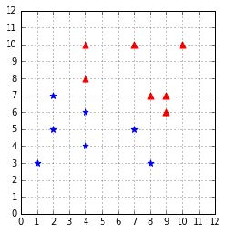
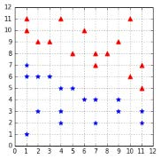

## 附录A：数据集

### 线性可分数据集

下面的代码用于加载本书大多数章节中使用的简单线性可分数据集。你可以在[这里](https://bitbucket.org/syncfusiontech/svm-succinctly)中找到本书中使用的其他数据集的源代码。



*图60：训练集*



*图61：测试集*

当如代码清单51所示导入模块时，它会加载代码52所示的方法。

方法`get_training_examples`返回图59所示的数据，而方法`get_test_examples`返回图60所示的数据。

方法`get_training_examples`返回图60所示的数据，而方法`get_test_examples`返回图61所示的数据。

*代码51*

```python
from succinctly.datasets import *
```

*代码52*

```python
import numpy as np 
def get_training_examples(): 
    X1 = np.array([[8, 7], [4, 10], [9, 7], [7, 10], [9, 6], [4, 8], [10, 10]])
    y1 = np.ones(len(X1)) 
    X2 = np.array([[2, 7], [8, 3], [7, 5], [4, 4], [4, 6], [1, 3], [2, 5]]) 
    y2 = np.ones(len(X2)) * -1 
    return X1, y1, X2, y2 
    
def get_test_examples(): 
    X1 = np.array([[2, 9], [1, 10], [1, 11], [3, 9], [11, 5], [10, 6], [10, 11], [7, 8], [8, 8], [4, 11], [9, 9], [7, 7], [11, 7], [5, 8], [6, 10]]) 
    X2 = np.array([[11, 2], [11, 3], [1, 7], [5, 5], [6, 4], [9, 4],[2, 6], [9, 3], [7, 4], [7, 2], [4, 5], [3, 6], [1, 6], [2, 3], [1, 1], [4, 2], [4, 3]])
    y1 = np.ones(len(X1)) 
    y2 = np.ones(len(X2)) * -1 
    return X1, y1, X2, y2

```

代码53展示了这段代码的典型用法。它使用代码54中的`get_dataset`方法，该方法和`datasets`包一起加载。

*代码53*

```python
from succinctly.datasets import get_dataset, linearly_separable as ls 

# Get the training examples of the linearly separable dataset. 
X, y = get_dataset(ls.get_training_examples)
```

*代码54*

```python
import numpy as np 
def get_dataset(get_examples): 
    X1, y1, X2, y2 = get_examples() 
    X, y = get_dataset_for(X1, y1, X2, y2) 
    return X, y 
    
def get_dataset_for(X1, y1, X2, y2): 
    X = np.vstack((X1, X2)) 
    y = np.hstack((y1, y2)) 
    return X, y 
    
def get_generated_dataset(get_examples, n): 
    X1, y1, X2, y2 = get_examples(n) 
    X, y = get_dataset_for(X1, y1, X2, y2) 
    return X, y
```
