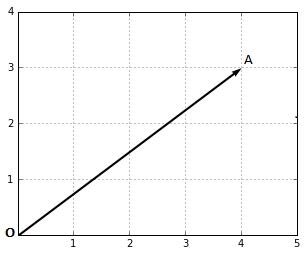
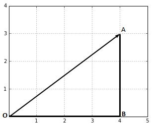
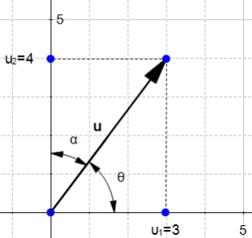
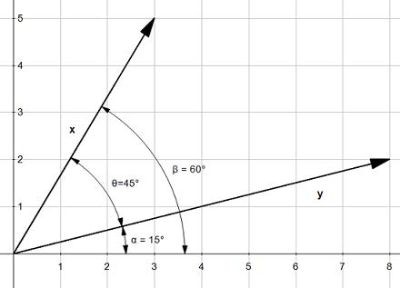
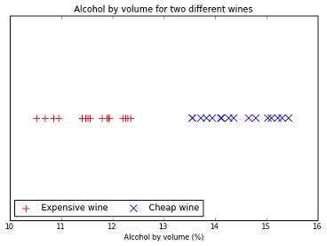
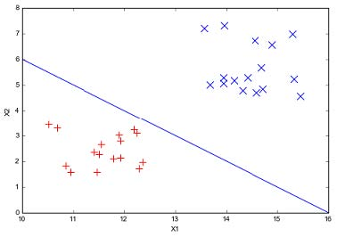
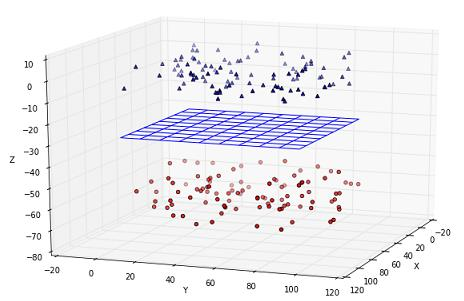
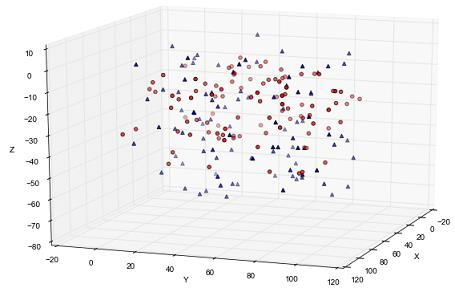

## 预备知识

本章介绍了一些为了更好地理解支持向量机需要了解的基础知识。我们将首先了解向量是什么，并研究它们的一些关键性质。然后，我们将学习数据线性可分的含义，然后引入一个关键组件:超平面。

### 向量(Vectors)

在支持向量机中，有**向量**这个词。为了理解支持向量机和如何使用支持向量机，了解向量的一些基础知识是很重要的。

####　什么是向量

向量是一种可以用箭头表示的数学对象（图1）



*图1：向量的表示方法*

当我们进行计算时，我们用它的端点(箭头尖端所在的点)的坐标来表示一个向量。在图1中，点A的坐标为(4,3)。我们可以写作：
$$
\vec{OA} = (4,3)
$$
如果愿意，可以给向量起另一个名字，如$\mathbf{a}$。
$$
\mathbf{a} = (4,3)
$$
从这一点出发，人们可能会认为向量是由它的坐标来定义的。但是，如果我给你一张只有一条水平线的纸，让你画出与图1中相同的矢量，你仍然可以这么做。

你只需要两条信息:

* 向量的长度是多少？
* 向量与水平方向的夹角是多少？

这就引出了向量的以下定义:

**向量**是既有大小又有方向的东西

让我们仔细看看组成向量的两个要素

#### 向量的大小

向量$\mathbf{x}$的大小（或者说长度）写作$||x||$，也称为向量的**模**



*图2：这个向量的大小就是线段OA的长度*

在图2中，我们可以利用勾股定理计算出向量$\vec{OA}$的大小$||OA||$：
$$
OA^2 = OB^2+AB^2 \\
OA^2=4^2+3^2 \\
OA^2=25 \\
OA=\sqrt{25} \\
||OA||=OA=5
$$
一般来说，我们用欧几里德范数公式来计算向量$x=(x_1,\cdots,x_n)$的模：
$$
||x||:= \sqrt{x_1^2+\cdots+x_n^2}
$$
在Python中，可以通过调用numpy模块提供的norm函数轻松地计算模，如代码1所示。

*代码1*

```python
import numpy as np 
x = [3,4] 
np.linalg.norm(x) # 5.0
```

#### 向量的方向

方向是向量的第二个分量。根据定义，它是一个新向量，它的坐标是向量的初始坐标除以它的模。

向量$\mathbf{u}=(u_1,u_2)$的方向是一个新的向量$\mathbf{w}$:
$$
\mathbf{w} = (\frac{u_1}{||u||},\frac{u_2}{||u||})
$$
可以使用代码2中的代码在Python中计算它。

*代码2*

```python
import numpy as np 
# Compute the direction of a vector x. 
def direction(x): 
    return x/np.linalg.norm(x)
```

它是利用几何学得来的，图3显示了向量$\mathbf{u}$与水平轴和垂直轴的夹角。$\theta$是向量$\mathbf{u}$与水平轴的夹角，$\alpha$是$\mathbf{u}$与垂直轴的夹角。



*图3：向量$\mathbf{u}$与轴的夹角*

使用初等几何，我们可以看到$\cos(\theta)=\frac{u_1}{||u||}, \cos(\alpha)=\frac{u_2}{||u||}$。这意味着$\mathbf{w}$也可以被定义为：
$$
\mathbf{w} = (\frac{u_1}{||u||},\frac{u_2}{||u||}) = (\cos(\theta),\cos(\alpha))
$$

$\mathbf{w}$的坐标由余弦函数定义。因此，如果$\mathbf{u}$与轴之间的夹角发生变化，$\mathbf{u}$的方向$\mathbf{w}$也会发生变化。这就是为什么我们称这个向量为$\mathbf{u}$的方向。我们可以计算$\mathbf{w}$(代码3)的值，并发现其坐标为$(0.6,0.8)$

*代码3*

```python
u = np.array([3,4]) 
w = direction(u) 
print(w) # [0.6 , 0.8]
```

值得注意的是，如果两个向量具有相同的方向，那么它们将具有相同的方向向量(代码4)。

*代码4*

```python
u_1 = np.array([3,4]) 
u_2 = np.array([30,40]) 
print(direction(u_1)) # [0.6 , 0.8] 
print(direction(u_2)) # [0.6 , 0.8]
```

此外，**方向向量的模永远是1**。我们可以用向量$\mathbf{w}=(0.6,0.8)$验证一下(代码5)。

*代码5*

```python
np.linalg.norm(np.array([0.6, 0.8])) # 1.0
```

这是有意义的，因为这个向量的唯一目标是描述其他向量的方向——通过模为1，它尽可能地保持简单。因此，像这样的方向向量通常称为**单位向量**。

#### 向量的维度
请注意，数字的书写顺序很重要。因此，我们说一个$n$维向量是$n$个实数的元组。

例如，$\mathbf{w}=(0.6,0.8)$是一个二维向量，我们常写作$\mathbf{w} \in \mathbb{R}^2$。同样的，向量$\mathbf{u}=(5,3,2)$是一个三维向量，且$\mathbf{u} \in \mathbb{R}^3$。

#### 点积

点积(点乘)是对两个向量进行的一种运算，它的结果是一个数。数有时被称为**标量**；这就是点积被称为**标量积**的原因。

人们经常在点积问题上遇到麻烦，因为它似乎是凭空出现的。重要的是，它是对两个向量执行的操作，它的结果使我们对这两个向量之间的关系有了一些了解。有两种方法来定义点积:几何和代数。

#### 点积的几何定义
几何上，点积是两个向量的欧几里得模的乘积与它们夹角的余弦值。


*图4：向量x和向量y*

这意味着如果有两个向量$\mathbf{x},\mathbf{y}$，并且它们之间的夹角是$\theta$ （图4），它们的点积为：
$$
\mathbf{x} \cdot \mathbf{y} = \|x\| \|y\| \cos(\theta)
$$
通过这个公式，我们可以看到点积受到角度的影响:

* $\theta=0^{\circ}$时，$\cos(\theta)=1$，有$\mathbf{x} \cdot \mathbf{y} = \|x\| \|y\|$

* $\theta=90^{\circ}$时，$\cos(\theta)=0$，有$\mathbf{x} \cdot \mathbf{y} = 0$

* $\theta=0^{\circ}$时，$\cos(\theta)=-1$，有$\mathbf{x} \cdot \mathbf{y} =- \|x\| \|y\|$

记住这一点，当我们学习感知器学习算法时，它会很有用。

我们可以使用这个定义编写一个简单的Python函数来计算点积(代码6)，并使用它来获得图4(代码清单7)中的点积的值。

*代码6*

```python
import math 
import numpy as np 
def geometric_dot_product(x,y, theta): 
    x_norm = np.linalg.norm(x) 
    y_norm = np.linalg.norm(y) 
    return x_norm * y_norm * math.cos(math.radians(theta))
```

但是，我们需要知道$\theta$的值才能计算点积

*代码7*

```python
theta = 45 
x = [3,5] 
y = [8,2] 
print(geometric_dot_product(x,y,theta)) # 34.0
```

#### 点积的代数定义



*图5：用这三个角可以简化点积*

在图5中，我们可以看到三个角$\theta,\beta,\alpha$之间的关系:
$$
\theta=\beta-\alpha
$$

这意味着计算$\cos(\theta)$相当于计算$\cos(\beta-\alpha)$

利用余弦的差分恒等式，我们得到：
$$
\cos(\theta)=\cos(\beta-\alpha) = \cos(\beta)\cos(\alpha)+\sin(\beta)\sin(\alpha) \\
\cos(\theta) = \frac{x_1}{\|x\|}\frac{y_1}{\|y\|} + \frac{x_2}{\|x\|}\frac{y_2}{\|y\|} \\
\cos(\theta) = \frac{x_1y_1+x_2y_2}{\|x\|\|y\|}
$$

两边同时乘以$\|x\|\|y\|$，得到:
$$
\|x\|\|y\|\cos(\theta) = x_1y_1+x_2y_2
$$

已知：
$$
\|x\|\|y\|\cos(\theta) = \mathbf{x}\cdot\mathbf{y}
$$

则易得：
$$
\mathbf{x}\cdot\mathbf{y} = x_1y_1+x_2y_2
$$
或者可以写成：
$$
\mathbf{x}\cdot\mathbf{y} = \sum_{i=1}^2(x_i y_i)
$$

对于$n$维向量，我们可以这样写：
$$
\mathbf{x}\cdot\mathbf{y} = \sum_{i=1}^n(x_i y_i)
$$

这个公式是点积的**代数定义**。

*代码8*

```python
def dot_product(x,y): 
    result = 0 
    for i in range(len(x)): 
        result = result + x[i]*y[i] 
    return result

```
这个定义的好处是我们不需要知道角度来计算点积。我们可以编写一个函数来计算它的值(代码8)，并得到与几何定义相同的结果(代码9)。


*代码9*

```python
x = [3,5]
y = [8,2] 
print(dot_product(x,y)) # 34

```
当然，我们也可以使用numpy提供的函数(代码10)。

*代码10*

```python
import numpy as np 
x = np.array([3,5]) 
y = np.array([8,2]) 
print(np.dot(x,y)) # 34

```
我们花了很多时间来理解点积是什么以及它是如何计算的。这是因为点积是一个你应该熟悉的基本概念为了弄清楚支持向量机的情况。现在我们将看到另一个重要的方面，线性可分性。

### 了解线性可分性

在这一节中，我们将用一个简单的例子来介绍线性可分性。

#### 线性可分的数据
假设你是一位葡萄酒生产商。你销售的葡萄酒来自两个不同的批次:

* 高端葡萄酒售价145美元一瓶。
* 普通葡萄酒售价8美元一瓶。

最近，你开始收到客户的投诉，他们买了一瓶昂贵的酒。他们声称瓶子里装的是廉价酒。这对你的公司造成了很大的声誉损失，顾客也不再买你的酒了。

#### 用酒精浓度来区分葡萄酒

你决定找到一种方法来区分这两种酒。你知道其中一个比另一个含有更多的酒精，所以你打开几个瓶子，测量酒精浓度，并在图上画出。



*图6：一个线性可分数据的例子*

在图6中，您可以清楚地看到，昂贵的葡萄酒比便宜的酒含有更少的酒精。事实上，您可以找到将数据分成两组的点。这个数据被称为线性可分的。现在，你决定在装一瓶昂贵的酒之前自动测量酒的酒精浓度。如果它大于13%，生产链停止，你的一个员工必须进行检查。这一改进极大地减少了投诉，您的业务再次繁荣。

这个例子太简单了——在现实中，数据很少像这样工作。事实上，一些科学家确实测量过葡萄酒中的酒精浓度，他们得到的图表如图7所示。这是一个非线性可分数据的例子。即使大多数时候数据不是线性可分的，很好地理解线性可分性是很基本的。在大多数情况下，我们会从线性可分的情况开始(因为它比较简单)，然后推导不可分的情况。


*图7：从真实数据集绘制的酒精浓度图*

类似地，在大多数问题中，我们不会只处理一个维度，如图6所示。现实生活中的问题比这个例子更具挑战性，其中一些问题可以有数千个维度，这使得处理这些问题更加抽象。然而，它的抽象性并没有使其更加复杂。本书中的大多数例子都是二维的。它们足够简单，很容易被可视化，我们可以在它们上面做一些基本的几何，这将让你理解支持向量机的基本原理。

在图6的示例中，只有一个维度:也就是说，每个数据点都由一个数字表示。当有更多维度时，我们将使用向量来表示每个数据点。每当我们添加一个维度时，我们用来分离数据的对象就会发生变化。实际上，虽然我们可以用图6中的一个点来分离数据，但一旦进入二维空间，我们就需要一条线(一组点)，而在三维空间中，我们需要一个平面(也是一组点)。

综上所述，数据在以下情况下是线性可分的:

* 在一维中，您可以找到一个点来分离数据(图6)。
* 在二维中，您可以找到一条线来分离数据(图8)。
* 在三维中，您可以找到一个平面来分离数据(图9)。



*图8：被线分割的数据*



*图9：被平面分割的数据*

类似地，当数据是非线性可分的时，我们无法找到一个分离点、线或平面。图10和图11显示了二维和三维线性不可分数据的例子。


*图10：二维中线性不可分的数据*



*图11：三维中线性不可分的数据*

### 超平面

当数据超过三个维度时，我们用什么来分离数据呢?我们用的是**超平面**。

#### 什么是超平面

在几何中，超平面是比其所在空间小一维的子空间。

这个定义虽然是正确的，但并不十分直观。现在不用理会它，我们将通过首先学习直线来理解超平面是什么。

如果你还记得学校里学过的数学，你可能学过直线有这样一个方程$y=ax+b$，这个常数$a$就是斜率，$b$是它与y轴相交的截距。这个公式有几个成立的值$x$，我们说解的集合是一条直线。

经常令人困惑的是，如果你在微积分课程中学习函数$f(x) = ax+b$，你就了解了一个单变量函数。

但是，需要注意的是，线性方程$y=ax+b$有两个变量，分别是$x$和$y$，我们可以随意命名它们。

例如，我们可以把$y$重命名$x2$，$x$重命名$x1$，等式变成:$x_2=ax_1+b$。

这和$ax_1-x_2+b=0$是等价的。

如果定义二维向量$\mathbf{x}=(x_1,x_2)$和$\mathbf{w}=(a,-1$，则得到直线方程的另一种表示形式(其中$\mathbf{w}\cdot\mathbf{x}$为$\mathbf{w}$和$\mathbf{x}$的点积):
$$
\mathbf{w}\cdot\mathbf{x} + b =0
$$

最后一个方程的优点是它使用了向量。即使我们用二维向量来推导它，它也适用于任何维度的向量。实际上，它就是超平面的方程。

从这个方程，我们可以对超平面有另一个认识:它是满足条件$\mathbf{w}\cdot\mathbf{x} + b =0$的点的集合。这个定义的本质是**超平面是点的集合**。

如果我们能够从直线方程推导出超平面方程，那是因为直线是超平面。你可以通过阅读超平面的定义来说服自己。你会注意到，实际上，一条线是一个二维空间，被一个三维平面包围着。类似地，点和面也是超平面。

#### 理解超平面方程
我们从直线方程推导出超平面方程。相反的做法很有趣，因为它更清楚地显示了两者之间的关系。

给定向量$\mathbf{w}=(w_0,w_1),\mathbf{x}=(x,y)$和$b$，我们可以用这个方程来定义超平面：
$$
\mathbf{w}\cdot\mathbf{x} + b =0
$$

这等价于：
$$
w_0 x +w_1 y+b =0 \\
w_1 y=-w_0 x-b
$$

把$y$放到等式的一边，有：
$$
y = -\frac{w_0}{w_1}x-\frac{b}{w_1}
$$

如果令$a=-\frac{w_0}{w_1},c=-\frac{b}{w_1}$，则得到：
$$
y=ax+c
$$

我们看到当$w_1=-1$时，直线方程的偏移量$c$只等于超平面方程的偏移量$b$。因此，当您看到超平面的图时，如果与垂直轴的交点不是$b$，您不应该感到惊讶(这将是我们下一个示例中的情况)。而且，如果$w_0$和$w_1$的符号相同，斜率为负。

#### 使用超平面对数据进行分类


*图12：线性可分的数据集*

考虑到图12中线性可分的数据，我们可以使用一个超平面来进行二分类。

例如，对于向量$\mathbf{w}=(0.4,1.0)$和$b=-9$，我们得到图13中的超平面。


*图13：被超平面分割的数据*

我们将每个向量$\mathbf{x}_i$与一个标签$y_i$关联起来，标签只有两个取值$+1,-1$(分别是图13中的三角形和星形)。

我们定义一个假设函数$h$:
$$
h(\mathbf{x}_i) = 
\begin{cases}
+1 & \text{if} \quad \mathbf{w}\cdot\mathbf{x}_i+b \geq 0 \\
-1 & \text{if} \quad \mathbf{w}\cdot\mathbf{x}_i+b < 0 \\

\end{cases}
$$

这等价于：
$$
h(\mathbf{x}_i) = sign(\mathbf{w}\cdot\mathbf{x}_i+b)
$$

它利用超平面与$\mathbf{x}$的位置来预测$\mathbf{x}$标签的值$y$。超平面一边的每个数据点将被分配一个标签，另一边的每个数据点将被分配另一个标签。

例如，对向量$\mathbf{x}=(8,7)$来说，$\mathbf{x}=(8,7)$在超平面的上面。当我们计算的时候，我们得到$\mathbf{w}\cdot\mathbf{x}+b = 0.4\times 8+1\times 7 -9=1.2$，其结果是正的，所以$h(x)=+1$。

同样地，$\mathbf{x}=(1,3)$在超平面下面，因为$\mathbf{w}\cdot\mathbf{x}+b = 0.4\times 1+1\times 3 -9=-5.6$,所以$h$的计算结果为$-1$

因为函数$h$超平面方程，它是值的线性组合，被称为**线性分类器**。

还有一个技巧，我们可以通过去掉b常数使公式$h$变得更简单。首先，我们往向量$\mathbf{x}_i=(x_1,x_2,\cdots,x_n)$添加一个分量$x_0=1$。我们得到了这个向量$\mathbf{\hat{x}}_i=(x_0,x_1,x_2,\cdots,x_n)$(它读作“$\mathbf{x}_i$ hat”，因为我们给它戴上了帽子)。类似地，我们向向量$\mathbf{w}_i=(w_1,w_2,\cdots,w_n)$添加一个分量$w_0=b$，它变成$\mathbf{\hat{w}}_i=(w_0,w_1,w_2,\cdots,w_n)$。

备注:在本书的其余部分中，我们将把一个向其添加人工坐标的向量称为**增广向量**

当我们使用增广向量时，假设函数为:
$$
h(\mathbf{\hat{x}}_i) = sign(\mathbf{\hat{w}}\cdot\mathbf{\hat{x}}_i)
$$

如果我们有一个超平面来分离数据集，如图13所示，通过使用假设函数，我们能够完美地预测每个点的标签。主要的问题是:我们如何找到这样的超平面?

#### 如何找到超平面(是否分离数据)?

回忆一下超平面方程的增广形式$\mathbf{w}\cdot\mathbf{x}=0$。重要的是要理解影响超平面形状的唯一值是$\mathbf{w}$。为了让你们相信，我们可以回到二维的情况，当时超平面只是一条直线。当我们创建增广的三维向量时，我们得到$\mathbf{x}=(x_0,x_1,x_2)$和$\mathbf{w}=(b,a,-1)$。可以看到，向量$\mathbf{w}$同时包含$a$和$b$，这是定义直线的两个主要要素。更改$\mathbf{w}$的值会给我们带来不同的超平面(线)，如图14所示。


*图14：不同的$\mathbf{w}$值会得到不同的超平面*

### 总结

在介绍了向量和线性可分性之后，我们学习了什么是超平面，以及如何使用它对数据进行分类。然后我们看到，学习算法的目标是找到一个分离数据的超平面。最终，我们发现寻找超平面等同于寻找向量$\mathbf{w}$。

现在我们将研究学习算法使用哪些方法来找到分离数据的超平面。在研究支持向量机是如何做到这一点之前，我们先来看看一个最简单的学习模型:感知机。