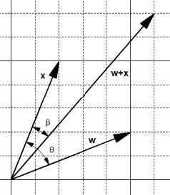
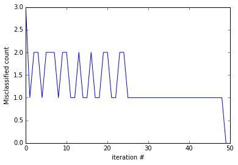
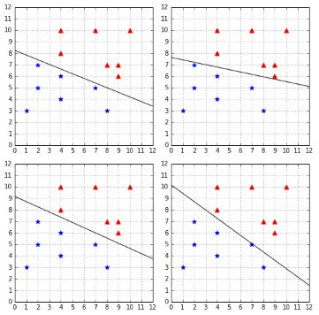

## 感知机

### Presentation

感知机是Frank Rosenblatt在1957年发明的一种算法，比支持向量机早了几年。它广为人知是因为它是一个简单神经网络的组成部分:多层感知机。感知机的目标是找到一个可以分离线性可分数据集的超平面。一旦找到超平面，就用它来进行二分类。

给定增广向量$\mathbf{x}=(x_0,x_1,\cdots,x_n)$和$\mathbf{w}=(w_0,w_1,\cdots,w_n)$，感知机使用我们在前一章中看到的相同的假设函数对数据点$\mathbf{x}_i$进行分类:
$$
h(\mathbf{x}_i) = sign(\mathbf{w}\cdot\mathbf{x}_i)
$$

译者注：之后翻译中的所有“假设”或者是“假设函数”都可以认为是上面那个公式。~~（我实在不知道咋翻译这个词）~~

### 感知机学习算法

给定$m$个$n$维的训练数据集$\mathcal{D}$，每个训练样本表示为$(\mathbf{x}_i,y_i)$，感知机学习算法(Perceptron Learning Algorithm,PLA)的目的是找到一个假设函数$h$，使其可以正确预测每一个样本$\mathbf{x}_i$的标签值$y_i$。

感知机的假设函数是$h(\mathbf{x}_i) = sign(\mathbf{w}\cdot\mathbf{x}_i)$，我们看到$\mathbf{w}\cdot\mathbf{x}$是超平面的方程。然后我们可以说，假设函数的集合$\mathcal{H}$是$n-1$维超平面的集合(因为一个超平面比它的所在空间小一维)。

这里重要的是要理解唯一未知的值$\mathbf{w}$。这意味着算法的目标是找到一个值$\mathbf{w}$。你只要找到$\mathbf{w}$，你就有了一个超平面。因为$\mathbf{w}$的取值是无限的，所以有无数个超平面，也就有无数的假设函数。

这个可以写成更正式的形式:

给定一个训练集：$\mathcal{D}=\left\{(\mathbf{x}_i,y_i)\mid \mathbf{x}_i \in \mathbb{R}^n,y_i \in \{+1,-1\}  \right\}_{i=1}^m$和假设函数的集合$\mathcal{H}$。找到一个$h \in \mathcal{H}$，使得对于每一个$\mathbf{x}_i$都有$h(\mathbf{x}_i)=y_i$

这也等价于：

给定一个训练集：$\mathcal{D}=\left\{(\mathbf{x}_i,y_i)\mid \mathbf{x}_i \in \mathbb{R}^n,y_i \in \{+1,-1\}  \right\}_{i=1}^m$和假设函数的集合$\mathcal{H}$。找到一个$\mathbf{w}=(w_0,w_1,\cdots,w_n)$，使得对于每一个$\mathbf{x}_i$都有$sign(\mathbf{w} \cdot \mathbf{x}_i)=y_i$


PLA是一个非常简单的算法，给出如下总结:

1. 从一个随机的超平面(由$\mathbf{w}$向量定义)开始，并使用它对数据进行分类。
2. 选择一个错误分类的例子，通过更新的值来选择另一个超平面，希望它能更好地对这个例子进行分类(这称为**更新规则**)。
3. 用新的超平面对数据进行分类
4. 重复步骤2，3直到没有错误分类的例子

一旦过程结束，就有了一个分隔数据的超平面。

该算法如代码11所示。

*代码11*

```python
import numpy as np 
def perceptron_learning_algorithm(X, y): 
    w = np.random.rand(3) # can also be initialized at zero. 
    misclassified_examples = predict(hypothesis, X, y, w) 
    while misclassified_examples.any(): 
        x, expected_y = pick_one_from(misclassified_examples, X, y) 
        w = w + x * expected_y # update rule 
        misclassified_examples = predict(hypothesis, X, y, w) 
    return w
```

让我们仔细看一下代码。

`perceptron_learning_algorithm`使用几个函数(代码12)。`hypothesis`函数是假设函数$h(x)$，它根据$\mathbf{w}$所定义的超平面返回样本$\mathbf{x}_i$的预测值$y_i$。`predict`函数计算每个样本的假设值（$h(x)$），并返回错误分类的样本。

*代码12*

```python
def hypothesis(x, w): 
    return np.sign(np.dot(w, x)) 
# Make predictions on all data points 
# and return the ones that are misclassified. 
def predict(hypothesis_function, X, y, w): 
    predictions = np.apply_along_axis(hypothesis_function, 1, X, w) 
    misclassified = X[y != predictions] 
    return misclassified
```

一旦我们用`predict`进行了预测，我们就知道哪些示例是错误分类的，因此我们使用函数pick_one_from随机选择其中一个示例(代码13)。


*代码13*

```python
# Pick one misclassified example randomly
# and return it with its expected label. 
def pick_one_from(misclassified_examples, X, y): 
    np.random.shuffle(misclassified_examples) 
    x = misclassified_examples[0] 
    index = np.where(np.all(X == x, axis=1)) 
    return x, y[index]
```

然后是算法的核心:更新规则。现在，只要记住它改变了$\mathbf{w}$。为什么这样做，稍后将详细解释。我们再次使用预测函数，但这一次，我们要将$\mathbf{w}$更新。它允许我们查看我们是否对所有数据点进行了正确的分类，或者我们是否需要重复这个过程直到所有数据点都正确分类。

代码14演示了如何将`perceptron_learning_algorithm`函数用于一个玩具数据集。注意，向量$\mathbf{w}$和向量$\mathbf{x}$必须具有相同的维数，因此在将每个向量赋给函数之前，我们将$\mathbf{x}$转换为增广向量。

*代码14*

```python
# See Appendix A for more information about the dataset 
from succinctly.datasets import get_dataset, linearly_separable as ls 

np.random.seed(88)

X, y = get_dataset(ls.get_training_examples) 

# transform X into an array of augmented vectors.
X_augmented = np.c_[np.ones(X.shape[0]), X] 

w = perceptron_learning_algorithm(X_augmented, y) 

print(w) # [-44.35244895 1.50714969 5.52834138]
```

#### 理解更新规则

为什么要使用这个更新规则呢？回想一下，我们随机选择了一个错误分类的例子。现在我们想让感知机正确地分类这个例子。为此，我们决定更新向量$\mathbf{w}$。这里的想法很简单。由于$\mathbf{w}$和$\mathbf{x}$点积结果的符号是不正确的，通过改变它们之间的角度，我们可以使它正确：

* 如果预测的标签是+1，$\mathbf{w}$和$\mathbf{x}$之间的夹角小于$90^{\circ}$，我们就要增加它。
* 如果预测的标签是-1，$\mathbf{w}$和$\mathbf{x}$之间的夹角大于$90^{\circ}$，我们就要减少它。


*图15:两个向量*

$\mathbf{w}$和$\mathbf{x}$之间有一个夹角$\theta$(图15)。

将两个向量相加会得到一个新向量$\mathbf{w}+\mathbf{x}$，这个新向量与$\mathbf{x}$的夹角$\beta$会小于$\theta$（图16）。




*图16:向量相加会得到一个更小的夹角*

同样的，将两个向量相减会得到一个新向量$\mathbf{w}-\mathbf{x}$，这个新向量与$\mathbf{x}$的夹角$\beta$会大于$\theta$（图17）。


*图17:向量相减会得到一个更大的夹角*

我们可以用这两个观测值来调整角度：

* 如果预测的标签是+1，$\mathbf{w}$和$\mathbf{x}$之间的夹角小于$90^{\circ}$，我们就要利用$\mathbf{w}=\mathbf{w}-\mathbf{x}$来增加它。
* 如果预测的标签是-1，$\mathbf{w}$和$\mathbf{x}$之间的夹角小于$90^{\circ}$，我们就要利用$\mathbf{w}=\mathbf{w}+\mathbf{x}$来减少它。

因为我们只在错误分类的样本上这样做，当预测标签有值时，预期标签是相反的。这意味着我们可以重写前面的语句:

* 如果样本真实的标签是-1（也就是说我们预测成了+1），我们要扩大夹角，$\mathbf{w}=\mathbf{w}-\mathbf{x}$
* 如果样本真实的标签是+1（也就是说我们预测成了-1），我们要缩小夹角，$\mathbf{w}=\mathbf{w}+\mathbf{x}$

译者注：$h(\mathbf{x}_i)=sign(\mathbf{w} \cdot \mathbf{x}_i)$的结果完全是由$\mathbf{w}$和$\mathbf{x}_i$夹角决定的（因为我们只关心正负，不关心数字大小）。所以如果$h(\mathbf{x}_i)=+1$而$\mathbf{x}_i$的真实标签是-1，就说明原先$\mathbf{w}$与$\mathbf{x}_i$的夹角小于90（cos在0~90时为正），所以更新后的$\mathbf{w}$要扩大与$\mathbf{x}$的夹角以达到$\mathbf{w}\cdot\mathbf{x}_i<0$，即$h(\mathbf{x}_i)=sign(\mathbf{w} \cdot \mathbf{x})=-1$

用代码描述如代码15所示，其完全等价于代码16。

*代码15*

```python
def update_rule(expected_y, w, x): 
    if expected_y == 1:
        w = w + x 
    else: 
        w = w - x 
    return w
```

*代码16*

```python
def update_rule(expected_y, w, x):
    w = w + x * expected_y 
    return w
```

我们可以通过在应用更新规则前后检查预测的值来验证更新规则是否如我们所期望的那样(代码17)。


*代码17*

```python
import numpy as np 

def hypothesis(x, w): 
    return np.sign(np.dot(w, x)) 
x = np.array([1, 2, 7]) 
expected_y = -1 
w = np.array([4, 5, 3]) 

print(hypothesis(w, x)) # The predicted y is 1. 

w = update_rule(expected_y, w, x) # we apply the update rule. 

print(hypothesis(w, x)) # The predicted y is -1.
```

请注意，更新规则并不一定要在第一次更改样本的假设符号。有时，在发生更新规则之前，有必要更新几次，如代码18所示。因为我们在错误分类的样本之间循环，所以我们将一直使用更新规则，直到样本被正确分类。重要的是，每次我们更新规则时，都会在正确的方向上改变角度的值(增加或减少角度)。

*代码18*

```python
import numpy as np 

x = np.array([1,3]) 
expected_y = -1 
w = np.array([5, 3]) 

print(hypothesis(w, x)) # The predicted y is 1. 

w = update_rule(expected_y, w, x) # we apply the update rule. 

print(hypothesis(w, x)) # The predicted y is 1. 

w = update_rule(expected_y, w, x) # we apply the update rule once again.

print(hypothesis(w, x)) # The predicted y is -1.
```

还要注意的是，有时更新特定样本$\mathbf{x}$的值会改变$\mathbf{w}$和超平面，从而使先前正确分类的样本变成错误分类。所以，在更新后，假设的分类能力可能会变差。这在图18中得到了说明，它向我们展示了在每个迭代步骤中错误分类的例子的数量。避免此问题的一种方法是在进行更新之前记录$\mathbf{w}$的值，并仅在更新减少错误分类样本的数量时使用更新的$\mathbf{w}$值。PLA的这种修改被称为口袋算法(Pocket algorithm)



*图18：PLA更新规则振荡*

#### 算法收敛性

我们说过，我们一直用更新规则更新向量$\mathbf{w}$，直到没有错误分类点。但我们怎么能如此确定这真的会发生呢?幸运的是,数学家们研究过这个问题,我们可以非常确定,因为感知机收敛定理保证如果两组P和N(正样本和负样本)是线性可分的,向量$\mathbf{w}$的更新次数是有限的,Novikoff在1963年首次证明了这一点(Rojas, 1996)。


#### 理解感知机的局限性

关于PLA算法需要了解的一点是，因为向量$\mathbf{w}$是随机初始化的，错误分类的样本是随机选择的，所以每次我们运行算法时，可能会返回一个不同的超平面。图19显示了在同一数据集上运行PLA四次的结果。如你所见，PLA得到了四个不同的超平面。



*图19：PLA每次得到的超平面都不同*

一开始，这似乎不是什么问题。毕竟，这四个超平面对数据进行了完美的分类，所以它们可能同样优秀，对吧?然而，当使用像PLA这样的机器学习算法时，我们的目标不是找到一种方法来完美地分类我们现在拥有的数据。我们的目标是找到一种方法来正确分类新数据。

让我们介绍一些术语来明确这一点。为了训练一个模型，我们从现有数据中选取一个**样本**，并将其称为**训练集**。我们训练模型，它会得到一个**假设**(在我们的例子中是一个超平面)。我们可以测量假设在训练集上的表现如何:我们称之为**样本内误差**(也称为训练误差)。一旦我们对假设感到满意，我们就决定将其用于新的数据(**测试集**)，看看它是否确实学到一些东西。我们测量假设在测试集中表现如何，我们称之为**样本外误差**(也称为泛化误差)。


#### 我们的目标是样本外误差最小

在PLA的例子中，图19中的所有假设都对数据进行了完美分类:它们的样本内误差为零。但我们真正关心的是样本外误差。我们可以使用图20中所示的测试集来检查它们的样本外错误。


*图20：测试集*

正如您在图21中所看到的，右边的两个假设，尽管对训练数据集进行了完美的分类，但在测试数据集上却出现了错误。

现在我们更好地理解了为什么它是有问题的。当对线性可分数据集使用感知机时，我们可以保证找到一个样本内误差为零的假设，但我们不能保证它能多好地泛化到新的数据(如果一个算法泛化得很好，它的样本外误差将接近样本内误差)。我们如何选择一个泛化良好的超平面?我们将在下一章中看到，这是支持向量机的目标之一。


*图21：并不是所有的假设都有完美的样本外误差*

### 总结

在本章中，我们学习了感知机是什么。然后我们看到了感知机学习算法是如何工作的，以及更新规则背后的动机是什么。在学习了PLA是保证收敛的之后，我们看到并不是所有的假设都是相等的，并且其中一些会比其他的更好地泛化。最后，我们发现感知机无法选择样本外误差最小的假设而只是随机选择一个样本内误差最小的假设。