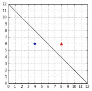

## 支持向量机优化问题

### 支持向量机搜索最优超平面

感知机有几个优点:它是一个简单的模型，算法很容易实现，我们有一个理论证明它会找到一个超平面来分离数据。但是，它最大的缺点是不能每次都找到相同的超平面。我们为什么要关心这个?因为不是所有分离的超平面都是相等的。如果感知机给你一个超平面它非常接近一个类的所有数据点，你有权利相信它在给出新数据时泛化效果很差。

支持向量机(Support Vector Machines,SVM)没有这个问题。事实上，SVM不是寻找超平面，而是试图得到超平面。我们称它为**最优超平面**，我们说它是最能分离数据的超平面。

### 怎么比较两个超平面
因为我们不能根据感觉来选择最优的超平面，我们需要某种评价标准来允许我们比较两个超平面，并说哪一个比其他所有超平面都好。

在本节中，我们将尝试了解如何比较两个超平面。换句话说，我们将寻找一种计算的方法，让我们知道哪个超平面分割数据的效果最好。我们将着眼于看似有效的方法，但随后我们将看到为什么它们不起作用，以及我们如何纠正它们的局限性。让我们只用超平面的方程来比较两个超平面。

#### 利用超平面方程

给定一个样本$(\mathbf{x},y)$和一个超平面，我们想知道这个样本和超平面间有什么关系。

我们已经知道的一个关键元素是如果的值$\mathbf{x}$满足直线方程，那么就表示它在直线上。超平面也类似，对于由向量$\mathbf{w}$和偏移量$b$定义的超平面，如果点$\mathbf{x}$在超平面上，则$\mathbf{w} \cdot \mathbf{x} + b = 0$

但是如果点不在超平面上呢？

让我们看看图22的例子。在图22中直线由$\mathbf{w}=(-0.4,-1)$和$b=9$定义，当我们用超平面方程时：

* 对于点A(1,3)，用向量$\mathbf{a}=(1,3)$，可以得到$\mathbf{w}\cdot\mathbf{a}+b=5.6$
* 对于点B(3,5)，用向量$\mathbf{b}=(3,5)$，可以得到$\mathbf{w}\cdot\mathbf{b}+b=2.8$
* 对于点A(5,7)，用向量$\mathbf{c}=(5,7)$，可以得到$\mathbf{w}\cdot\mathbf{c}+b=0$


*图22：A在方程中得到的结果比B大*

正如你所看到的，当点不在超平面上时我们得到一个不等于0的数。事实上，离超平面越远，得到的数值越大。

另一件需要注意的事情是，方程返回的数字的符号告诉我们这个点相对于直线的位置。利用图23所示的直线方程，我们得到:

* 点A(3,5)得到的是2.8
* 点B(5,7)得到的是0
* 点C(7,9)得到的是-2.8


*图23：这个方程对C返回负数*

如果方程返回一个正数，则该点在这条线的下面，如果它是一个负数，则该点在这条线的上面。注意，在视觉上它并不一定在上面或下面，因为如果您有一条像图24中那样的线，它将在左边或右边，但应用相同的逻辑。超平面方程返回的数字的符号可以让我们判断两点是否在同一侧。事实上，这正是我们在第二章中定义的假设函数的作用。


*图24：一条线可以以不同的方式分隔空间*

现在我们有了比较两个超平面的方法。


给定一个训练样本$(\mathbf{x},y)$和一个由向量$\mathbf{w}$和偏移量$b$定义的超平面，我们计算$\beta=\mathbf{w}\cdot\mathbf{x}+b$来知道点到超平面有多远。

给定一个数据集$\mathcal{D}=\left\{(\mathbf{x}_i,y_i)\mid \mathbf{x}_i \in \mathbb{R}^n,y_i \in \{+1,-1\}  \right\}_{i=1}^m$，我们对每个样本计算它的$\beta$值，并记$B$是所有$\beta$中最小的值：
$$
B = \min_{i=1\dots m}\beta_i
$$

如果我们需要在两个超平面之间进行选择，我们将选择其中$B$最大的一个。

要清楚的是，这意味着如果我们有$k$个超平面，我们将计算$B_i (i=1\dots k)$并选择其中$B$最大的超平面。

#### 负样本存在问题

不幸的是，利用超平面方程的结果有其局限性。问题是，取最小值对负值的样本(即方程返回负值的样本)是行不通的。

记住，我们总是希望取离超平面最近的点的$\beta$。用正样本来计算$\beta$实际上是没问题 的。如果有两个点的$\beta$分别为$\beta=+5,\beta=+1$，我们会选择较小的那个，也就是$+1$。但是，如果两个值分别为$\beta=-5,\beta=-1$，根据规则会选择$-5$，因为$-5<-1$，实际情况是$\beta=-1$的点会更靠近超平面。


解决这个问题的一种方法是使用的绝对值。

给定一个数据集$\mathcal{D}$，我们对每个样本计算它的$\beta$值，并记$B$是所有$\beta$中绝对值最小的值：
$$
B = \min_{i=1\dots m}|\beta_i|
$$

#### 超平面是否正确分类数据?

计算$B$可以让我们选择一个超平面。但是，如果只使用这个值，我们可能会选择一个错误的超平面。考虑图25中的情况:样本被**正确分类**，使用最后一个公式计算的$B$值为2。




*图25：超平面正确分类了数据*

在图26中，样本分类不正确，但其$B$的值也是2。这是有问题的，因为我们不知道哪个超平面更好。理论上，它们看起来一样好，但实际上，我们希望选择图25的超平面。


*图26：超平面正确错误分类了数据*

我们如何调整我们的公式来满足这个要求?

好吧，在我们的训练样本$(\mathbf{x},y)$中有一个值我们没有使用：样本的标签$y$。

如果我们往$\beta$值上乘一个$y$，就能改变它的符号，把这个新的值记作$f$：
$$
f = y \times \beta \\
f = y(\mathbf{w}\cdot \mathbf{x} + b)
$$

这样如果**样本被正确分类，则$f$的符号永远会是正号**；而如果**样本被错误分类，则$f$的符号永远会是负号**。

给定数据集$\mathcal{D}$，我们可以计算：
$$
F = \min_{i=1\dots m}f_i \\
F = \min_{i=1\dots m}y_i (\mathbf{w}\cdot\mathbf{x}+b)
$$

根据这个公式，当比较两个超平面时，我们仍然会选择其中$F$最大的一个。额外的好处是，在像图25和图26这样的特殊情况下，我们将始终选择正确分类的超平面(因为它的值将为正值，而其他超平面的值将为负值)。


在文献中，$f$被称为函数间隔;它的值可以用Python计算，如代码19所示。类似地，这个数字被称为数据集$\mathcal{D}$的函数间隔。

*代码19*

```python
# Compute the functional margin of an example (x,y) 
# with respect to a hyperplane defined by w and b. 
def example_functional_margin(w, b, x, y): 
    result = y * (np.dot(w, x) + b) 
    return result 
# Compute the functional margin of a hyperplane 
# for examples X with labels y. 
def functional_margin(w, b, X, y): 
    return np.min([example_functional_margin(w, b, x, y[i]) for i, x in enumerate(X)])
```

利用这个公式，我们发现在图25中超平面的函数间隔为+2，而在图26中超平面的函数间隔为-2。因为图25中的超平面有更大的函数间隔，所以我们选择第一个。

提示:记住，我们希望选择边界(间隔)最大的超平面


#### 标度不变性(Scale invariance)

看来这次我们找到了比较两个超平面的好方法。然而，函数间隔有一个主要的问题:不具有标度不变性。

给定一个向量$\mathbf{w}_1=(2,1)$和偏移量$b_1=5$，如果把它们乘以10，就得到$\mathbf{w}_2=(20,10)$和$b_2=50$。我们对它们进行了**重缩放（rescaled）**。

向量$\mathbf{w}_1$和$\mathbf{w}_2$代表同一个超平面，因为它们具有相同的单位向量。超平面是一个正交于向量$\mathbf{w}$的平面，它与向量的长度无关。唯一重要的是它的方向，正如我们在第一章看到的，它是由单位向量给出的。此外，当在图上跟踪超平面时，垂直轴与超平面的交点的坐标将是$0,b/w_1$，因此超平面也不会因为缩放$b$而改变。

正如我们在代码20中所看到的，问题是，当我们用$\mathbf{w}_2$计算函数间隔时，我们得到的是一个比$\mathbf{w}_1$大10倍的数字。这意味着给定任何超平面，只要缩放$\mathbf{w}$和$b$，我们总能找到一个函数间隔更大的超平面。

*代码20*

```python
x = np.array([1, 1]) 
y = 1 

b_1 = 5 
w_1 = np.array([2, 1]) 

w_2 = w_1 * 10 
b_2 = b_1 * 10 

print(example_functional_margin(w_1, b_1, x, y)) # 8 
print(example_functional_margin(w_2, b_2, x, y)) # 80
```

要解决这个问题，我们只需要做一个小小的调整。我们不用向量$\mathbf{w}$，而是用它的单位向量。为此，我们将除以它的模。用同样的方法，我们也对$b$除以$\mathbf{w}$的模使它也保持比例不变。

回想一下函数间隔的公式：$f = y(\mathbf{w}\cdot \mathbf{x} + b)$

稍微对它进行一点修改，得到一个新的数字$\gamma$：
$$
\gamma = y(\frac{\mathbf{w}}{\|w\|}\cdot \mathbf{x} + \frac{b}{\|w\|})
$$
和前面一样，给定一个数据集$\mathcal{D}$，我们计算：
$$
M = \min_{i=1\dots m} \gamma_i \\
M = \min_{i=1\dots m} y_i(\frac{\mathbf{w}}{\|w\|}\cdot \mathbf{x}_i + \frac{b}{\|w\|})
$$

这样做的好处是，不管我们选择的向量$\mathbf{w}$有多大，结果都是一样的。$\gamma$也被称为样本的**几何间隔**，而$M$则是数据集的几何间隔。代码21是其的一个Python实现。

*代码21*

```python
# Compute the geometric margin of an example (x,y) 
# with respect to a hyperplane defined by w and b. 
def example_geometric_margin(w, b, x, y): 
    norm = np.linalg.norm(w) 
    result = y * (np.dot(w/norm, x) + b/norm) 
    return result 
    
# Compute the geometric margin of a hyperplane 
# for examples X with labels y. 
def geometric_margin(w, b, X, y): 
    return np.min([example_geometric_margin(w,b, x, y[i]) for i, x in enumerate(X)])
```

我们可以验证一下几何间隔是否如我们期望的那样。代码22中，向量$\mathbf{w}_1$和它的重缩放向量$\mathbf{w}_2$都返回了同一个值。

*代码22*

```python
x = np.array([1,1]) 
y = 1 

b_1 = 5 
w_1 = np.array([2,1])

 w_2 = w_1*10 
 b_2 = b_1*10 

 print(example_geometric_margin(w_1, b_1, x, y)) # 3.577708764 
 print(example_geometric_margin(w_2, b_2, x, y)) # 3.577708764
```
它被称为几何间隔，因为我们可以用简单的几何方法验证这个公式。它给出了超平面和$\mathbf{x}$之间的距离。

在图27中，我们看到这个点$X'$是点$X$到超平面的正交投影。我们希望找到$X$和$X'$之间的距离$d$。


*图27：点$X$到超平面的几何间隔*


向量$\mathbf{k}$和向量$\mathbf{w}$有相同的方向，所以他们有一个相同的单位向量$\frac{\mathbf{w}}{\|w\|}$。我们知道$\mathbf{k}$的模是$d$，所以$\mathbf{k}$为：$\mathbf{k}=d\frac{\mathbf{w}}{\|w\|}$。

此外，我们可以看到$\mathbf{x}'=\mathbf{x}-\mathbf{k}$，所以我们把$\mathbf{k}$代入得：
$$
\mathbf{x}'=\mathbf{x}-d\frac{\mathbf{w}}{\|w\|}
$$

因为点$mathbf{x}'$是在超平面上，所以$\mathbf{x}'$满足超平面方程，故有：
$$
\mathbf{w} \cdot \mathbf{x}' +b = 0\\

\mathbf{w} \cdot (\mathbf{x} - d\frac{\mathbf{w}}{\|w\|})+b = 0\\

\mathbf{w}\cdot\mathbf{x} - d\frac{\mathbf{w}\cdot\mathbf{w}}{\|w\|}+b=0 \\

\mathbf{w}\cdot\mathbf{x} - d\frac{\|w\|^2}{\|w\|}+b=0 \\

\mathbf{w}\cdot\mathbf{x} - d\|w\| +b=0 \\

d = \frac{\mathbf{w}\cdot\mathbf{x}+b}{\|w\|}\\

d = \frac{\mathbf{w}}{\|w\|}\cdot \mathbf{x} + \frac{b}{\|w\|}


$$

最后，和前面一样，我们两边乘上$y$，以确保我们选择了一个正确分类数据的超平面，它给出了我们前面看到的几何间隔公式：
$$
\gamma = y(\frac{\mathbf{w}}{\|w\|}\cdot \mathbf{x} + \frac{b}{\|w\|})
$$


*图28：w=(-0.4,-1)和b=8的超平面*


*图29：w=(-0.4,-1)和b=8.5的超平面*

现在我们已经定义了几何间隔，让我们看看它是如何让我们比较两个超平面的。我们可以看到，与图29相比，图28中的超平面更接近蓝色星形示例，而不是红色三角形示例。因此，我们期望它的几何间隔更小。代码23使用代码21中定义的函数来计算每个超平面的几何间隔。从图29中可以看出，$\mathbf{w}=(-0.4,-1)$和$b=8.5$定义的第二个超平面的几何间隔更大$(0.64 > 0.18)$。在这两者之间，我们会选择图29这个超平面。

*代码23*

```python
# Compare two hyperplanes using the geometrical margin. 
positive_x = [[2,7],[8,3],[7,5],[4,4],[4,6],[1,3],[2,5]] 
negative_x = [[8,7],[4,10],[9,7],[7,10],[9,6],[4,8],[10,10]] 

X = np.vstack((positive_x, negative_x)) 
y = np.hstack((np.ones(len(positive_x)), -1*np.ones(len(negative_x)))) 

w = np.array([-0.4, -1]) 
b = 8 

# change the value of b 
print(geometric_margin(w, b, X, y)) # 0.185695338177 
print(geometric_margin(w, 8.5, X, y)) # 0.64993368362
```

我们看到，为了计算另一个超平面的几何间隔，我们只需要修改$\mathbf{w}$或$b$的值。我们可以试着用一个小增量来改变它，看看边际是否会变大，但这是一种随机的，它会花很多时间。我们的目标是在所有可能的超平面中为一个数据集找到最优的超平面，但是超平面有无数个。

tip:要找到最优超平面，只要找到$\mathbf{w}$和$b$的值，就可以得到最大的几何间隔。

我们怎么才能找到使几何间隔取得最大的值$\mathbf{w}$呢?幸运的是，数学家已经设计了解决这些问题的工具。为了找到$\mathbf{w}$和$b$，我们需要解决所谓的**优化问题**。在研究支持向量机的优化问题之前，让我们快速回顾一下什么是优化问题。

### 什么是优化问题

#### 无约束优化问题

优化问题的目标是最小化或最大化关于某个变量x的函数(也就是说，找到函数返回的最小或最大值的x值)。例如，求函数$f(x)=x^2$的最小值的问题是这样的:
$$
\underset{x}{\text{minimize}} \quad f(x)
$$
或者写作：
$$
\min_x \quad f(x)
$$

在这种情况下，我们可以在所有可能的值中自由搜索。我们说这个问题是不受约束的。如图30所示，函数的最小值在$x=0$处。


*图30：无约束条件下，最小值是0*


*图31：在约束为x-2=0的条件下，最小值为4*

#### 约束优化问题

##### 单等式约束
有时我们对函数本身的最小值不感兴趣，而是对满足某些约束条件时的最小值感兴趣。在这种情况下，我们通常在约束条件前面加上*subject to*，通常缩写为*s.t.*。例如，如果我们想知道$f$的最小值，但$x$限制为一个特定的值，我们可以这样写:

$$
\underset{x}{\text{minimize}} \quad f(x) \\
subject \ to \quad x=2
$$
这个示例如图31所示。一般来说，等式右边的约束条件是0，所以问题可以被重写:
$$
\underset{x}{\text{minimize}} \quad f(x) \\
subject \ to \quad x-2=0
$$

使用这个符号，我们清楚地看到约束是一个**仿射函数（affine function）**，而目标函数是一个**二次函数（quadratic function）**。因此我们称这个问题为二次优化问题或二次规划(Quadratic Programming,QP)问题。

##### 可行域(feasible set)

满足问题约束的变量集称为可行集(或可行域)。在求解优化问题时，将从可行集中选取解。在图31中，可行集只包含一个值，所以问题很简单。然而，当我们操作具有多个变量的函数时，例如$f(x,y)=(x^2+y^2)$，它允许我们知道我们试图从哪个值中选取最小(或最大值)。

例如：
$$
\underset{x,y}{\text{minimize}} \quad f(x,y) \\
subject \ to \quad x-2=0
$$

在这个问题中，可行集是所有点对$(x,y)$的集合，如$(x,y)=(2,y)$

##### 多等式约束何向量表示法

我们可以添加任意多的约束条件。这里有一个函数有三个约束条件的问题的例子$f(x,y,z)=x^2+y-z^2$：
$$
\begin{align*}
& \underset{x,y,z}{\text{minimize}} \quad & f(x,y,z) \\
& subject \ to  & x-2=0 \\
& & y+8=0 \\
& & z+3=0
\end{align*}
$$

当我们有几个变量时，我们可以切换到向量表示法来提高可读性。对于向量$\mathbf{x}=(x,y,z)^T$，函数变成$f(x)=x_1^2-x_2+x_3^2$，问题就变成：
$$
\begin{align*}
& \underset{\mathbf{x}}{\text{minimize}} \quad & f(\mathbf{x}) \\
& subject \ to  & \mathbf{x}_1-2=0 \\
& & \mathbf{x}_2+8=0 \\
& & \mathbf{x}_3+3=0
\end{align*}
$$

当添加约束时，请记住这样做会减少可行集。要接受一个解时，这个解必须满足所有的约束条件。

例如，我们看下面这个问题：
$$
\begin{align*}
& \underset{x}{\text{minimize}} & x^2 \\
& subject \ to  & x-2=0 \\
& & x-8=0 \\

\end{align*}
$$

我们可以认为$x=2$和$x=8$是解，但事实并非如此。$x=2$时，约束$x-8=0$不满足;$x=8$时，约束$x-2=0$不满足;这个问题无可行集(或者说无解)。

tip: 如果你给一个问题添加太多的约束条件，它就会变得不可行

如果你通过添加一个约束来改变一个优化问题，你会使优化变得更糟，或者，最好的情况下，新加的约束让原可行集保持不变(Gershwin, 2010)。

##### 不等式约束

我们也可以使用不等式作为约束:
$$
\begin{align*}
& \underset{x,y}{\text{minimize}} & x^2+y^2 \\
& subject \ to  & x-2 \geq 0 \\
& &  y \geq 0 \\
\end{align*}
$$
我们也可以结合等式约束和不等式约束：
$$
\begin{align*}
& \underset{x,y}{\text{minimize}} & x^2+y^2 \\
& subject \ to  & x-2 = 0 \\
& &  y \geq 0 \\
\end{align*}
$$
##### 如何解决优化问题?

有几种方法可以解决各种类型的优化问题。然而，介绍它们超出了本书的范围。感兴趣的读者可以查看*OpModels and Application*(El Ghaoui, 2015)和*Convex Optimization*(Boyd & Vandenberghe, 2004)，这两本好书可以开始这个主题，并且可以在线免费获得(详情请参阅参考书目)。相反，我们将再次关注支持向量机，并推导出一个优化问题，使我们能够找到最优超平面。如何解决支持向量机优化问题将在下一章详细解释。

### 支持向量机的优化问题

给定一个线性可分数据集$\mathcal{D}=\left\{(\mathbf{x}_i,y_i)\mid \mathbf{x}_i \in \mathbb{R}^n,y_i \in \{+1,-1\}  \right\}_{i=1}^m$以及一个由向量$\mathbf{w}$和偏移量$b$决定的超平面，回忆一下超平面的几何间隔$M$是由以下定义的:
$$
M = \min_{i=1\dots m}\gamma_i
$$
其中$\gamma_i=y_i(\frac{\mathbf{w}}{\|w\|}\cdot \mathbf{x}_i + \frac{b}{\|w\|})$是样本$(\mathbf{x}_i,y_i)$的几何间隔。

最优分离超平面是由法向量$\mathbf{w}$和偏移量$b$定义的几何间隔$M$最大的超平面。

为了找到$\mathbf{w}$和$b$，我们需要解决下面的优化问题，约束是每个样本的间隔应该大于或等于$M$:
$$
\underset{\mathbf{w},b}{\text{maximize}} \quad M \\
subject\ to\quad \gamma_i \geq M,i=1,\dots,m
$$

几何间隔与函数间隔之间存在一定的关系：
$$
M = \frac{F}{\|w\|}
$$

所以我们可以把问题重写为：
$$
\begin{align*}
\underset{\mathbf{w},b}{\text{maximize}} \quad &M \\
subject\ to\quad &\frac{f_i}{\|w\|} \geq \frac{F}{\|w\|},i=1,\dots,m
\end{align*}
$$
然后我们可以通过去除不等式两边的模来简化约束:
$$
\begin{align*}
\underset{\mathbf{w},b}{\text{maximize}} \quad &M \\
subject\ to\quad &f_i \geq F,i=1,\dots,m
\end{align*}
$$

回想一下，我们试图最大化几何间隔，$\mathbf{w}$和$b$的缩放比例并不重要。我们可以任意缩放$\mathbf{w}$和$b$，其几何间隔并不会改变。因此，我们决定缩放$\mathbf{w}$和$b$直到$F=1$。它不会影响优化问题的结果。（注：这里的M和F都是超平面到数据集的间隔，而不是数据点(或者叫样本)到超平面的间隔。不要记混了）

问题就变成了：
$$
\begin{align*}
\underset{\mathbf{w},b}{\text{maximize}} \quad &M \\
subject\ to\quad &f_i \geq 1,i=1,\dots,m
\end{align*}
$$

因为$M=\frac{F}{\|w\|}$，所以有：
$$
\begin{align*}
\underset{\mathbf{w},b}{\text{maximize}} \quad &\frac{F}{\|w\|} \\
subject\ to\quad &f_i \geq 1,i=1,\dots,m
\end{align*}
$$
而我们又让$F=1$，故上面等价于：
$$
\begin{align*}
\underset{\mathbf{w},b}{\text{maximize}} \quad &\frac{1}{\|w\|} \\
subject\ to\quad &f_i \geq 1,i=1,\dots,m
\end{align*}
$$
这个最大化问题等价于下面的最小化问题：
$$
\begin{align*}
\underset{\mathbf{w},b}{\text{minimize}} \quad &\|w\| \\
subject\ to\quad &y_i(\mathbf{w}\cdot\mathbf{x}_i+b) \geq 1,i=1,\dots,m
\end{align*}
$$

> tip:您还可以在[本页](http://www.svm-tutorial.com/2015/06/svm-understanding-math-part-3/)上阅读这个优化问题的另一个推导，在这里我使用几何间隔，而不是函数间隔和几何间隔。

这个最小化问题给出了与下面相同的结果：

$$
\begin{align*}
\underset{\mathbf{w},b}{\text{minimize}} \quad &\frac{1}{2}\|w\|^2 \\
subject\ to\quad &y_i(\mathbf{w}\cdot\mathbf{x}_i+b) \geq 1,i=1,\dots,m
\end{align*}
$$
为了方便以后使用QP求解器来解决问题，添加了这个$\frac{1}{2}$因子，并且对范数进行平方具有去掉平方根的优点。

最后，你会看到写在大多数文献里的优化问题:
$$
\begin{align*}
\underset{\mathbf{w},b}{\text{minimize}} \quad &\frac{1}{2}\|w\|^2 \\
subject\ to\quad &y_i(\mathbf{w}\cdot\mathbf{x}_i+b) \geq 1,i=1,\dots,m
\end{align*}
$$

为什么我们要这么费劲地重写这个问题呢?因为原来的优化问题很难解决。相反，我们现在有一个凸二次优化问题(convex quadratic optimization problem)，虽然不明显，但更容易解决。

### 总结

首先，我们假设某些超平面比其他超平面更好:它们在处理新的数据时会表现得更好。在所有可能的超平面中，我们决定将“最佳”超平面称为最优超平面。为了找到最优超平面，我们寻找了一种比较两个超平面的方法，最后我们得到了一个允许我们这样做的数。我们发现这个数字也有几何意义，叫做几何间隔。

然后我们说，最优超平面是具有最大几何间隔的超平面，我们可以通过最大化间隔来找到它。为了让事情变得简单，我们注意到，我们可以最小化$\mathbf{w}$的模，即超平面的法向量，我们可以确定它是最优超平面的$\mathbf{w}$(如果你记得，$\mathbf{w}$在计算几何间隔的公式中使用过)。