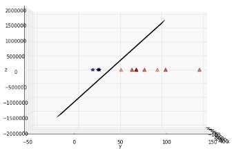
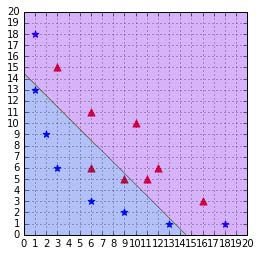
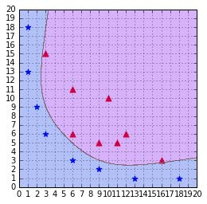
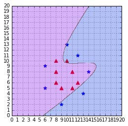
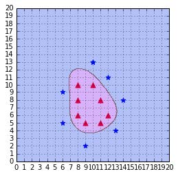
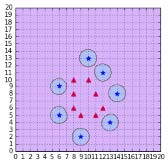

## 核

### 特征转换(Feature transformatioins)

####　我们能对线性不可分数据进行分类吗？

假设您有一些线性不可分的数据(如图38中的数据)，您希望使用svm对其进行分类。我们已经知道这是不可能的，因为数据不是线性可分的。然而，最后这个假设是不正确的。这里需要注意的是数据在**二维空间**中不是线性可分的。


*图38：直线不能分离这些数据*


即使原始数据是二维的，也不能阻止您在将其输入SVM之前对其进行转换。例如，一种可能的变换是，将每个二维向量$(x_1,x_2)$转换为三维向量。

例如，我们可以通过定义的函数$\phi :\mathbb{R}^2->\mathbb{R}^3$来实现多项式映射：
$$
\phi (x_1,x_2) = (x_1^2,\sqrt{2}x_1 x_2,x_2^2)
$$

代码31显示了用Python实现的这个转换。

*代码31*

```python
# Transform a two-dimensional vector x into a three-dimensional vector. 
def transform(x): 
    return [x[0]**2, np.sqrt(2)*x[0]*x[1], x[1]**2]
```

如果您转换图38的整个数据集并绘制结果，就会得到图39，它并没有显示出多大的改进。然而，经过一段时间的处理，我们可以看到数据实际上在三维空间中是可分离的(图40和图41)!


*图39：在三维空间中看起来不能分割*


*图40：数据实际可以被平面分割*



*图41：另一个视角可以看到 数据在平面的两侧*

下面是一个基本的方法，我们可以使用它来分类这个数据集：

1. 用代码31把二维向量转换为三维向量
2. 对3维数据集进行训练
3. 对于我们希望预测的每个新样本，在将其传递给预测方法之前，使用`transform`方法对其进行转换

当然，您不必强制将数据转换为三维;它可以是5维，10维，或者100维

#### 我们如何知道要使用哪个转换

选择应用哪种转换很大程度上取决于您的数据集。 能够转换数据以使您希望使用的机器学习算法发挥最佳性能可能是机器学习领域成功的关键因素之一。 不幸的是，没有完美的配方，它会通过反复试验获得经验。 在使用任何算法之前，请务必检查是否有一些通用规则来转换文档中详述的数据。 有关如何准备数据的更多信息，您可以阅读 scikit-learn 网站上的[数据集转换](http://scikit-learn.org/stable/data_transforms.html)部分。


### 什么是核

在上一节中，我们看到了一个用于线性不可分数据集的方法。它的一个主要缺点是我们必须转换每个样本。如果我们有数百万或数十亿个样本，而转换方法很复杂，那就会花费大量的时间。这时，核就来救场了。

如果你还记得，当我们在对偶拉格朗日函数中寻找KKT乘子时，我们不需要一个训练样本$\mathbf{x}$的值;我们只需要两个训练样本之间的点积$\mathbf{x}_i \cdot \mathbf{x}_j$：
$$
W(\alpha) = \sum_{i=1}^m \alpha_i - \frac{1}{2}\sum_{i=1}^m\sum_{j=1}^m \alpha_i \alpha_j y_i y_j \mathbf{x}_i \cdot \mathbf{x}_j
$$

在代码32中，我们应用诀窍的第一步。想象一下，当数据被用来学习时，我们唯一关心的是点积返回的值，在这个例子中是8100。

*代码32*

```python
x1 = [3,6] 
x2 = [10,10] 

x1_3d = transform(x1) 
x2_3d = transform(x2)

print(np.dot(x1_3d,x2_3d)) # 8100

```
问题是:**有没有一种方法可以在不变换向量的情况下，计算出这个值?**

答案是:是的，用核!

让我们看看代码33中的函数：

*代码33*

```python
def polynomial_kernel(a, b): 
    return a[0]**2 * b[0]**2 + 2*a[0]*b[0]*a[1]*b[1] + a[1]**2 * b[1]**2
```

在前面的两个示例中使用这个函数将返回相同的结果(代码34)。

*代码34*

```python
x1 = [3,6] 
x2 = [10,10] 

# We do not transform the data. 

print(polynomial_kernel(x1, x2)) # 8100
```

仔细想想，这是非常不可思议的。

向量$\mathbf{x}_1$和$\mathbf{x}_2$都是二维的，核函数计算它们的点积，就好像它们被转换成了三维的向量一样，它不需要做变换，也不需要计算它们的点积!

总结一下:核是一个函数，它返回在另一个空间中执行的点积的结果。更正式的说法是:

**定义**：给定一个映射函数：$\phi: \mathcal{X} \rightarrow \mathcal{V}$，我们把由$K(\mathbf{x},\mathbf{x}')=\langle \phi(\mathbf{x}),\phi(\mathbf{x}')\rangle_\mathcal{V}$定义的函数$K:\mathcal{X} \rightarrow \mathbb{R}$，称为**核函数**。其中$\langle\cdot,\cdot\rangle_\mathcal{V}$表示$\mathcal{V}$的内积

#### 核技巧

现在我们知道了什么是核，我们将看到什么是核技巧。

如果我们定义了一个核：$K(\mathbf{x}_i,\mathbf{x}_j) = \mathbf{x}_i \cdot \mathbf{x}_j$，我们可以重写软间隔的对偶问题：
$$
\begin{align*}
\underset{\alpha}{\text{maximize}} \quad & \sum_{i=1}^m \alpha_i - \frac{1}{2}\sum_{i=1}^m\sum_{j=1}^m \alpha_i \alpha_j y_i y_j K(\mathbf{x}_i \cdot \mathbf{x}_j)  \\

subject\ to \quad & 0 \leq \alpha_i \leq C,\text{for any }i=1,\dots,m \\
& \sum_{i=1}^m \alpha_i y_i = 0


\end{align*}
$$

就是这样。我们对对偶问题做了一个简单的改变——我们称之为核技巧。

> Tip:应用内核技巧仅仅意味着用一个核函数替换两个样本的点积

这个变化看起来非常简单，但请记住，要从最初的优化问题推导出对偶公式需要做大量的工作。我们现在有能力改变核函数来分类线性不可分的数据

当然，我们还需要改变假设函数来使用核函数:

$$
h(\mathbf{x}_i) = sign(\sum_{j=1}^S \alpha_j y_j K(\mathbf{x}_j \cdot \mathbf{x}_i)+b)
$$

记住这个公式中的$S$是支持向量的集合。通过这个公式，我们可以更好地理解为什么支持向量机也被称为稀疏内核机。这是因为它们只需要在支持向量上计算核函数，而不是像其他核方法那样在所有的向量上计算核函数(Bishop, 2006)。

### 核的类型

#### 线性核
这是最简单的核。它是这样的：
$$
K(\mathbf{x},\mathbf{x}') = \mathbf{x} \cdot \mathbf{x}'
$$
其中$\mathbf{x},\mathbf{x}'$是两个向量。

在实践中，您应该知道线性核可以很好地用于[文本分类](http://www.svm-tutorial.com/2014/10/svm-linear-kernel-good-text-classification/)

#### 多项式核
我们在之前介绍核的时候已经看到了多项式核，但这一次我们将考虑更通用的版本:
$$
K(\mathbf{x},\mathbf{x}') = (\mathbf{x} \cdot \mathbf{x}' + c)^d
$$
它有两个参数，一个$c$表示常数项，一个$d$表示核的次数。这个很容易用python实现，如代码35所示。

*代码35*

```python
def polynomial_kernel(a, b, degree, constant=0): 
    result = sum([a[i] * b[i] for i in range(len(a))]) + constant 
    return pow(result, degree)
```

在代码36中，我们看到当我们使用次数2时，它返回的结果与代码33的相同。使用该核训练SVM的结果如图42所示。

*代码36*

```python
x1 = [3,6] 
x2 = [10,10] 

# We do not transform the data. 
print(polynomial_kernel(x1, x2, degree=2)) # 8100
```


*图42：使用多项式核的SVM能够分离数据(degree=2)*

次数为1且没有常数的多项式核就是线性核(图43)。当增加多项式核的次数时，决策边界将变得更加复杂，并且有受个别数据示例影响的趋势，如图44所示。使用高次多项式是危险的，因为高次多项式通常可以在测试集上获得更好的性能，但它会导致所谓的**过拟合**:模型太接近数据，不能很好地泛化。




*图43：degree=1的多项式核*




*图44：degree=6的多项式核*

> Note:使用高次多项式核常常会导致过拟合

#### RBF核（高斯核）

有时候多项式核还不够复杂。当您有一个如图45所示的复杂数据集时，这种类型的核有其局限性。


*图45：更复杂的数据集*

正如我们在图46中所看到的，决策边界在分类数据方面非常糟糕



*图46：多项式核不能分离这个数据(degree=3,C=100)*

这种情况需要我们使用另一种更复杂的核:高斯核。它也被称为RBF核，其中RBF代表径向基函数。径向基函数是其值仅取决于到原点或到某一点的距离的函数

其公式为：
$$
K(\mathbf{x},\mathbf{x}') = \exp(-\gamma\|\mathbf{x}-\mathbf{x}'\|^2)
$$

你会经常在其他地方读到它将向量映射到无限维空间中。这是什么意思?

在我们前面看到的多项式核的例子中，核返回在$\mathbb{R}^3$中执行的点积的结果。RBF内核返回在$\mathbb{R}^\infty$中执行的点积的结果。

我不会在这里详述，但如果你愿意，你可以阅读这个[证明](http://pages.cs.wisc.edu/~matthewb/pages/notes/pdf/svms/RBFKernel.pdf)，以更好地理解我们是如何得出这个结论的。



*图47：gamma=0.1时，RBF核正确分类了数据*

[这个视频](https://www.youtube.com/watch?v=3liCbRZPrZA)对于理解RBF内核如何分离数据特别有用。


*图48：gamma=1e-5时的RBF核*



*图49：gamma=2时的RBF核*


当gamma值太小时，如图48所示，模型表现为线性SVM。当gamma值太大时，模型受每个支持向量的影响太大，如图49所示。有关gamma的更多信息，您可以阅读[scikit-learn文档页面](http://scikit-learn.org/stable/auto_examples/svm/plot_rbf_parameters.html)。

#### 其他核

对核的研究一直很丰富，现在有很多可用的核。其中一些是特定于域的，比如[字符串核](https://en.wikipedia.org/wiki/String_kernel)，可以在处理文本时使用。如果您想了解更多的核，这篇来自César Souza的[文章](http://crsouza.com/2010/03/17/kernel-functions-for-machine-learning-applications/)描述了25种内核

### 该怎么去使用核

推荐的方法是先尝试RBF内核，因为它通常表现得很好。但是，如果有足够的时间，最好尝试其他类型的内核。核是两个向量之间相似度的度量，因此，这就是当前问题的领域知识可能产生最大影响的地方。构建自定义核也是可能的，但这需要您对核背后的理论有良好的数学理解。你可以在(Cristianini & shaw - taylor, 2000)中找到关于这个主题的更多信息。

### 总结

核技巧是使支持向量机强大的一个关键组件。它允许我们将支持向量机应用于各种各样的问题。在本章中，我们看到了线性核的局限性，以及多项式核如何分类线性不可分的数据。最终，我们看到了最常用、最强大的核之一:RBF核。不要忘记有许多核，并尝试寻找为解决您要解决的问题而创建的核。使用正确的核和正确的数据集是支持向量机成败的一个关键因素。