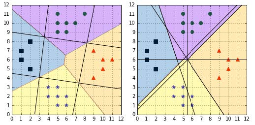

## 多分类SVM

支持向量机能够生成二分类器。然而，我们经常会遇到数据集有两个以上的类别。例如，原始的葡萄酒数据集实际上包含来自三个不同生产商的数据。有几种方法允许支持向量机进行多分类。在本章中，我们将回顾一些最流行的多类方法，并解释它们的来源。

对于本章中的所有代码示例，我们将使用代码41生成的数据集，并显示在图51中。

*代码41*

```python
import numpy as np 

def load_X(): 
    return np.array([[1, 6], [1, 7], [2, 5], [2, 8], [4, 2], [4, 3], [5, 1], [5, 2], [5, 3], [6, 1], [6, 2], [9, 4], [9, 7], [10, 5], [10, 6], [11, 6], [5, 9], [5, 10], [5, 11], [6, 9], [6, 10], [7, 10], [8, 11]]) 

def load_y(): 
    return np.array([1, 1, 1, 1, 2, 2, 2, 2, 2, 2, 2, 3, 3, 3, 3, 3, 4, 4, 4, 4, 4, 4, 4])

```


*图51：四分类问题*


### 解决多个二分类问题
#### 一对多(One-against-all)

这可能是最简单的方法，也被称为“一个对其余的”(one-versus-the-rest)。

为了对$K$个类进行分类，我们构造了$K$个不同的二分类器。对于给定的类，正样本是该类中的所有数据点，负样本是除该类外的所有数据点(代码42)。

*代码42*

```python
import numpy as np 
from sklearn import svm 

# Create a simple dataset 

X = load_X() 
y = load_y() 

# Transform the 4 classes problem 
# in 4 binary classes problems. 
y_1 = np.where(y == 1, 1, -1) 
y_2 = np.where(y == 2, 1, -1) 
y_3 = np.where(y == 3, 1, -1) 
y_4 = np.where(y == 4, 1, -1)

```

我们针对每个问题训练一个二分类器(代码43)。结果，我们得到每个分类器一个决策边界(如图52所示)。

*代码43*

```python
# Train one binary classifier on each problem. 
y_list = [y_1, y_2, y_3, y_4] 

classifiers = [] 
for y_i in y_list: 
    clf = svm.SVC(kernel='linear', C=1000) 
    clf.fit(X, y_i) 
    classifiers.append(clf)

```


*图52：一对多方法为每个类别创建了一个分裂器*

为了做出新的预测，我们将新的样本运用在所有分类器上，如果某个分类器返回的是正值，则表明该样本是属于返回正值分类器的类别(代码44)。然而，因为一个标签被同时分配给多个类别或没有分配到一个类别(Bishop, 2006)，可能会产生不一致的结果。图53说明了这个问题;一对多的分类器不能为蓝色区域中的样本预测一个类别，因为存在两个分类器在蓝色区域都返回的是正值。这将导致样本同时拥有两个类别。同样的问题也出现在中间，因为每个分类器都在中间的区域中返回负值。因此，不能将任何类分配给该区域中的样本。

*代码44*

```python
def predict_class(X, classifiers): 
    predictions = np.zeros((X.shape[0], len(classifiers))) 
    for idx, clf in enumerate(classifiers): 
        predictions[:, idx] = clf.predict(X) 
        
    # returns the class number if only one classifier predicted it 
    # returns zero otherwise. 
    return np.where((predictions == 1).sum(1) == 1, (predictions == 1).argmax(axis=1) + 1, 0)

```


*图53：一对多导致了模糊的结果*

作为一种替代解决方案，Vladimir Vapnik建议使用决策函数值最大的分类器的类(Vapnik V. N, 1998)。代码45演示了这一点。注意，我们使用了`decision_function`而不是调用分类器的`predict`方法。该方法返回一个实值，如果样本位于分类器的正确一侧，则为正，如果位于分类器的另一侧，则为负。值得注意的是，当所有分类器不一致时，通过取最大值而不是绝对值的最大值，这种方法将选择最接近样本超平面的类。例如，图54中的数据点(6,4)将被分配为蓝色的星形类。

*代码45*

```python
def predict_class(X, classifiers): 
    predictions = np.zeros((X.shape[0], len(classifiers))) 
    for idx, clf in enumerate(classifiers): 
        predictions[:, idx] = clf.decision_function(X) 
    
    # return the argmax of the decision function as suggested by Vapnik.
    return np.argmax(predictions, axis=1) + 1
```


*图54：应用简单的启发式方法避免了模糊决策问题*

应用这种启发式方法，我们得到的分类结果没有歧义，如图54所示。这种方法的主要缺陷是不同的分类器是在不同的任务上训练的，所以不能保证`decision_function`返回的数量具有相同的尺度(Bishop, 2006)。如果一个`decision`函数返回的结果比其他`decision`函数的结果大10倍，那么在某些例子中，它会分到错位的类别中。

“一对多”方法的另一个问题是，训练集是不平衡的(Bishop, 2006)。对于100个类，假设每个类别有10个样本，那么每个分类器都将用10个正样本和990个负样本训练。因此，负样本对决策边界的影响很大。

尽管如此，“一对多”仍然是多类分类的流行方法，因为它易于实现和理解。

> Note: 在实践中，一对其余(one-versus-the-rest)的办法是使用最广泛的，尽管它的公式特别，在实际中也有局限性。(Bishop, 2006)

当使用sklearn时，LinearSVC默认自动使用"一对多"策略。您还可以通过将`multi_class`参数设置为`ovr `(one-vs-the-rest)来显式地指定它，如代码46所示。

*代码46*

```python
from sklearn.svm import LinearSVC 
import numpy as np 

X = load_X() 
y = load_y() 

clf = LinearSVC(C=1000, random_state=88, multi_class='ovr') 
clf.fit(X,y) 

# Make predictions on two examples. 
X_to_predict = np.array([[5,5],[2,5]]) 
print(clf.predict(X_to_predict)) # prints [2 1]
```

#### 一对一(one-against-one)

在这种方法中，我们不是试图将一个类别与所有其他类别区分开来，而是试图将一个类别与另一个类别区分开来。因此，我们对每一对类别训练一个分类器，得到K个类别的K(K-1)/2个分类器。每个分类器都是在数据的一个子集上训练的，并产生自己的决策边界(图55)。


*图55：一对一 为每一对类别构建了分类器*

预测是使用一种简单的**投票策略(voting strategy)**进行的。我们希望预测的每个样本都被传递给每个分类器，预测的类被记录下来。然后，拥有最多票数的类被分配给样本(代码47)。

*代码47*

```python
from itertools import combinations 
from scipy.stats import mode 
from sklearn import svm 
import numpy as np 

# Predict the class having the max number of votes. 
def predict_class(X, classifiers, class_pairs): 
    predictions = np.zeros((X.shape[0], len(classifiers))) 
    for idx, clf in enumerate(classifiers): 
        class_pair = class_pairs[idx] 
        prediction = clf.predict(X) 
        predictions[:, idx] = np.where(prediction == 1, class_pair[0], class_pair[1]) 
    return mode(predictions, axis=1)[0].ravel().astype(int) 

X = load_X() 
y = load_y() 

# Create datasets. 
training_data = [] 
class_pairs = list(combinations(set(y), 2)) 
for class_pair in class_pairs: 
    class_mask = np.where((y == class_pair[0]) | (y == class_pair[1])) 
    y_i = np.where(y[class_mask] == class_pair[0], 1, -1) 
    training_data.append((X[class_mask], y_i)) 

# Train one classifier per class. 
classifiers = [] 
for data in training_data: 
    clf = svm.SVC(kernel='linear', C=1000) 
    clf.fit(data[0], data[1]) 
    classifiers.append(clf) 
    
# Make predictions on two examples. 
X_to_predict = np.array([[5,5],[2,5]]) 
print(predict_class(X_to_predict, classifiers, class_pairs)) #prints [2 1]
```


在这种方法中，我们仍然面临着模糊的分类问题。如果两个类有相同的投票数量，就建议选择索引较小的那一个(注：就是数组中靠前的那一个)可能是可行的(但可能不是最好的)策略(Hsu & Lin, a Comparison of Methods for Multi-class Support Vector Machines, 2002)。


*图56：预测是使用投票方案进行的*


图56中显示了一对一策略生成的决策区域与一对多策略生成的决策区域是不同的(图54)。在图57中，有趣的是，对于一对一分类器生成的区域，区域只有在经过超平面(用黑线表示)后才会改变其颜色，而对于一对多所有的情况则不是这样。



*图57：一对多(左)和一对一(右)的比较*

一对一的方法是sklearn中使用的多类分类的默认方法。与代码47不同，使用代码48的代码将获得与代码47中完全相同的结果。

*代码48*

```python

from sklearn import svm 
import numpy as np 

X = load_X() 
y = load_y() 

# Train a multi-class classifier. 
clf = svm.SVC(kernel='linear', C=1000) 
clf.fit(X,y) 

# Make predictions on two examples. 
X_to_predict = np.array([[5,5],[2,5]]) 
print(clf.predict(X_to_predict)) # prints [2 1]
```

针对一对多的方法的一个主要缺点是分类器会倾向于过拟合。此外，分类器的个数随类别的数量呈超线性增长，因此该方法在处理大型问题时速度较慢(Platt, Cristianini， & shaw - taylor, 2000)。


#### 有向无环图支持向量机（Directed Acyclic Graph SVM,DAGSVM）

它是由John Platt等人在2000年提出的，作为一对一的改进(Platt, Cristianini， & shaw - taylor, 2000)。

> Note:John C. Platt发明了SMO算法和Platt Scaling，并提出了DAGSVM。这是对svm世界的巨大贡献!

DAGSVM背后的思想是使用与一对一相同的训练，但通过使用有向无环图(DAG)选择使用哪个分类器来加快测试速度。

如果我们有四个类别，分别是：A, B, C, D，和六个分别训练在一对类上的分类器:(A,B);(A,C);(A,D);(B,C);(B,D)和(C,D)。我们对样本S使用第一个分类器(A,D),其预测是A而不是D,则用第二个分类器(A,C)继续预测，得到的结果不是C。这意味着分类器(B, D)、(B, C)或(C, D)可以忽略,因为我们已经确定样本S不属于类别C或类别D.最后用分类器(A,B),如果它预测结果是B，我们就本B类分配给样本S。图中的红色路径说明了这个例子。图的每个节点是一对类的分类器。


*图58：用于沿有向无环图进行预测的路径说明*

对于四个类，我们使用三个分类器来进行预测，而不是一对一中的六个分类器。一般来说，对于有K个类的问题，将评估K-1个决策节点。

将代码47中的`predict_class`函数替换为代码49中的`predict_class`函数可以得到相同的结果，但可以使用更少的分类器。

在代码49中，我们用一个列表实现DAGSVM方法。我们从可能的类别列表开始，在每次预测之后，我们删除不合格的类别。最后，剩下的类是应该分配给样本的类。

注意，这里的代码49是为了演示的目的，不应该在您的生产代码中使用，因为当数据集(X)很大时，它并不快。

*代码49*

```python
def predict_class(X, classifiers, distinct_classes, class_pairs): 
    results = [] 
    for x_row in X: 
        
        class_list = list(distinct_classes) 
        
        # After each prediction, delete the rejected class 
        # until there is only one class. 
        while len(class_list) > 1: 
            # We start with the pair of the first and 
            # last element in the list. 
            class_pair = (class_list[0], class_list[-1]) 
            classifier_index = class_pairs.index(class_pair) 
            y_pred = classifiers[classifier_index].predict(x_row) 
            
            if y_pred == 1: 
                class_to_delete = class_pair[1] 
            else: class_to_delete = class_pair[0] 
            
            class_list.remove(class_to_delete) 
        
        results.append(class_list[0]) 
    return np.array(results)

```

> Note: "DAGSVM的评估速度比Max Wins快1.6到2.3倍。"(Platt, Cristianini, & Shawe-Taylor, 2000).

### 解决单一优化问题

另一种方法是尝试解决单一优化问题，而不是尝试解决几个二次优化问题。多年来，已经有几个人提出了这种方法。

#### Vapnik, Weston, and Watkins

该方法是对支持向量机优化问题的一种推广，可直接解决多分类问题。它是由Vapnik (Vapnik V. N, 1998)和Weston & Watkins (Weston & Watkins, 1999)独立发现的。把每个类的约束条件都添加到优化问题中。因此，问题的规模与类别的数量成正比，可能会训练的非常慢。

#### Crammer and Singer

Crammer和Singer (C&S)提出了一种可选的方法来处理多分类支持向量机。像Weston和Watkins一样，他们解决了一个单一的优化问题，但使用了较少的松弛变量(Crammer & Singer, 2001)。这可以减少内存和训练时间。然而，在他们的比较研究中，Hsu和Lin发现C&S方法在使用较大的正则化参数值$C$时特别慢(Hsu和Lin, a Comparison of Methods for Multi-class Support Vector Machines, 2002)。

在sklearn中，当使用LinearSVC时，你可以选择使用C&S算法(代码50)。在图59中，我们可以看到C&S预测不同于一对多的方法和一对一的方法。

*代码50*

```python
from sklearn import svm 
import numpy as np 

X = load_X() 
y = load_y() 

clf = svm.LinearSVC(C=1000, multi_class='crammer_singer')
clf.fit(X,y) 

# Make predictions on two examples. 
X_to_predict = np.array([[5,5],[2,5]]) 
print(clf.predict(X_to_predict)) # prints [4 1]

```


*图59：Crammer & Singer算法*

### 该使用哪种方法

有这么多可用的选项，选择一个适合您问题多分类方法可能会很困难。

Hsu和Lin写了一篇有趣的论文，比较了支持向量机的不同多类方法(Hsu和Lin, A Comparison of Methods for multi-class Support Vector Machines, 2002)。他们得出的结论是“一对一和DAG方法比其他方法更适合实际应用。”一对一的方法有一个额外的优势，那就是sklearn中已经有了这种方法，所以它应该是您的默认选择。

一定要记住，LinearSVC在默认情况下使用的是一对多的方法，也许使用Crammer & Singer算法会更好地帮助你实现目标。在这个问题上，Dogan等人发现，尽管它比其他算法快得多，但针对所有算法的产量假设在统计上的准确性明显较差(Dogan, Glasmachers， & Igel, 2011)。表1提供了本章中介绍的方法的概述，以帮助您做出选择。

|方法名|一对一|一对多|Weston&Watkins|有向无环图SVM|C&S|
|:-:|:-:|:-:|:-:|:-:|:-:|
|第一次使用时间|1995|1996|1999|2000|2001|
|方法|多个二分类|多个二分类|求解单一优化问题|多个二分类|求解单一优化问题|
|训练方式|每个类别单独一个分类器|每对类别单独一个分类器|分解法|和一对一相同|分解法|
|分类器数量(K是类别数量)|K|$\frac{K(K-1)}{2}$|1|$\frac{K(K-1)}{2}$|1|
|测试方法|选择决策函数值最大的类|“Max-Wins”投票策略|使用分类器|使用DAG中的K-1个分类器|使用分类器|
|scikitlearn|LinearSVC|SVC|无|无|LinearSVC|
|缺点|类别样本数量不平衡|K过大时，训练时间过长|训练时间过长|常用库中没有|训练时间过长|

### 总结

由于多年来的许多改进，现在有几种利用支持向量机进行多类分类的方法。每种方法都有优点和缺点，大多数情况下，您最终将使用正在使用的库中可用的一种方法。但是，如果有必要，您需要知道哪种方法更有助于解决您的特定问题。

关于多分类支持向量机的研究还没有结束。最近关于这个问题的论文集中于分布式训练。例如，Han & Berg提出了一种名为“分布式共识多类支持向量机（Distributed Consensus Multiclass SVM）”的新算法，该算法使用的是共识优化和Crammer & Singer公式的修改版本(Han & Berg, 2012)。

